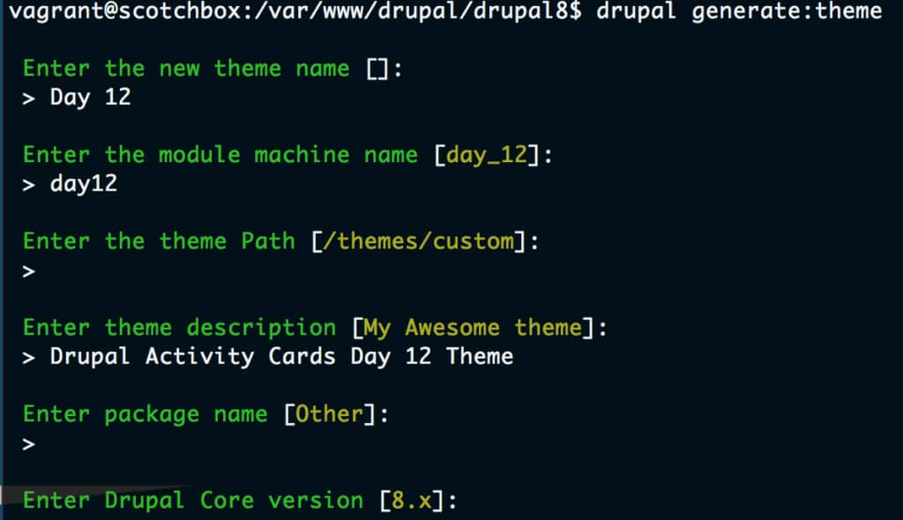

Drupal 8 has a new theme engine, however many of the concepts we are familiar with in Drupal 7 are still in place in this new version. Themes still have the same ability to overwrite various templates within core, only now instead of modifying .tpl.php files, you will be creating Twig files in their place. Theme functions are still available to use, however they are now kept in the .theme file instead of template.php. Other changes worthy of exploring in more depth are briefly summarized below.

### **Twig**

The biggest change of course has been the move to the Twig Template Engine, and I will be getting more into Twig later in this series. For now though, I have been focusing on Day 12 of the Drupal Activity Cards, which introduces us to theming at a high level.

### **Base Themes**

When looking at the new theme layer in Drupal 8, the first thing that stands out as a major integral part of the system is the concept of base themes. Base themes are not new, we have had them in Drupal 7 for quite some time, however with Drupal 8 pretty much every theme you will use will most likely inherit from two major base themes in the system called Stable and Classy. In fact Bartik and Seven both are sub themes of Classy. A Tale of Two Base Themes in Drupal 8 Core provides a thorough overview of these new base themes and their importance in Drupal 8.

### **.yml Files**

The use of .yml files are also prevalent in the new theme layer as with other areas in Drupal 8, however they more or less simply replace functionality of the previous info and template.php files found in Drupal 7.

### **Libraries**

I talked about libraries in Attaching JS and CSS Assets in Drupal 8 and they function in a similar with within the theme layer itself.

### **Drupal Console**

One last major change is the newer integration with Drupal Console, which lets us generate boilerplate theme code, similar to that of custom module and content entity scaffolding functionality covered in an earlier post.

## Generating your Theme via Drupal Console

To get started with theming in Drupal 8, you can use the Drupal Console to generate starter code by issuing the following command:

```
drupal generate:theme
```

You will be prompted to provide information for your new theme including its name, path, base theme, etc., similar to the screenshot below.



Drupal console will also provide you with the option, at the time of generation, to provide the names of regions you would like defined in your new theme. I generated the theme Day12 with base theme Classy and the regions I defined included Content, Sidebar1, and Sidebar2. To demonstrate similarities with the Drupal 7 theme engine, I grabbed a copy of the Classy page.html.twig (in Drupal 7 this would have been page.html.tpl.php) and copied it into a templates directory in my new theme. I made several changes directly in this file to rearrange my layout into the three column table demonstrated in Day 12 and my finished template code looked like the following.

```php
<!-- Day 12 Edits -->
<table class="table">
    <tr>
        <td>
            --------- SIDEBAR FIRST -----------
            
            <aside class="layout-sidebar-first" role="complementary">
                {{ page.sidebar_first }}
            </aside>
            
        </td>
        <td>
            --------- CONTENT -----------
            <div class="layout-content">
                {{ page.content }}
            </div>{# /.layout-content #}
        </td>
        <td>
            --------- SIDEBAR SECOND -----------
            
            <aside class="layout-sidebar-second" role="complementary">
                {{ page.sidebar_second }}
            </aside>
            
        </td>
    </tr>
</table>
<!-- End Day12 Edits -->
```

There was nothing very interesting here except that I was able to demonstrate a change in my site layout by modifying a template file, just as I would have done in Drupal 7. I'll be looking more in depth at the theme layer in later posts, but for now this should serve as a basic overview of both the similarities and differences between Drupal 7 and Drupal 8 theming at a very basic level.
