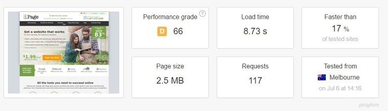
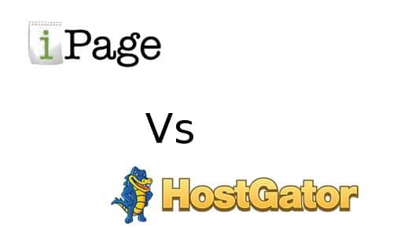

iPage and Hostgator are two of the most popular shared website hosting companies. They have a customer base of over a million users. iPage is operational since 1998 whereas HostGator brand started flourishing from 2002 onward. Both companies are reliable. Thus, many users who want to launch a new website or change the host are often confused in choosing a shared hosting service between the two.

Today, we'll try to clear the confusion for you by sharing a comparison of the pricing, performance, uptime, features and customer support offered by iPage and HostGator.

**Note**: Shared hosting is ideal for websites that have little traffic. For large sites (traffic > 100000 UV per month), we recommend DigitalOcean or HostGator VPS.

## iPage vs HostGator 2017

### Pricing

iPage, at the first glance, seems to be the cheapest hosting platforms. The shared hosting plans from the iPage start at just $1.99. You can buy hosting for below $2 for a month, quarter or the full year. Once the subscription has expired, renewing the plan will cost you around $11.

Hostgator's plans are attractive. You can buy shared hosting from them for a price starting at $8.76. If you pay in advance for three, two or one years of hosting, the pricing will drop to $5.5, $6.3 and $7.1 respectively.

### Performance

The iPage company's website is hosted on the iPage server and HostGator website is deployed on an HG server. Let's check the performance of the two websites.

As you can see in the above picture, iPage's website took 8.7 seconds to load on the client's browser. Hostgator's site on another hand took just 6.32 seconds to open.

I've used the Pingdom page speed tool for checking the performance of the two websites. I've purposefully set the test location to Australia.

**Check**: Bluehost review 2016 with 3.49 dollar coupon

### Uptime

I've checked customer reviews of both iPage and HostGator. Six out of every ten users have given three, one or two points out of five to iPage for their uptime. There were a bunch of users who were happy with the uptime offered by iPage. Like many other companies, iPage claims to provide 99+ percent uptime.

HostGator has excellent infrastructure. Thus their uptime is expected to be better than iPage. I've used HostGator for a year. My site was never down for a minute.

### Technical Support

A company that offers poor customer support will hardly survive for a year. Both iPage and Hostgator are operating for more than a decade. They have experienced team of support staff who are ready to help you with any issue 24 x 7.

HostGator and iPage have set up a live chat module through which customers can get answers and solutions to their queries when needed.  Support is also provided via emails and telephone. If you need help on an issue, just log in to your iPage or HostGator dashboard and create a ticket.

### Features

iPage claims to offer $500 worth of freebies for the people who signup for their hosting service. HostGator offers some free stuff as well.

When it comes to features, iPage and HostGator offer the below features:

- Unlimited disk space and bandwidth.
- Once click installer tools for setting up your favorite content management system (Ex WordPress).
- Support for MySQL database and PHP.
- Scaling support.
- Free domain name registration for the 1st year.
- Access to raw access logs.
- FTP access, custom 404 pages and access to a file manager tool.

### Which hosting to choose between iPage and HostGator?

3 Reasons to choose HostGator:

**Transparency**: HostGator has clearly stated the specifications of their shared hosting servers. HG servers have latest AMD or Intel E5 processors, SSD storage and up to 64GB of RAM. iPage hasn't revealed the configuration of their shared servers.

**Billing**: HostGator gives you the option to buy hosting for a month. There's no such option available with iPage.

**Uptime**: Having using HostGator, I can say that their uptime is great. People who have used iPage were not happy with the uptime. Thus, they have moved their websites to other hosts.

**Signup for HostGator here.** Use the promo code **hostileblog** and get 25 percent off on any shared hosting plan.

Reason to buy Hosting from iPage:

Cheap plans: If you have long term goals for your website and if you're searching for a cheap shared hosting plan, then iPage is the best available option for you. If you buy a yearly plan from this company, you save 40 to 50 dollars.

**Signup for the** **$1.99 hosting plan from IPage** here (80 percent discount).

\[kkstarratings\]
