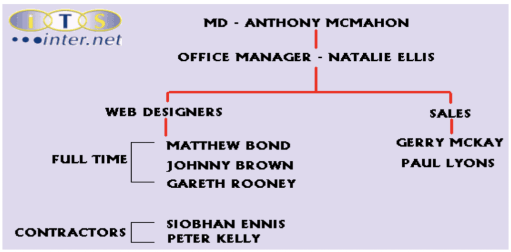
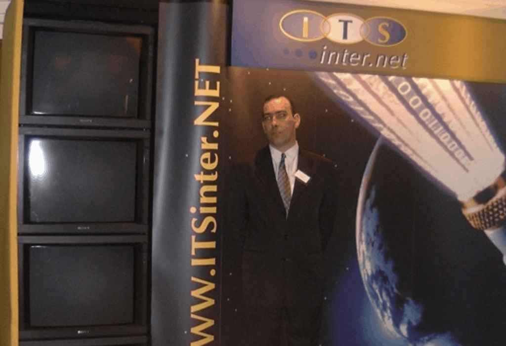

It has been surprising to see the amount of small Internet based companies that have ‘made it big’ within a very short period of time. Perhaps it has been the pure innovation of releasing a particular service on-line or offering goods that no one else had yet thought of. Perhaps it has just been a case of the company getting in before others had giving them the edge that would continue for many years to come.

One of the biggest examples which is along side the most common services used today on the web was ‘Hotmail – the worlds first web based email service’. This became so popular that eventually the industry computer software giant Microsoft acquired the company during 1998. On the more local front in Northern Ireland, the small ISP in Belfast, Direct Net Access was recently acquired by Ulster Television.

‘UTV plc, Northern Ireland's most popular TV channel, today announced a record 43% increase in its operating profit to £11.9m - and the acquisition of leading internet service company - Direct Net Access (DNA) for £4.25m.’

All these companies have one thing in common, they are all new on-line organisations in some cases without any physical premises; pure online business opportunities. The problem is that not all companies on the Internet have been as successful. In fact it can be argued that in today’s commercial world Internet companies are alongside the most risky business investments on the market. Stories of success often can be complimented with multiple stories of non-profitable ventures, or worse ones of failure and financial ruin.

The following case study examines the history of a small Internet Company ‘ITS Internet’, which has not been one of the fortunate success stories, along with the problems it has faced over the last year and a half.

## History of ITS Internet

ITS Internet was formed in early 1999 as a specialist Internet company in Website Design and Hosting Services for local business organizations. Owner and Managing Director Anthony McMahon originally formed the company with the intention to further expand the business into a Virtual Internet Service Provider by mid 2000.

‘With the increasing need for companies to have an Internet presence, ITS Internet is well placed to deliver a high quality, professional package tailored to the individual needs of the company.’

The realisation was there that Northern Ireland was behind the rest of the world in the area of online-business. When ITS was formed, there were only a few other web design companies within Northern Ireland. Some of the larger more recognised businesses including DNET, Creative Online Media (COM) and Webforia offered tailored business web packages to the local company at various prices. Originally, the ITS strategy was to undercut the prices of all the large players in Northern Ireland and offer a fully tailored web design and hosting service for under £400. This included the following services: Domain Registration, Multiple Email Accounts, Complete web design and full hosting for one year.

At this time the MD worked solely from home and employed one web designer. Advertising was taken out in local newspapers including the Newsletter, Irish News and Belfast Telegraph. Business was very slow in the first few months of the company but eventually ITS managed to build upon a customer base of local Belfast companies. Demand meant that other designers would be required in order to take on the additional workload, so Mr. Mahon decided to move into premises in Belfast city centre and hire additional staff.

Mr. McMahon was looking to expand the business as quickly as possible so the best way in his opinion to achieve this was to move the business into the city centre at Chichester Street. ITS Internet moved into the Company shop and took on additional staff. As more business came in, a heavier advertising campaign was launched in order to gain more recognition to the local community. Eventually ITS had 8 staff in total with a mixture of Full Time, Part Time, and Contractors.  

As time went by, the original strategy of developing low cost web solutions for local companies had changed greatly. ITS now wanted to expand into a full Internet Service Provider offering a mixture of different services including small solutions to full e-commerce secure transactions. A leased line was purchased and installed in the Company Shop through NTL Communications during October 1999 and two additional staff were brought in, one to maintain the network that was planned for implementation early November and a programmer for full back-end web solutions that ITS were planning as another service.

ITS had moved from a simple Web Design and Hosting company into a full Internet Services Consultancy. Mr McMahon had planned to further expand the business by purchasing physical servers to run on-site instead of through a Virtual Server which was currently in place. ITS used the American company Adgrafix (http://www.adgrafix.com) for all its hosting needs as it was both cost effective and faster than many UK hosting companies of that time.

ITS had approached a size of ten staff members and continued to promote their services through local media and business catalogues. The customer base grew larger but the problem was the company was beginning to expand beyond the sales that it was accumulating. In a major effort to boost the company’s sales, the Managing Director decided to launch ITS Internet’s new animation and 3D services at an I.T. show within the Europa Hotel in Late January, 2000.

In many ways the show was a success. The sales team managed to obtain many contacts of parties that were interested in moving their business towards e-commerce solutions, and local awareness was raised further. However the initial costs of the show needed to be covered and although there was a very positive reaction, on the short term ITS was beginning to run into short term financial problems.

Mr. McMahon was aware of this problem and pushed the sales team to pull in more short-term / small cost customers. Unfortunately at this time of year just after the New Year holidays, many local companies had already spent a lot of money on pre and post Christmas advertising. Many were still interested but it would be a few months before any kind of sale.

In the weeks that followed the show, ITS suffered increasing financial debt that needed to be resolved. There were many potential customers and existing clients that had outstanding invoices with ITS but the money was needed quickly and there didn’t seem to be any other resolution but to let several staff members go.

As time went on more staff lost their jobs as it had come to the stage where ITS could no longer survive unless major investment was brought forward. Negotiations were ongoing with several investors but unfortunately nothing came of it. Increasing bills meanwhile accrued including costs for the premises, virtual hosting costs which had increased due to the larger customer base, leased line costs and of course staff wages. In the end the company had to move out of the premises and the only staff left remaining were the Managing Director and one web designer.

ITS Internet still operates from the home of Managing Director Mr. McMahon. It seems strange that a company could have grown so quickly in such a short time, yet ended back to where it started at the beginning of 1999. Currently ITS Internet has managed to secure most of its debts and continues to run as a small web site design and hosting company, but the important question that needs to be addressed is what actually went wrong? The best way to approach this was by through the Managing Director who agreed to an interview.

## ITS Internet – Current Standing & Future Possibilities

When approached with the question of why ITS Internet had failed in such a short space of time, Mr. McMahon proceeded to discuss the overall bad timing of ITS Internet’s introduction in Belfast. He believed it was down to the business sector at that stage during mid 1999 that a small Internet business such as ITS found it so difficult to thrive. This has recently been redressed during late 1999 and the beginning of 2000 by the British government’s drive towards an e-commerce society. This combined with business expenses throughout Northern Ireland at that time in preparation for Y2K protection had hindered any great amount of sales made in the web design and hosting market towards e-commerce.

When approached with the question of whether or not the growth rate of ITS was too great in comparison with the profit intake, Mr McMahon stated that this was not the problem and lack of credible sales was. At that time with the previous problems mentioned earlier, the original sales team of ITS could not manage to secure enough clients. He went on to mention the second sales person he hired was much better and if, recruited at the start, there would have been major differences.

Mr. McMahon admitted that the advertising campaign would have been different. He would not have advertised in as many newspapers, but targeted more business specific journals. According to him, there was not too much money spent on advertising or city centre premises with a leased line, as the company needed to project its image as much as possible throughout the early days in order to attract sales from larger corporations.  

## Analysis of ITS Internet: ITS Tomorrow

ITS is clearly still functioning as a company and will remain to do so into the future, but it has become clear that expansion of this business cannot happen overnight despite the MDs need for rapid growth. Although the Managing Director has made it clear that the company will move into premises in the future, for the present time, the company is being operated from the home of Mr. McMahon and sales over the last month have started to look positive.

Did ITS therefore fail because of its lack of timing into the market place coupled with problems of the aforementioned Y2K problems making local businesses dubious about any I.T. investments at that time. When analysing the organisation it can be argued that the original undercutting price strategy was wrong. Expansion rate of the business was just too much for the amount of sales to justify. Expenses in advertising along with expensive premises and equipment certainly did not benefit the company, but at the end of the day what help was available to this small growing company with huge potential?

The Managing Director felt that expansion was needed in order for the company to succeed in a market of fast growing competition. Perhaps lessons can be learned from ITS and now that the government is beginning to realise the potential of this market within Northern Ireland, the future of ITS and other similar companies could turn out to be a very prosperous one.
