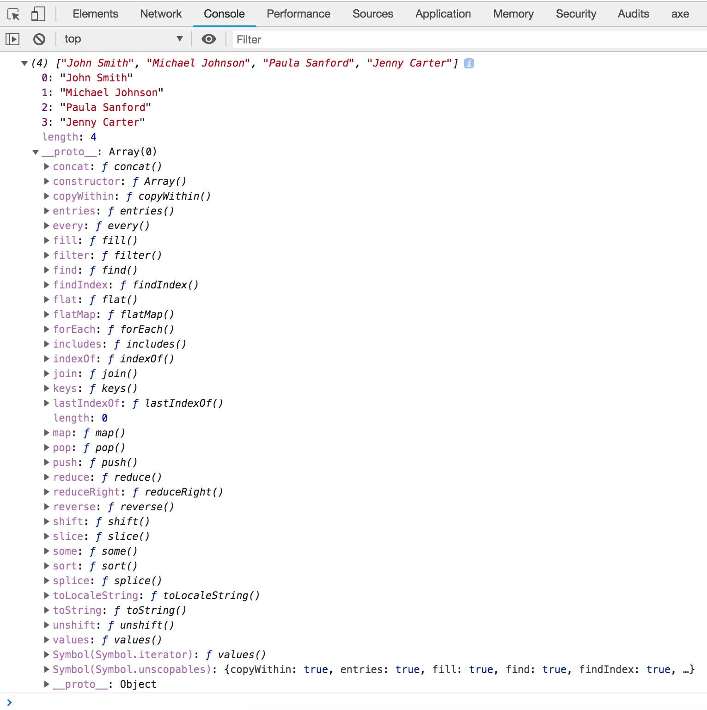

Earlier we looked at datatypes and variables. Arrays take the concept of a variable or binding one step further and allow us to form groups of values within a data structure, which we can then manage in our code. A good use for an array is a list of data. Arrays not only let you group data, but they offer a range of tools or methods to update and manipulate their contents. They are used commonly across different programming languages and have become a routine way of passing around data within applications.

Arrays are also a form of object, which we will be covering later. Once you have mastered arrays, you will quickly realize their strength in managing multiple data points across the code you write. Let's dig into arrays by considering an example. Below I have included a group of students, who we would like to manage in some JavaScript application. For the purpose of this example, we are only interested in basic information.

- John Smith
- Michael Johnson
- Paula Sanford
- Jenny Carter

To create variables for these students, we would have previously done something like:

```javascript
let student1 = "John Smith"
let student2 = "Michael Johnson"
let student3 = "Paula Sanford"
let student4 = "Jenny Carter"
```

Instead of separate variables, we are going to use an array to store all four students.

## **→ Try it out**

Create two files called **index.html** and **script.js** and enter the code below into each. Alternatively, if you followed along in the previous lesson, use the existing script.js file and replace its content with code below. Note, to initialize an array, the format expected is surrounding square brackets, followed by each data element separated by a comma.

```markup
<!DOCTYPE html>
<html>
  <head>
    <title>Bitesize JavaScript</title>
  </head>
  <body>
    <h1>Bitesize JavaScript</h1>
    <script src="script.js"></script>
  </body>
</html>
```

```javascript
/**
* Arrays
*/

let students = ["John Smith", "Michael Johnson", "Paula Sanford", "Jenny Carter"];
console.log(students);
```

> To see the results: open index.html in your browser and open the console, Press Ctrl+Shift+J (Windows / Linux) or Cmd+Opt+J (Mac).

In your console, you should see the output of your array: (4) \["John Smith", "Michael Johnson", "Paula Sanford", "Jenny Carter"\]

The number in parenthesis let's us know that there are **four elements** in our array. The contents of the array are also displayed. While it is nice to be able to recall our students directly by viewing the contents of an array, to make an array usable, we would need to be able to access and manipulate the individual elements contained within.

## Accessing Array Elements

Arrays are **zero-based**, meaning that they count their elements starting from zero. In the example above, John Smith would be in the zero position, Michael Johnson 1, and so on. To access a specific element within an array, we simply specify the element number we are interested in. If we wanted to return Paula Sanford we would do so by entering the following command:

```javascript
console.log(students[2]);
```

Note that Paula is represented by 2 and would be returned in the console.

## Array Data Types and Array of Arrays

Arrays can consist of the different data types available to us within JavaScript including the basic number, string and boolean primitive data types. An array can be a list of all of the same type (which is commonly the case) or can consist of a mix of different types of data.

In addition to this, arrays can also contain complex data types such as other arrays or objects (which we will cover in a future lesson). Try adding the mixedArray and arrayOfArrays variables to your script as shown below and then inspect the results in your browsers console.

```javascript
/**
* Arrays
*/

let students = ["John Smith", "Michael Johnson", "Paula Sanford", "Jenny Carter"];
console.log(students);

let mixedArray = [true, 43, "String example"];
console.log(mixedArray);

let arrayOfArrays = [students, mixedArray];
console.log(arrayOfArrays);
```

As you can quickly see, having these capabilities means that arrays are very powerful and can be used for lots of different use cases in our code. As you begin building applications in JavaScript you will quickly realize their importance and usefulness in working with data.

## Working with Arrays

Now that we know how to create an array and how to access a specific element, let's take a look at what else we can do with them. Thankfully for us, arrays in JavaScript have a built in number of functions (or methods), which we can use to find out information about an array in order to manipulate or update its contents. Before we explore array properties and methods in depth, it is important to understand an important concept in JavaScript called prototypes.

### The Array Prototype

Since arrays are a form of object in JavaScript (don't worry too much about objects yet as we'll be covering these later), they inherit some of the same qualities including a base template or prototype. This prototype provides a number of properties and methods that we can use to work with our array.

> Think of a prototype as a **bag of tools** that comes with every new array.

To see these tools, let's go back to our earlier script by refreshing the browser window and inspecting the console output.



When you expand the array output as shown above, you should see a property called \_\_proto\_\_. This contains all of the prototype properties and methods, which we can use to work with our array. For your reference, W3schools provides a nice JavaScript Array Reference that describes all properties and methods. Don't worry too much about the details of \_\_proto\_\_ right now, the reason I'm introducing it here is to show you that we have a number of options available to us for working with our array. We are not going to cover everything listed under the prototype, instead we will look at the most commonly used properties and methods that will be useful to us working with our new array. In the next lesson I will provide an overview of each of these methods that will be most useful to you and will cover the majority of your use cases for working with arrays.

By now you should have a good understanding of the concept of an array and how it is a data structure that lets us store multiple elements or pieces of data within in our code. Arrays are a fundamental concept in most modern programming languages and you will find them used a lot in JavaScript.
