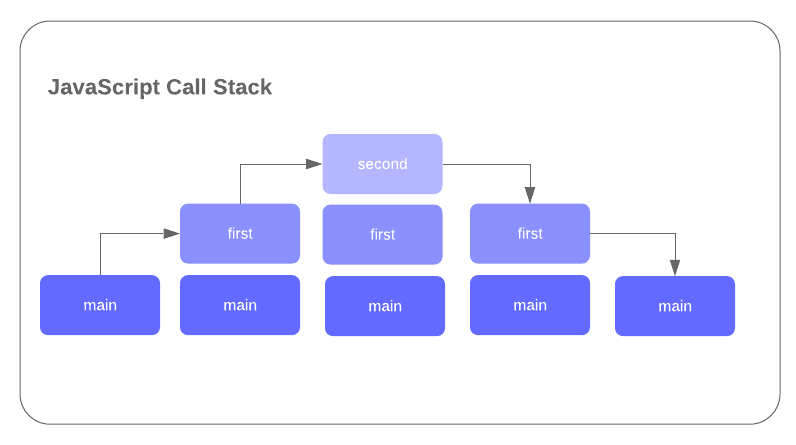
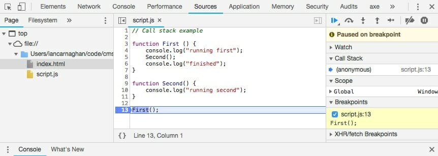
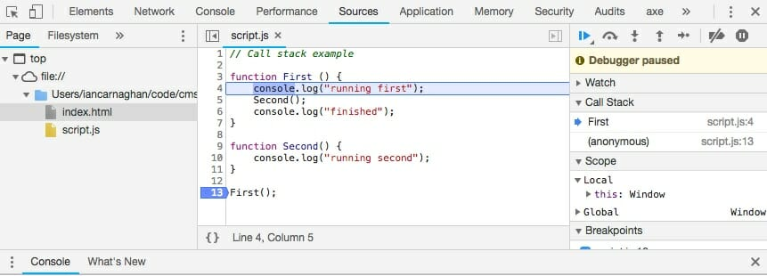
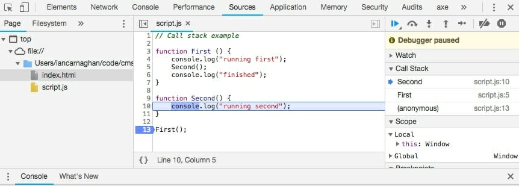

In earlier lessons, we wrote code without using any functions. Now that you have been introduced to the various ways we can organize our code within function declarations and expressions, it is helpful to step back for a moment to understand the flow of execution within our code. JavaScript uses a call stack to in order to manage this flow, which is essentially a data structure (or to-do list) that keeps track of function calls using a Last In First Out (LIFO) ordering system. Let's take a look at an example to help explain this concept.

```javascript
// Call stack example

function first () {
    console.log("running first");
    second();
    console.log("finished");
}

function second() {
    console.log("running second");
}

first();
```

In the code above we have defined two different functions, First and Second. The First function will initiate a console.log and then call Second. Second will in turn execute another console.log and return to control to First. First will execute a third console.log and then return control to main. This is better illustrated in the following steps:

1. in main call stack / not in function
2. in first (executes console.log)
3. in second (executes console.log)
4. in first (executes console.log)
5. in main call stack / not in function

The diagram below illustrates the five different states of the call stack during execution of the program above. Visually you can see how the principle of Last In First Out (LIFO) is followed within the call stack. It is important to gain an understanding of your program flow within the JavaScript call stack in order to manage your functions and overall organization of code.



## **→ Try it out**

Create two files called **index.html** and **script.js** and enter the code below into each. Alternatively, if you followed along in the previous lesson, use the existing script.js file and replace its content with code below. After you have updated your script.js file, examine the results produced in the browser console.

Instead of using the console this time, we are going to use the 'Sources' tab.

1. Within the sources tab, click on the 'show debugger' icon: 
2. Click the number beside line 13 to set a break point. (A break point stops the execution of JavaScript code so we can inspect the call stack).
3. Refresh the your browser.

Your debugger should look similar to the image below.



Note: your break point has stopped execution of the code on line 13, on your first function invocation. We are now going to step through the code using the debugger and examining the call stack. Click on the 'Step into Next Function Call' button: 



Note the first function is now added to the call stack. Keep stepping into next function calls and observe the behavior in the call stack.



Eventually you will see both First and Second in the call stack. The blue arrow to the left of the function name in the Call Stack in the debugger indicates which function will be executed next. Eventually you will step through the functions executing Second, returning to First, executing First, and then finishing up. Note you can also observe the results of your code by selecting the Console tab.

For more on the JavaScript call stack, there is an excellent video by Colt Steele, which I'm including as a reference below. In this video, Colt does a complete overview of the JavaScript call stack in less than 10 minutes. Definitely worth a watch.

<iframe src="https://www.youtube.com/embed/W8AeMrVtFLY" width="560" height="315" frameborder="0" allowfullscreen="allowfullscreen"></iframe>

By now you should have a good understanding of the JavaScript Call Stack. This is an important concept to understand as you begin organizing your code in functions and start building larger more complex applications.
