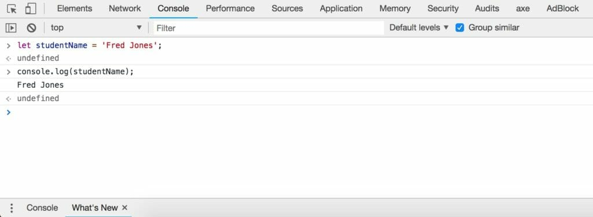
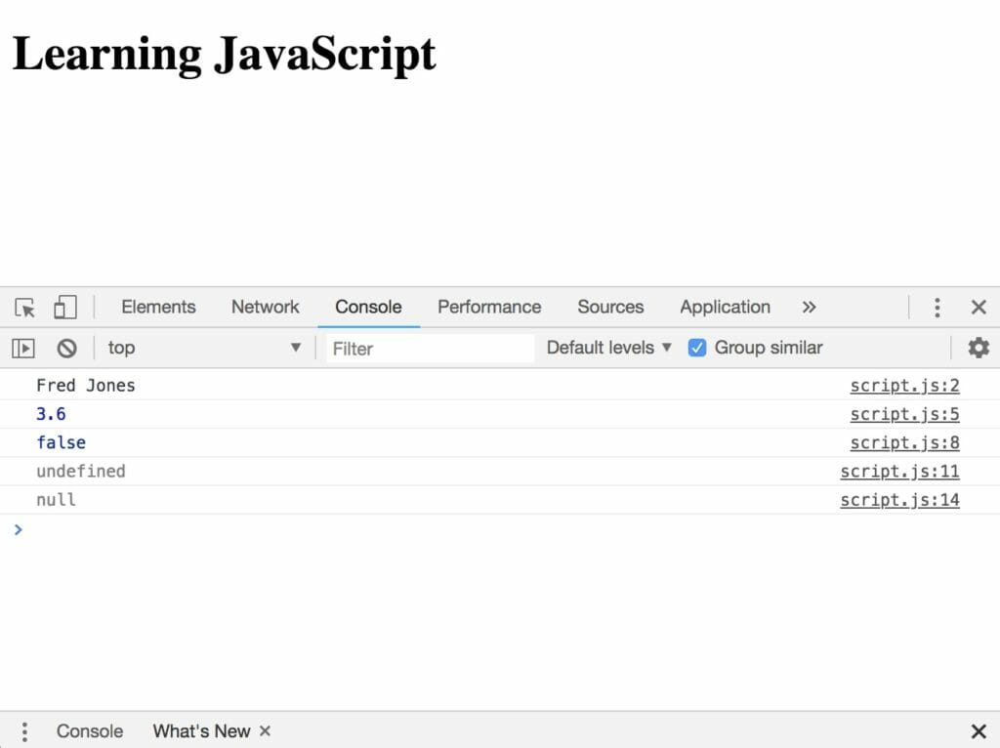

JavaScript is one of the three core technologies used to build websites and web applications. Alongside HTML and CSS, JavaScript provides the interactive functionality commonly used throughout the web. In this lesson you will be introduced to some of the core concepts of JavaScript.

To follow along, you will need a modern web browser, such as Google Chrome or equivalent with developer tools. You will also need a capable text editor. I highly recommend Microsoft Visual Studio Code. The first concept we are going to cover in this lesson is variables. Variables are spaces of memory where you can store information of a certain type, that can be retrieved later in your code.

JavaScript is capable of storing five different types of primitive data types within variables. These include:

- Number (including whole, integer, float)
- String (or text)
- Boolean
- Undefined (a variable that has not yet been assigned a value or type)
- Null (an assignment representing no value)

The keyword **let** is used to declare a variable. A variable can either be declared as undefined (without a value set) or defined with a value. The following examples illustrate declaring variables of different types.

```javascript
let studentName = 'Fred Jones'; // string. Strings are always stored in quotes
let gpa = 3.6; // number. Numbers are stored without quotes
let graduated = false; // boolean. Either true or false can be assigned
let quizResult; // undefined
```

Note each statement in JavaScript ends with a semi-colon. The // is used to create an in-line comment, i.e. anything written after // will be ignored. You can also write multi-line comments by enclosing your comments in /\* and \*/.

> Variable names have certain rules that we need to follow. All variable names must start with an underscore \_ or letter. The rest of the name can contain any letter, any number, or the underscore. You can't use any other characters. Variables are case-sensitive.

Now that you have learned the basics of variables, let's try using some next.

## **→ Try it out in the Browser Console**

In Chrome (or an equivalent browser), open the development tools. Using Chrome you can access 'developer' tools in the view menu (Mac) or tools menu (Windows). Alternatively, right-clicking an empty area in the browser window and selecting 'inspect' will also get you there. You can also open the console by pressing Ctrl+Shift+J (Windows / Linux) or Cmd+Opt+J (Mac).

Next try declaring the studentName variable as above. Once you hit enter on the keyboard, enter the command:

```javascript
console.log(studentName)
```

You should now see the relevant output showing the value of studentName as shown in the screenshot below.



The console.log command is a very handy way of quickly outputting results to the console. As shown above, we have successfully declared the studentName variable and assigned the value 'Fred Jones'. Strings are always stored using either single or double quotes. The console.log command confirms our value is stored to the variable.

## **→ Try it out in Code Files**

While the developer tools are very handy for quick debugging, you typically will write JavaScript code within text files. As mentioned above, I highly recommend Visual Studio Code for editing purposes, and this is the editor I use throughout this course. To get started, create a new project folder on your computer called bite-size-javascript and open VS Code (or an equivalent editor) and create two new files in this directory called **index.html** and **script.js**.

```javascript
<!DOCTYPE html>
<html>
  <head>
    <title>Learning JavaScript</title>
  </head>
  <body>
    <h1>Learning JavaScript</h1>
    <script src="script.js"></script>
  </body>
</html>
```

```javascript
/**
* Variables and Types
*/

let studentName = 'Fred Jones'; // string. Strings are always stored in quotes 
console.log(studentName)

let gpa = 3.6; // number. Numbers are stored without quotes 
console.log(gpa)

let graduated = false; // boolean. Either true or false can be assigned 
console.log(graduated)

let quizResult; // undefined
console.log(quizResult)

let emptyValue = null; // null
console.log(emptyValue)
```

Earlier, you were introduced to single line comments. Note the top line beginning with /\* This is called a multi-line comment. Multiline comments can appear anywhere between an opening /\* and closing \*/ In this case we are using a multi-line comment to include a human-readable header for our code called ‘Variables and Types’. Comments make our code easier to read and will make more sense to you as you get practice using them.

> Open index.html in your browser and open the console, Press Ctrl+Shift+J (Windows / Linux) or Cmd+Opt+J (Mac).

You should see results similar to the screenshot below.



Note each of the different variables display their associated value in the console.

## Coercion and Mutation

So far you have learned about variables and the types of data that can be stored within them. The data types (string, number, boolean, etc.) are tied to the value in JavaScript, and **not the variable container itself**. For example, if I have a variable called **gpa** and store 3.6 (number) as the value, I can later coerce this into a string by combining (or concatenating) it with other variables. If I combine studentName and gpa by using the + function in JavaScript, the resulting output will be provided in a string.

> Other languages, such as Java and C# enforce strict typing, meaning the variable itself (in this case student) would be assigned a type of string. If I later tried to store the boolean true value, I would receive a compilation error.

Similarly, because JavaScript does not enforce the data type at the variable, different values of different data types can be stored over time. Just like coercion, which happens when variables are coerced into a different type, mutation can occur when a different value of a different type is stored in the variable. Take the gpa variable from the example above. In the code it is a value set to 3.6 (number). We can however update this variable and store a value of "three point six" (string). Both coercion and mutation are made possible by using JavaScript's dynamic typing. To summarize, JavaScript will allow you to store values of any type within a variable without enforcement. Let's look at a couple of examples to better understand this process.

**In your script.js file, update the code, adding the new lines on the end starting with the comments 'Coercion and Mutation':**

```javascript
/**
* Variables and Types
*/

let studentName = 'Fred Jones'; // string. Strings are always stored in quotes 
console.log(studentName)

let gpa = 3.6; // number. Numbers are stored without quotes 
console.log(gpa)

let graduated = false; // boolean. Either true or false can be assigned 
console.log(graduated)

let quizResult; // undefined
console.log(quizResult)

let emptyValue = null; // null
console.log(emptyValue)

/**
* Coercion and Mutation
*/

// Type Coercion Example
console.log(studentName + ' ' + gpa) // The + concatenates studentName with an empty space and gpa is coerced into a string
 
// Variable Mutation Example
gpa = "three point six"; // JavaScript changes the data type to string and updates the gpa variable
console.log(gpa)
```

You should now feel comfortable with the JavaScript fundamental programming concept of data types, variables, and dynamic typing.
