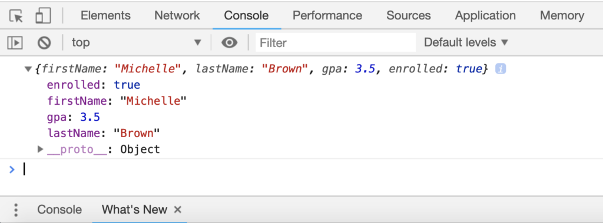

The last couple of lessons focused on arrays, and hopefully by now you will have come to see the value of using them in your code. Objects expand on the concept of arrays, except for a few differences, which provide greater control of the data stored. It is said, in Javascript, "Almost everything is objects". Dates are always objects, Arrays are always objects, functions are always objects, and regular expressions are always objects. Primitive data types such as Numbers, Boolean and Strings are also objects when defined with the new keyword.

Objects are building blocks of modern javascript. Primitive data types can only store one value, whereas multiple values with different data types can be stored in objects. Moreover, methods can also be stored in objects. Simply, javascript objects are unordered collections or related data. Data in javascript objects are always stored in key-value pairs. Instead of using an index number to reference a value, we can use a name (referred to as a key), which gives us more flexibility on how we organize and categorize our data. Building on the student example in the Arrays lesson, let's take a look at how an object could be used to define a student using key value pairs.

## **→ Try it out**

Create two files called **index.html** and **script.js** and enter the code below into each.

<script src="https://gist.github.com/icarnaghan/fd6d75786fb66ed4c54ebf6f764911e7.js?file=index.html"></script>

<script src="https://gist.github.com/icarnaghan/38cfa855c65f910437d33c36f29d0e70.js"></script>

Here we are defining a new object via the object literal syntax. An object literal is simply a comma-separated list of key value pairs wrapped in curly braces. Each key is separated from the value by a colon. Multiple entries are separated by commas. Let's see what this looks like in the console

> _To see the results: open index.html in your browser and open the console, Press Ctrl+Shift+J (Windows / Linux) or Cmd+Opt+J (Mac)._



As you can see the object is represented above contains all of the key value pairs we defined in the code. Let's take a look at some more examples below.

## Object properties

Properties are nothing but key-value pairs. Property has two parts:

1\. **key**: It is a string that defines what will be stored.

2\. **value**: It can be anything such as String, Number, Boolean, or even a method.

Observe the following variable.

```javascript
var employee = "Walter White"
```

The variable employee has a string value of "Walter White". This is a simple variable with only one value. It does not define much about Walter White, just his name. A javascript object can be useful here to reflect more about this employee.

```javascript
var employee = {
    name: "Walter White",
    age: 50,
    location: "Abiquiu, New Mexico"
}
```

Now, we have an object i.e. employee. Observe it. Doesn't it reflect more information than the variable we created earlier? Of course, it does. Let's understand what is actually happening here.

- First, to create an object, we have to use curly brackets.
- There are three key-value pairs and each of them is separated by a comma. The name and location keys have a string value while the age has a number.

### Accessing properties

We have an object with three properties, let's see how can we access them. There are three different syntaxes to access the properties of an object.

1\. **objectname.property**

For example:

```javascript
employee.name // This will print - "Walter White"
employee.age // This will print - 21
```

2\. **objectname\["property"\]**

For example:

```javascript
employee["name"] // This will print - "Walter White"
employee.["age"] // This will print - 21
```

3\. **objectname\[expression\]**

For example:

```javascript
var exp1 = "name";
var exp2 = "age";
employee[exp1] // This will print - "Walter White"
employee[exp2] // This will print - 21
```

### Adding new properties

```javascript
var employee = {
    name: "Walter White",
    age: 50,
    location: "Abiquiu, New Mexico"
}
```

This is the object we created earlier. It has three properties right now but javascript objects are not limited to this only. We can also add new properties to an object. Let's see how can we do this.

```javascript
employee.salary = 50000
```

And we added a new property - salary, in the employee object. It is this simple. A property will be added, if it doesn't already exist. If it does exist, the value will be updated.

### Deleting properties

To delete a property, use the delete keyword. For example, if we want to delete the location property, we can use the following syntax.

```javascript
delete employee.location
```

## Object methods

Earlier, I mentioned we can also have methods as the value of a key. Let's create an object containing an object method.

```javascript
var employee = {
    name: "Walter White",
    age: 50,
    location: "Abiquiu, New Mexico"
    info: function(){
        return "Name is: " + this.name + " and location is: " + this.location
    }
}
```

Observe the info property. As a value, we have assigned a method. Inside the function body, we are returning a string that uses two properties of the employee object itself. But check the syntax. This is not how we access properties, right? We use the name of the object before the dot, but here we used "this" keyword. Inside an object, we cannot use the object name, we have to use "this" keyword. The "this" keyword refers to the owner of the function, i.e. employee.

### Accessing object methods

We cannot access the object methods like we access a normal property.

```javascript
employee.info
```

This will return the function definition. The correct syntax is:

```javascript
employee.info()
```

### Adding new object methods

Like we added new properties to an object, we can also add new object methods to an object using the same way.

```javascript
var getAge = function() {
    return "Age of " + this.name  + " is: " + this.age
}
```

Remember, again we have to use "this" keyword.

## Object constructors

Earlier, we created a single object. What if we need more than one object of the same type? We use constructors in such cases. For example, we can have multiple employees with same properties. For this, we can create an object constructor function and then its objects can be created. Let's try.

```javascript
function employee(name, age, location){
    this.name = name;
    this.age = age;
    this.location = location;
}
```

This is a constructor. We passed all the values as parameters here. Again, we used the "this" keyword

Let's create multiple objects.

```javascript
var emp1 = new employee("Walter White", 50, "Abiquiu")
var emp2 = new employee("Jesse Pinkman", 27, "Abiquiu")
```

And like this, we can create as much as objects we want using the new keyword and constructor function.

## Object prototypes

We learned how to create javascript objects. All the properties and methods are inherited by javascript objects from a prototype. Earlier, we discussed how to add new properties to an object. But we cannot add properties to an object constructor in the same way. We need a prototype for this.

Let's add a new property to the following object constructor.

```javascript
function employee(name, age, location){
    this.name = name;
    this.age = age;
    this.location = location;
}
```

```javascript
employee.prototype.employeeId = 1001
```

This is how we add properties to an object constructor. Similarly, we can also add methods using the prototype.

```javascript
employee.prototype.getAge  =  function() {
    return "Age of " + this.name  + " is: " + this.age
}
```

As mentioned earlier, "Almost everything is objects in javascript". You may have got an idea of this by going through this article.
