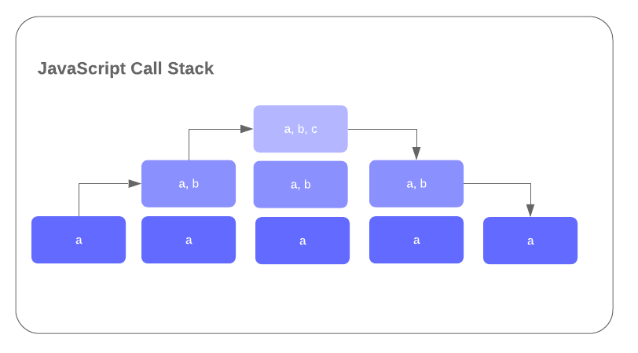

Scope determines what variables or bindings are available to JavaScript within its current context. For example, if a variable is defined outside of any functions within your code (often referred to as the main call stack), these variables are available to all other code embedded within other blocks and functions. Variables defined in main are often referred to as 'Global Variables' because they are globally available throughout your application. But what about those variables that are defined within functions?

## Lexical Scope

The term Lexical Scope is used to define how binding visibility is implemented within JavaScript. **If a variable is defined within a function, it will only be available to that function and any other blocks or functions defined within it.** Let's go back to our call stack example from the last lesson, make some changes to the way we structured the functions. In addition, we will define some variables.

```javascript

let a = 1;
console.log(a);

function first() { // function defined within main call stack and has access to a and local variables
  let b = 2;
  console.log(a,b);
  
  function second() { // function defined within first and has access to a and b and any local variables
    let c = 3;
    console.log(a,b,c);
  }
  second()
}

first()
```

In the above example we are defining variable a within our main call stack, which in turn becomes a global variable. This means a will be available within both first and second functions. In the first function we are defining a second variable called b with a value of 2. Because a was defined in the main call stack, it is also available to first, therefore the console.log will yield the results of both a and b. At this stage we define a function called second within first, which now has access to both a and b. In addition we define a third variable c and are able to view the results of all three once second is called from within first. Let's look back at the call stack diagram and see how these variables are available within the different stages.

> A major change we made from the last lesson was to embed _second_ within _first_, instead defining it within the main call stack and invoking it within first. If second was defined within the main call stack, it would not have access to b.



As you can see from above, a will always be available within the main scope and any other blocks or functions (first and second) defined within it. The first function therefore has access to a and b and the second function has access to a, b, and c.

## var, let and const

When defining variables, you have three main choices, var, let and const. Let's take a look at these more closely. First of all const (which stands for constant) is a special type of variable that contains an immutable value. In other words, a value defined in a const variable cannot be reassigned or changed once it has been initialized. Take the following variable definition:

```javascript
const homeCity = "New York"; homeCity = "Washington DC";
```

The code above would result in the following exception error: Uncaught TypeError: Assignment to constant variable.  
at <anonymous>:1:10. The reason JavaScript would throw this error is because the second line of the code above is attempting to change a value that has been set as a constant and therefore cannot change.

Up until now, we have used the **let** keyword to define a new variable. JavaScript also allows the use of the **var** keyword, which was more commonly used before the introduction of ES6. The var keyword works in a similar manner to **let** with a few subtle but important differences:

- let (and const) will define a new binding within their local scope or block. In other words if you create a new block such as a conditional statement (wrapped in curly braces), the variable will only be available within that block.
- In contrast to this, var will only have a new scope if a new function is created. In other blocks, var is visible throughout the entire function or global scope.

To understand this better, take a look at the following example.

```javascript
function letFunction() {
    if(true) { // will always return true for example
        var a = 1;
        let b = 2;
    }
    console.log(a); // will return 1
    console.log(b); // exception error, b is not available in this context
}

letFunction()
```

Prior to ES6, functions were the only way to create new scope. With the introduction of let and const. this can be achieved within new blocks inside the main call stack or any subsequent functions. You should now have a better understanding of scope within JavaScript. For the remainder of these lessons, we will be using let and const only. You may still use var in your code, however I prefer to use the newer const and let whenever possible.
