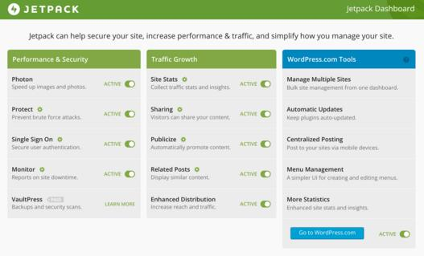
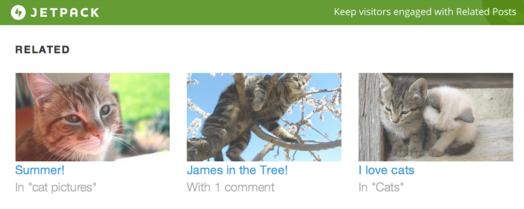

Jetpack, one of an essential WordPress plugin now allows you to generate a sitemap to google search as well as google news. This new feature has been added to the latest version (v 3.9) of Jetpack

A sitemap is an important element of a website (no matter what its niche is). It makes the search engine aware of the latest posts on your site. When Sitemap is submitted to Google, Yandex or Bing, your posts will be indexed faster.

The first thing that a webmaster should do after launching a WordPress site is to install a sitemap functionality. Yoast and AIOSEO, the 2 of the most popular WordPress SEO Plugins includes a module to generate it. If you're not using either of them, then JetPack gives you the option to get rid of standalone sitemap plugins for WordPress. You can activate this module from the settings page of Jetpack

Apart from the sitemap feature, JetPack 3.9 includes a lot of enhancements. It has a powerful social menu utility that lets you use genericons for displaying links to social networks like Facebook, Google Plus, and others.

This plugin now supports custom text message in its Contact Form module. Thus it's now possible to display a message like "You must not leave fields blank" instead of a single word.

If you're using the WordPress multisite feature, Jetpack 3.9 allows you to hide the archived websites.

If your site is using HTTPS protocol instead of HTTP, then the Photon image content delivery network module will be enabled when you activate Jetpack plugin. Photon now handles the responsive images better than ever.

Skype is one of the most widely used social network platforms. Jetpack now allows users to add a skype sharing button. Unfortunately, it doesn't have a button to share the blog posts on WhatsApp messenger app yet.

JetPack 3.9 lets you change the width of the Facebook like page widget. Videos added to the blog posts will be resized automatically to support different screen sizes and resolution.

Download the latest version of the Free JetPack plugin.

Other important features of Jetpack WordPress plugin:

- Supports adding of related posts with thumbnails.
- Single sign-on function.
- Brute force protection for preventing hacking attempts.
- Blog posts statistics (alternative to Google Analytics dashboard).
