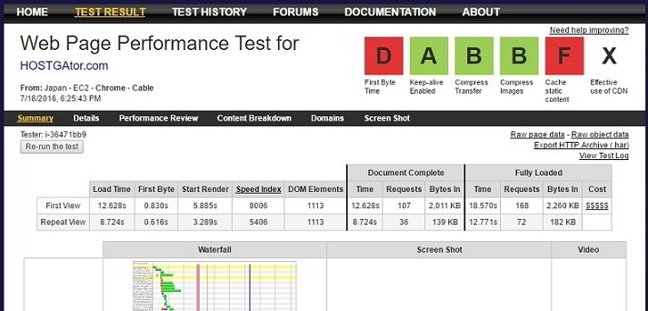
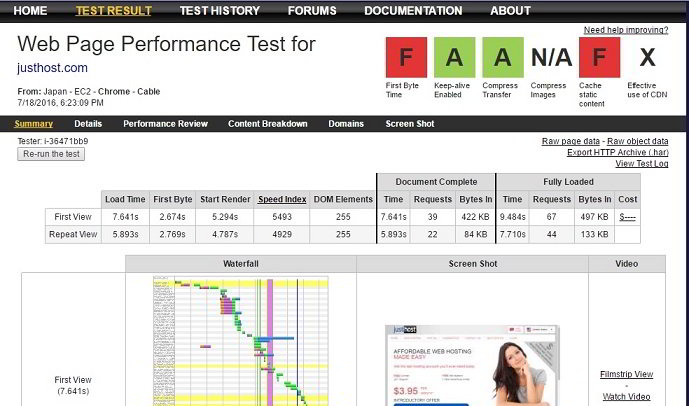

Many people shortlist Hostgator and Justhost for their new WordPress blog or website. But they are unsure about the hosting company they should signup for. For such people, today we have shared a detailed comparison of Justhost and Hostgator.

Endurance International Group owns Hostgator as well Justhost. The two shared hosting providers might be owned by the same company, but the infrastructure and services offered by HG & JH are different. Check the below comparison to understand the difference between the features and services offered by the two organisations.

### Customer Support:

Justhost and Hostgator customers can get support in the below three ways:

Both Justhost and Hostgator allows users to communicate with the support staff online in real time with the live chat module.

If your website's performance is not up to the mark, contact the technical support team to get help on the issue. The TSE will fix the problem if the issue is server related. If the WP theme or plugin is making your site slow, you will have to seek help from the developers. Live Chat is the best way to get support.

Phone and Ticket are the other two methods through which you can seek help from JustHost or Hostgator staff. Avoid using the phone support if you're not fluent in English. You should not waste your time using the ticket based support.

### Free stuff

Justhost provides customers a free domain name worth $15.93 when they register a new account. There is no such offer available for the Hostgator users.

HG and JH offer free Google AdWords credits. They also give the customer an access to one-click WP, Joomla installers, and Weebly. With Weebly, the users can launch a new site within few minutes. It offers over 1000 free templates to choose from.

### Hosting Plans

HostGator provides three Hosting plans - Hatchling, Baby, and Business. Its competitor has Justhost offers four plans -Basic, Starter, Plus, and Pro.

The three plans from HG offer unlimited storage, one-click installer tools, and unlimited bandwidth.

| **Monthly Pricing** | **Plan Name** | **No of domains** | **Bandwidth** |
| :-- | :-- | :-- | :-- |
| $3.95 | Hatchling | 1 | Unmetered |
| 5.95 USD | Baby | Unlimited | Unlimited |
| $5.95 | Business | No limit | Unmetered |

**Buy Shared hosting from Hostgator with a huge discount.**

Only the Pro plan from Justhost offer support unlimited data storage.

| **Subscription cost** | **Plan Name** | **No of domains** | **Bandwidth** |
| :-- | :-- | :-- | :-- |
| 7.99 to 9.99 | Basic | 1 | 5OGB |
| 5.99 to 7.99 USD | Starter | 1 | 150GB |
| 10.99 to 14.99 | Plus | 10 | 150GB |
| 23.99 to 29.99 | Pro | UL | UL |

**Grab the Justhost Pro plan for just 3.95 USD.**

Both the companies have a money back guarantee policy through which you can reclaim your money if you are not satisfied with the service.

When you signup with any one of these hosts, you'll have an access to CPanel for managing your website. The control panel offered by JH has the same design as the CPanel provided by Bluehost.

### Performance

Hostgator shared hosting servers are equipped with E5 Intel processors. It has data centers in the United States.

Justhost claims that its machines are using a quad-core processor, and they have a generator that supplies power during the power failure. The company has not mentioned the location of its DC.

I tested the performance of the homepage of Justhost and Hostgator. The test location is Japan. The connection type is T1 and browser is chrome. Below is the performance report for the same.

**Hostgator speed test**:

**Justhost speed test:**

As you can see in the picture I've shared above, the TTFB of Hostgator's website is less than 1 second. Justhost website's time to first byte value is significantly higher. This proves that the network infrastructure and servers at Hostgator data center are excellent.

### Uptime

Website uptime is the most important factor to consider before buying a hosting plan. Having used Hostgator before for 6 to 7 months, I can say that the uptime offered by HG is excellent. My site was accessible all the time.

JustHost on another hand has plenty of mixed reviews.

### Which is the better hosting among HostGator and JustHost?

The answer is Hostgator if you're looking for a reliable company. The hosting plans are same as that of JH, but the network infrastructure and the servers are much better. Your site's performance will be superb on HG shared hosting platform.

**Click here to check the latest plans and discounts** Hostgator is offering for new customers.

If you are launching your first blog or if you want to move your websites to a cheap hosting platform, Justhost is a good option to consider. **Signup for JustHost here with a big discount**.
