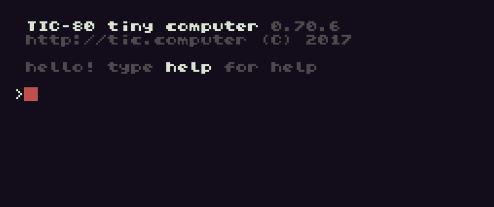

If you're 40 years old or older, you might have learned how to use a computer on an old Commodore 64, Apple II or another computer about the same age. One of the things you probably learned about was the BASIC programming language. Maybe you were lucky enough to have a computer at home. One thing you probably learned was that if you wanted to play games, one way was to buy computer magazines at the bookstore and type in published source code. If you're like some people, you learned a few things about programming from typing in those games, and went on to write your own. 

Fast forward to today. Modern kids  have access to all sorts of high technology. However, take a look at the typical mobile device; they're made more for watching and consumer consumption than for learning how technology works. Read a tutorial on how to write an app for an iPhone or an Android device. For many, it can be daunting even if you know something about programming. Seasoned computer professionals report that younger people are coming into the workplace with little to no computer skills. 

> Look at the popularity of Minecraft in gaming and education. It has a look that's inspired by old games and buy Lego, and nowadays can be scripted in languages like Lua. 

It's because of the complexity of modern programming, modern devices, the proliferation of devices that are made to be media consumption devices instead of Home computers, and the difficulty in teaching younger people how technology works rather than just having them use the technology, and a nostalgia for the old days, that has led to the rise of fantasy consoles. These are similar to emulators, programs that let you run old games or old computer programs, with a major difference being that they're simply based on a artificial set of constraints. There are several fantasy computers in fantasy consoles out now, but I want to concentrate on one called TIC-80. 

  
TIC-80 was inspired by a fantasy console called PICO-8. TIC-80 is an open source console/computer released under the MIT license.  The console has a 240 X 136 pixel display with a 16 color palette, 256 8 by 8 color sprites, 4-channel sound, and a 64K limit on programs. The downloadable binaries on the website only allow you to use the built-in text editor to write programs; however, there is a pro version available for $15, or you can build the pro version from source. I highly suggest that if you feel passionately about this project, that you go ahead and buy the pro version to support future development.

Some fantasy consoles are based on a particular type of hardware, whether a real historical set of hardware, or one invented for the console. Other fantasy consoles are like this one, where a set of constraints are put on the software, but have the full power of the Lua programming language behind it. To aid in writing software, the console comes not just with a text editor, but also a sprite editor, sound effect editor, and a map editor.  In other words, it comes with all the tools you need to make a retro game. If this isn't realistic enough for you, the software allows you to toggle a graphical mode that looks like it's running on a CRT. By default, the console saves all of your data to what it terms a cartridge, which is a binary file in the file system that stores your code and and other assets for the game. Once completed, you can share your completed game with the rest of the TIC-80 community, which seems to be fairly active. 

> If writing in plain Lua isn't your cup of tea, TIC-80 also supports other languages including MoonScript (inspired by Python); JavaScript; Fennel (Lisp-like syntax), and Wren, a Smalltalk-style language. 

Since the console has access to the full set of Lua commands, anything that you've learned about Lua should work. In addition to this, there's a fairly complete API of function calls to access sound, graphics, and anything else you need to be able to write a game.  There are several tutorials available to teach kids the Lua programming language. If they've already learned to script Minecraft, though, learning to program for the TIC-80 should be a snap. If they don't have access to their own computer, in addition to running on Windows, Mac, and Linux, the console runs on Android, iOS, and even in the browser.  The Android version can even be loaded on to Android devices such as the Fire tablet; add a Bluetooth keyboard, and you have an inexpensive retro computer.

To get started with the TIC-80, visit their website here. Documentation can be found on the TIC-80 Github page. Feel free to share your experience with TIC-80 in the comments area below. I'm just starting to get into this project and would be interested to hear what others have to say about it.
