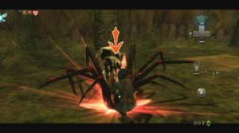
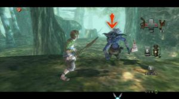
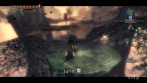

This unparalleled quest, you will be able to live in two different ways, depending on whether you opt for the Wii or the GameCube version. If their content is identical, the gaming experiences they provide vary widely, given the considerable changes made to gameplay by the Wii version, and it goes without saying that it necessarily benefits of an additional attraction in terms of discovery. Nevertheless it was legitimate to have some reservations and doubts about the effectiveness of its grip bold and unprecedented for a title of this magnitude. But to be among the first to have questioned the relevance of the outcome, let me dispel any fears you may have about this. Not only is the unique gameplay on the Wii version significantly renews the feeling of the game, but it is also intuitive enough to be forgotten in a few hours, the difficulties of taking control that inevitably occur when the familiar first time with a console of a new kind. Thus, cross swords through the Wiimote is going to become second nature, like each of the actions you'll be asked to and you will see how fun that can be feel when engaged in a video game depends on the immersion.

A very difficult to assess due to lack of reference in the sense that it is unclear how far can the Wii. But even if the achievement is only the level of a GameCube, the general aesthetic is enough to make us forget the few technical weaknesses. In a brazen diversity, the software builds on the best references (Okami, Shadow of the Colossus, Princess Mononoke, The Lord of the Rings, etc..) For a result which leaves dreamer. Twilight Princess was able to both fully anchored in the world of Zelda in the recipe for magnifying Ocarina of Time, while complementing the traditional phases of other much more unexpected. The best example is the evolution in the realm of the shadow through the wolves totally renewing experience of the game. If ownership requires a certain adaptation time on Wii, it greatly enhances the immersion and does not progress.

 We were promised dungeons larger and richer, but we did not expect that they are almost overshadowed by the cult scenes which I prefer not to reveal. The hours pass a speed that does not break his attention at any time. If we add the fulfillment of countless quests, life explodes easily sixty hours, according to my estimates. Not as significant as expected, the music is a little discreet despite some grandiose themes. We discover a large number of tunes, all remixed, which should delight connoisseurs. As for Foley, they enrich the atmosphere, the best example being the Midon’s interventions that disturbs by its sly jibes and incessant yawns

To simplify the story without revealing anything important, be aware that the quest is to restore the light in different parts of Hyrule enveloped by darkness. It is very brief, but I prefer to leave you a surprise, knowing that the adventure reserve an incredible number of unusual encounters and memorable scenes.

Ignoring all the pressure weighing on his shoulders, The Legend of Zelda: Twilight Princess is indeed the culmination of the saga and will have no difficulty in gaining consensus among the players. Admit that these arguments do not weigh heavily in comparison with the memorable quest that awaits you, so you know if you want to participate or not. At once poetic, dreamlike, violent and wild, this masterpiece has everything you could dream and become the undisputed spearhead of the Wii.
