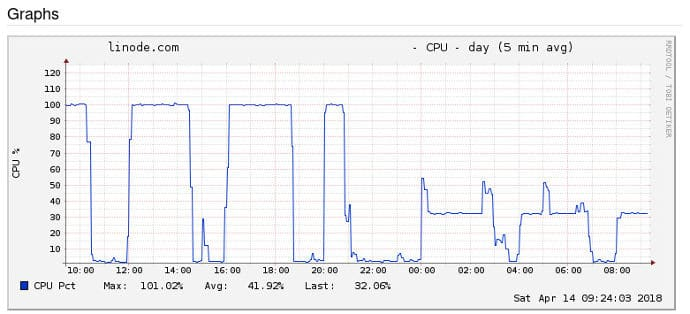

Most hosting companies have introduced 2+ plans. The price of the hosting depends on the hardware and software the company is offering the customer. A plan that offers a low amount of RAM or a single core processor will be less expensive as compared to a plan that provides heaps of system memory and CPU.

No matter what plan you use, you must always keep an eye on the server CPU usage. If you don't do so, a user process may use up to 90 - 100% CPU and other applications/system processes won't be able to execute their tasks.

You can hire staff to do the job of monitoring server resource usage. The staff will manually run linux commands every 5 to 10 minutes to make sure that everything is OK on the server. If you don't want to go on a hiring spree, use one of the below two applications to keep an eye on the CPU usage.

### CPU limit

CPU Limit is an open source program that accepts two arguments, limit, and the name of the program/commands that you must enter to run a program. The limit can be a value within 0 to 100.

Example: `cpulimit -l 10 -- java -jar xyz.jar`

XYZ is the name of the jar file. The limit of 10 ensures that the CPU usage won't exceed 10%.

Also read: Best WordPress hosting companies

#### Does this tool work?

Cpulimit works live a charm. I'm using it on my production server to control the CPU usage of an executable jar file. The below screenshot indicates that the process created by the jar file consumed up to 100% CPU for several minutes. When I began using Cpulimit, the processor usage was restricted to just 30 to 40% (-l 30)

Although CPUlimit is a free and open-source utility, it doesn't come pre-installed on all Linux distros. If you see the error "CPUlimit command not found" while trying to run this utility, then install this tool manually by entering one of the below two commands in the terminal/console.

`apt-get install cpulimit`

`yum install cpulimit`

### Nice

One more effective way of reducing the processor usage is by lowering the priority of the process by using the "nice" command. With nice, you can assign a process priorities between -20 and 19. 19 is the lowest priority and 20 is the highest.

Example: nice -n 19 java -jar xyz.jar

n in the above line indicates the nice value.

In my perspective, nice is not as effective as Cpulimit in controlling the CPU usage of Java applications. I've not tested it with other languages. As nice is a built-in tool, you should first give it a try before installing Cpulimit.

Also check: Reducing CPU usage in shared hosting
