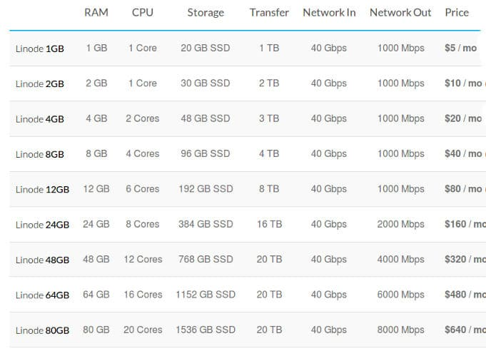
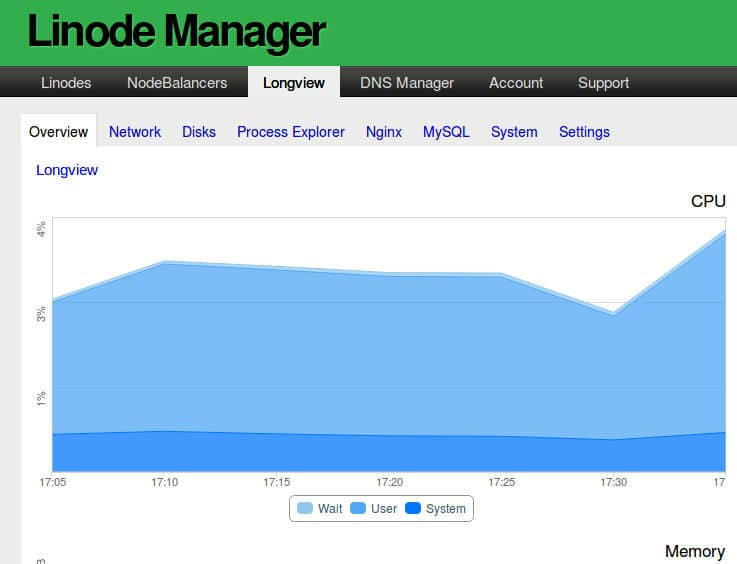

I started my online career with a site hosted on Godaddy. I switched to A Small Orange from Godaddy after finding its plans cheap. After a major DNS incident, I quit ASO and bought shared hosting plan from Hostgator. HG shared plans are great for growing sites.

The traffic to my site grew and I had launched a few more sites. To make sure that HG doesn't ban my sites by high server resource usage, I bought unmanaged Hostgator VPS plan. The VPS had 512 MB RAM. Everything was going great. When I was holidaying at my native place, my sites were down for 8 hours. To find the reason for this, I logged into the server to go through PHP, Nginx, MySQL log, and system log files. The system log file had several "MYSQL server has gone away" entries. This problem occurs when the system doesn't have enough free memory for MySQL.

Although I managed to fix this problem by rebooting the OS, the problem occured every week. This lasted for a few weeks until I decided to quite HG. I didn't want to waste my time in fixing the same error again and again. Although Hostgator enables users to upgrade their plans, HG 1GB RAM VPS plan was expensive. Hence, I decided to buy unmanaged cloud hosting plan from Digital Ocean.

DO provides the same configuration for half the price i.e. $10. Linode suffered a major DDOS attack due to which I was scared to move my sites to Linode.

After a few months of the attack, Linode changed the pricing of its hosting plans. To prevent DDOS attacks, Linode began using CloudFlare network. I found the plans impressive. Thus, I switched to Linode from DO.

I'm using Linode for 4 months. Below is my review of the cloud hosting firm.

## Linode Review

Linode has over 40000 customers. It powers several managed hosting providers and high-traffic news portals. It has affordable plans and a superb infrastructure.

### Data Centers and Servers

Linode data centers are located in North America, Europe, and Asia-Pacific region. It has 4 data centers in the US, 2 in Japan, 1 in Singapore, Frankfurt, and London.

The servers at the data centers are connected to a high-speed 40 GBe network. They have Intel E5 series processors and a high-speed SSD.

Linode has recently introduced block storage feature through which you can increase the storage memory on your server. If your site gets a huge amount of traffic, you can increase the system memory quickly for the smooth functioning of the website.

Linode enables you to set up load balancers for your high-traffic site through its web interface. Once your load balancer is ready, the traffic will be split and handled by other various servers.

Linode lets users install one of following Linux distros on their server:

- Debian, CentOS, Ubuntu.
- Fedora, Gentoo, Arch openSUSE.
- Slackware.

The Linode Manager enables you to configure the swap size and create a new disk on the VPS. It displays the last system shutdown and reboot dates. It features an option to restart or shut down the server.

The Cloud Service provider gives users access to a special feature called Rescue mode. This mode restores your server to a normal state when it has crashed or encountered critical errors.

**Sign up for Linode**

### Linode plans

Linode has launched several plans for customers. The pricing for the same starts at $5. The cheapest plan is ideal for low traffic sites. Higher plans are suitable for larger sites.

**Sign up for Linode**

### Security

As mentioned earlier, Linode nameservers are now protected by the robust CloudFlare network. When a rogue personal is trying to take your site down by a DDOS attack, the nameservers will filter the attack.

Linode supports two-factor authentication. The Linode Manger (web interface) lets you login into the server.

If you are not comfortable in backing up your data in command line mode, you can activate the Linode Backup feature. When you turn on this feature, extra $2.5 will be charged in addition to the monthly hosting charges.

**Sign up for Linode**

### DNS Management

If you're using Linode, you don't have to edit named files to setup nameservers. Linode provides a DNS manager tool through which you can launch new sites quickly. To launch a new website, all you have to do is install Web/DB servers, PHP and configure them as per your requirements.

Once you're done with this, you must open the DNS Manager tool and enter the website domain names.

### Linode Longview

Longview is an application that allows users to get vital details of the server through the Linode Manager. It displays the amount of system memory/storage in use. It shows the list of processes and their CPU + system memory usage. Longview makes you aware of the number of active Nginx and MySQL connections.

Longview application has been developed by Linode. Once you install it, the application runs in the background, collects system data and saves it to the database. The Longview web interface fetches the data from the DB and it displays it.

**Sign up for Linode**

### Support

Linode has a ticket based support system. As you're using an Unmanaged VPS hosting, you should be able to fix software/ package configuration related issues by yourself.

If you're not able to fix a technical problem, you can raise a support ticket and wait for the support staff to get back to you.

**Conclusion**: If you're searching for a cloud hosting service wit superb uptime and nice infrastructure, you should try out Linode. My sites are hosted on the Linode unmanaged VPS. The server uptime is 100%. The performance of my sites is great.
