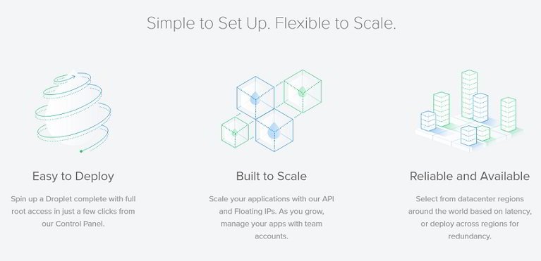
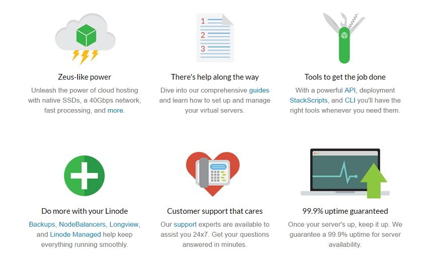

Linode and Digital Ocean cloud VPS providers offer KVM based servers for hosting a website and 40 GbE for high-speed networking. These two companies are growing at a very fast rate giving a cut throat competition to Hostgator, Bluehost, Vultr, and many other VPS providers.

Today, we have compared the features and services offered by Linode and Digital Ocean. In case you're confused in choosing between DO & Linode, go through the paragraphs shared below.

## DigitalOcean vs Linode : Which is the top cloud hosting service?

### Dashboard

Both the cloud hosting companies offer a web-based interface to manage the VPS configuration, billing, security, packages, etc. In Linode, the VPS is called a Linode. VPS in DigitalOcean is called as a droplet. The dashboard lets users set up a VPS wth just a few clicks of the mouse.

### Package deployment

Linode allows you to deploy packages and frameworks on the VPS with a software called StackScripts.

Stackscripts is the once-click installer tool for Linode users. It allows you to install popular frameworks to power your website. Users may have to search for a  package in the community Stackscripts module.

You'll get access to the Stackscripts tool immediately after you create your Linode. Users are allowed to set up their StackScripts. Once the script is published, other users can use it for installing a package.

When your droplet in DigitalOcean is ready, you can install any OS or framework of your choice in 3 or 4 seconds. DigitalOceal displays a list of frameworks that it supports. You must select the framework of your choice for installation. Users don't have to waste time in searching for a package.

\[caption id="attachment\_2583" align="alignnone" width="767"\] DigitalOcean Features:\[/caption\]

### DigitalOcean vs. Linode plans

Linode and DigitalOcean virtual private servers are equipped with powerful SSD. The cloud hosting plans offered by two platforms are almost the same. Here's a table of comparison for the same.

| Cost | Company | RAM | CPU | Disk Space | Bandwidth |
| --- | --- | --- | --- | --- | --- |
| 5 USD | DigitalOcean | 512MB | Single Core | 20GB | 1TB |
| Linode | 1GB | Single Core | 20GB | 1TB |
| 10 USD | DigitalOcean | 1GB | Single Core | 30GB | 2TB |
| Linode | 2GB | Single Core | 30GB | 2TB |
| 20 USD | DigitalOcean | 2GB | 2 Core | 40GB | 3TB |
| Linode | 4GB | 2 Core | 48GB | 3TB |
| 40USD | DigitalOcean | 4GB | Dual Core | 60GB | 4TB |
| Linode | 8GB | 4 Core | 96GB | 4TB |
| 60 USD | DigitalOcean | NA | NA | NA | NA |
| Linode | 16GB | 1 Core | 20GB | 5TB |
| 80 USD | DigitalOcean | 8GB | Quad Core | 80GB | 5TB |
| Linode | 12GB | 6 Core | 192GB | 8TB |
| 160 USD | DigitalOcean | 16GB | Eight Core | 160GB | 6TB |
| Linode | NA | NA | NA | NA |
| 320 USD | DigitalOcean | 32GB | Twelve Core | 320GB | 7TB |
| Linode | NA | NA | NA | NA |

**Click here to sign up for any one of the above plans of DigitalOcean and get free $10 credit**.

**Signup for Linode here**.

### Security

Unlike many other VPS platforms, Linode and DigitalOcean allow users to add two-factor authentication support for their accounts. As websites are the most important element on the Internet, it is an important job for the webmasters to keep it protected from hackers.

The 2F authentication will prevent unauthorized access to the VPS control panel i.e. the DigitalOcean and Linode dashboard.

### Locations

Linode has data centers in the below seven regions across the globe:

1. Newark in New Jersey.
2. Fremont in California.
3. Atlanta (Georgia).
4. Dallas (Texas).
5. London (Great Britain).
6. Singapore (Asia).
7. Frankfurt (Germany).
8. Tokyo 2 (Japan)
9. Tokyo 2

DigitalOcean hosts its data centers in the below countries/states.

1. San Francisco (United States).
2. Singapore (Asia).
3. Bangalore (India).
4. Toronto (Canada).
5. Frankfurt (Germany).
6. Amsterdam (Netherlands).
7. London (UK).

As you can see above, the two companies have data centers at different Geographic regions. If you're using one of these two services, you can easily migrate your website from one region to another.

### Snapshot

Like DigitalOcean, Linode lets its user take a full system snapshot. In a snapshot, all your files and their locations will be as it is so that the migration from one Linode/DO server to another is a quick and easy task for the user.

### DNS management

When you're using DigitalOcean or Linode, you don't have to edit BIND or HOST files to define nameservers. Both the cloud hosting providers have a tool that automates this task. The user will find this tool in their account's dashboard.

\[caption id="attachment\_2584" align="aligncenter" width="842"\] Linode features\[/caption\]

### Backup

Creating a backup of important files and database is a crucial activity for a webmaster. Unlike shared hosting platforms, users will have to backup their data themselves by typing commands in the terminal. Linode & DigitalOcean offers a special tool for the users who want an automated solution. The tool will backup you data on a regular basis. Its pricing starts at 2.0 USD.

### Load Balancer for high availability

Linode offers NodeBalancers for the high-traffic websites. The NodeBalancers have health monitoring modules to make webmasters aware of site related issues. Users can control the NB with CLI or by the API. Users of Digital Ocean who want to set up a load balancer will have to refer tutorials.

### Insights

With DigitalOcean and Linode, you don't have to log in to the server via terminal or putty to check the memory, CPU and the bandwidth usage of your websites. This information can be accessed from the account's dashboard.

### Support

Both the hosting providers offer ticket based customer support. The support will be limited to unmanaged VPS accounts. They support executives will not help you in troubleshooting a problem in your application or database. So raise a ticket only when you're website is unreachable because off a network outage or server problem.

### CPUs

All DigitalOcean and Linode VPS servers are powered by Intel Xeno E5 series processors. The CPU is powerful and ideal for cloud hosting services.

The big question.

### Who is the winner? DigitalOcean or Linode?

Frankly speaking, it is tough to answer this question. Both the cloud hosting platforms offer similar services. But this doesn't mean that you cannot choose one service between the two.

Identify the country from which most of your website traffic comes from. Then, check which cloud hosting provider has a data center in the country from which most of your visitors come from. If it's Linode, signup with Linode else buy a hosting plan from DigitalOcean.
