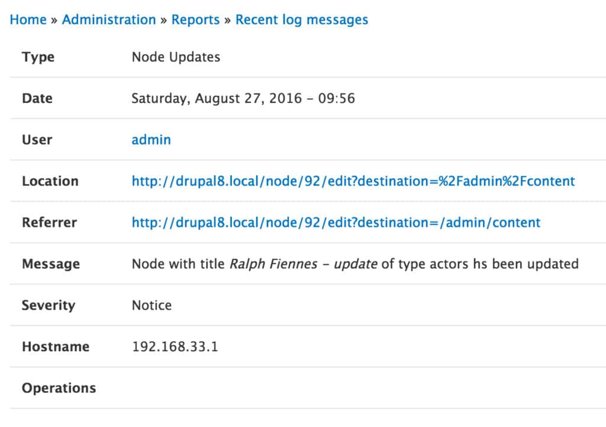

Logging is very important in any production site because we don't have the same ability to debug code that we have in our development environments. Drupal 7 had a very robust logging system called watchdog(), which has been replaced by logger in Drupal 8. This post summarizes a basic use case for logging in Drupal 8 continuing the Drupal 8 Activity Cards series on Day 13.

Amber Matz breaks down logging in Drupal 8 concisely in How to Log Messages in Drupal 8. In her article, she breaks down the code needed to implement logger and provides solid explanations. The examples provided involve procedural coding in the .module file as does the example I provide in this article. If you are writing controllers or forms that extend ControllerBase or FormBase then it would be better to use the service container to inject logger into your code.

## Basic Example of Logging Updates

For a basic example, I created a custom module that simply logged a message any time a node was updated. In order to do this, I first referred to the available hooks in Drupal 8 and soon realized the best way to accomplish this would be through hook\_entity\_update. To get started I issued the command:

```
drupal generate:module
```

I provided the information requested and scaffolded out boilerplate code for a new custom module called Day 13. For more information on generating boilerplate code, see Creating a Custom Content Entity Type.

```
Generated or updated files
  Site path: /var/www/drupal/drupal8
  1 - modules/custom/day13/day13.info.yml
  2 - modules/custom/day13/day13.module
```

After the boilerplate code was generated I edited the .module file and implemented hook\_entity\_update.

```php
function day13_entity_update(Drupal\Core\Entity\EntityInterface $entity) {
    \Drupal::logger('Node Updates')->notice('Node with title %title of type @type hs been updated',
    array(
        '@type' => $entity->bundle(),
        '%title' => $entity->label(),
    ));
}
```

To test, I enabled the new module and made a content update. After reviewing logs I found the new entry generated by the module.



This is just a basic example using procedural code directly in the .module file. A better use of logger would be via the services container as mentioned earlier and instead of using a hook, we could use a event. Some of this I will cover at a later time, but for now this overview provides the basics of getting up and running with the new Drupal 8 logging system.
