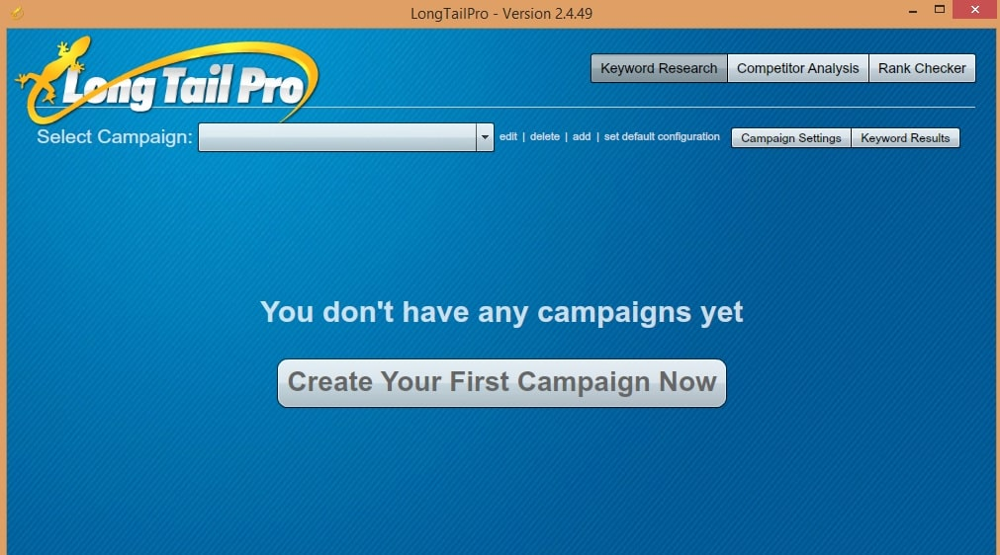

When the user opens a search engine like google or bing? What is the 1st thing he sees? A large text box accompanied with a search button. To find information, the user must enter some data in the textbox. This data in SEO world is known as the keyword. Many bloggers, webmasters, and SEO professionals use keywords to rank their websites in search engines.

Finding the right keywords is not an easy task. You'll have to spend plenty of hours using online tools like Google AdWords, sem rush, etc. Adwords is owned by Google. It is used by online marketing professionals and agencies to advertise products or websites in Google. The advertisers use AdWords to find keywords that a user enters in the search field of the Google. You can use this free tool only if you have a Google account.

One major disadvantage of using AdWords is that you'll be shown a large number of keywords. For an internet marketer, it will be a tedious task to find the most profitable LSI keywords. In such cases, you can use SEM Rush or Long tail pro. SemRush is an excellent tool and a good alternative to AdWords but it's not free. It is widely used for competitor keyword analysis. We've already shared its review (and a link to sign up for its free trial version) through this article. Please go through it if you're interested in using SEM Rush.

Long tail pro Platinum (version 3.0) is an amazing desktop software to find all low, medium and high competition LSI keywords. It has been developed and maintained by a successful professional blogger named spencer hawks. This guy earns 1000s of dollars with his niche websites. Ranking niche content sites is an extremely difficult task. Spencer used Google AdWords planner to find long tail keywords and as he discovered profitable keywords, he constantly updated his blogs with his new findings.

**Sign up for Long Tail Pro $1 trial here** or get 33 percent off on annual plan.

His software is nothing but an automation of his hard work i.e keyword research activity. Long tail pro is a simple application that can make you rich if you use it correctly. Many professional and top bloggers are using LTP. Their success has reached much greater heights. Instead of maintaining a database, this application uses AdWords aAPIto find and display the most profitable keywords. Thus LTP will run on any PC or laptop. If you have used AdWords before, you might be knowing that fact that it displays 1000s of keywords. LTP will remove irrelevant keywords and it will display only LSI ones.

If your blog is not performing well in Google or Bing, update your articles with relevant LSI keywords suggested by Long Tail Pro and add some more words to it. After few weeks or a month, you'll see good improvement in search engine traffic. LTP is a must use software for everyone who owns a blog. If you use it, you'll be able to outrank your competitors in Bing or Google. You can use Long tail pro to find profitable domain names too (in case you plan to launch niche website). This is yet another good reason to purchase Long tail pro software.

**Download LongTail Pro here.**

LTP is an excellent application but it is not free to download. You can buy it for around 100 dollars without applying any coupon/promo code. With Long tail pro discount for July 2016, you can purchase this software for less than $300 (Annual Plan). Monthly Subscription plan will cost you $37. The price is not very high for a useful SEO tool. If you use it smartly, you'll earn 100 dollars a day by simply writing articles containing high CPC low competition keywords.
