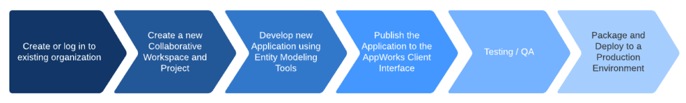
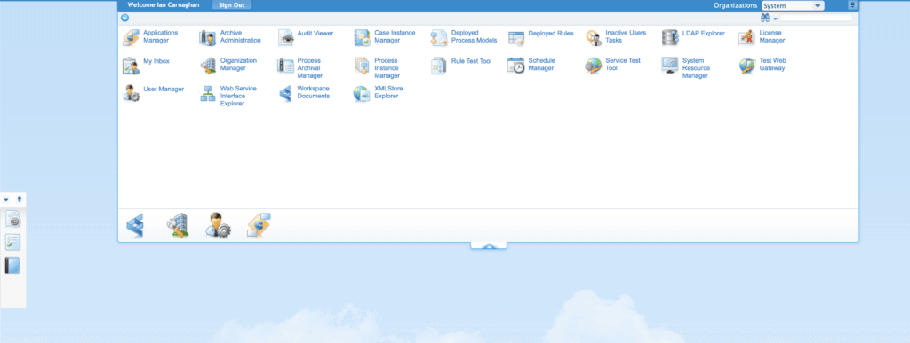
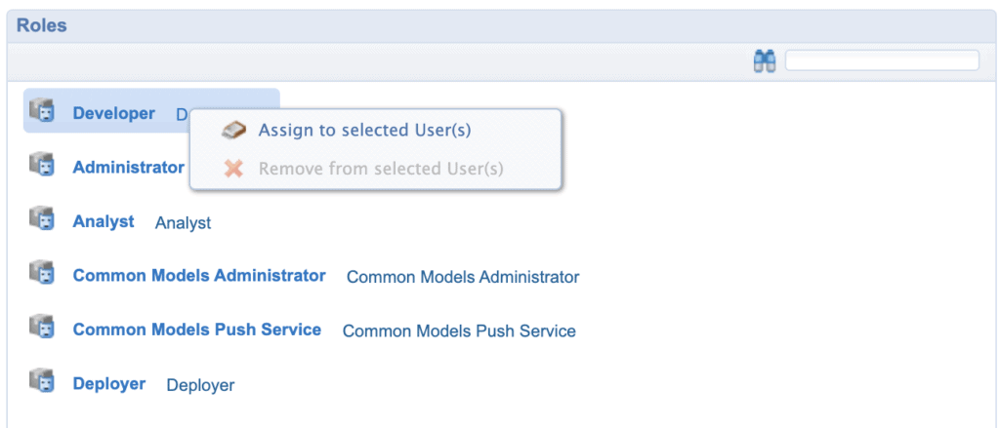
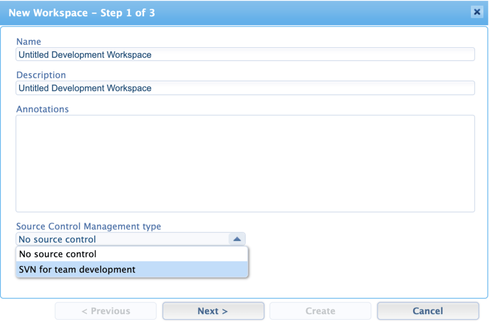

OpenText AppWorks is an application development platform that enables rapid creation of software designed to meet business problems. It's low-code capabilities means that we can involve requirements specialists and business analysts in the development process while working along-side developers implementing more advanced services integrations and business processes. A few months ago I wrote a couple of articles outlining how to install AppWorks locally using Docker as well as setting up a version control system for your applications using SVN. If you are interested in setting up AppWorks as a development environment, I highly recommend checking these out.

AppWorks provides multiple ways to build applications. Generally these are characterized as data\-driven and process-driven. The process driven approach focuses on business use cases and involves development of process models, web services and custom code where applicable. Data\-driven on the other hand (referred to as the Entity Modeling approach to development in AppWorks) gives us the ability to model our applications up front using a range of low-code tools. I'm mostly going to be focusing on the low-code data\-driven approach in these articles and will later cover process-driven development.

<figure>

<figcaption>

AppWorks Low-Code Development Process

</figcaption>

</figure>

AppWorks Low-Code development process can be summarized in six main steps as outlined in the graphic above. In this article I touch on the first two steps and will cover the remaining steps in later posts.

## Getting Started with Organizations and Users

When you first log into AppWorks, you are going to be presented with the OpenText AppWorks Platform Explorer. This is the main area that you will have access to the various tools and features that AppWorks provides. The top right hand corner tells you what 'Organization' you are currently logged into. Organizations in AppWorks provide isolated sub-sections where you can write, collaborate, and deploy applications. Each organization has its own set of users. Roles and permissions can be assigned to users within these organizations. If you are running your own local development environment, you will most likely have logged in using the sysadmin account and will see the System organization below.

<figure>

<figcaption>

OpenText AppWorks Platform Explorer

</figcaption>

</figure>

While this is not mandatory, I highly recommend setting up your own development organization and user, which will keep your development activities separate from your administration environment. This will also give you some practice managing organizations and users.

> Keep in mind, for our purposes we are using the built-in user management and roles tools in AppWorks. OpenText provides a number of options for managing user accounts including the OpenText Directory Services (OTDS).

Your organization where you work may already have setup Active Directory Single Sign on accounts and if this is the case you do not need to follow along here. These instructions are only for those of you who have setup your own local development environment.

To get started, you will need to create a new user and organization so you are not logging in with the default sysadmin account and using the System organization. As mentioned above, the System organization provides additional tools to administer the platform which you will not be needing as a developer. I've outlined the steps you need to follow below:

1. Select Organization Manager from the Explorer screen
2. Click the green + symbol to insert a new organization (give it a label such as Sandbox)
3. Select your Sysadmin account (or currently logged in admin account) under Users (From all Organizations) and click add
4. Close Organization Manager.
5. Select Sandbox organization in your drop-down (top right hand corner of Explorer).
6. Once in Sandbox, click User Manager and create a new user (select platform for authentication type) and fill in the fields for user details and password.

Once your user has been created, navigate back to the User Manager. Select 'Show All' if your new user isn't showing in the list. Click the new user you just created and on the right hand side under Roles, right-click on Developer and select 'Assign to selected User(s)'.

<figure>

<figcaption>

User Manager

</figcaption>

</figure>

Now that you have created a developer 'sandbox' organization with a new user, you should be able to log out from your admin account and then log back into AppWorks using your newly created credentials. Once logged back in, verify you are signed into the 'Sandbox' organization you created.

## AppWorks Collaborative Workspace (CWS)

CWD provides you an area within your organization where you and others can collaborate in the same applications or projects. Within the CWS you will create projects and within these projects, directories that will house components of your application including entities, forms, UIs, etc. To get a better idea of how this works, you can create a new CWS by selecting the Workspace Documents icon in Explorer. This should be available to you if your user account has the 'developer' role (see above). Once selected, you will be presented with the 'Organize Workspaces' window, which will let you create or work within existing collaborative workspaces. By clicking on the green + sign (Insert) under Organize Workspaces, you will be presented with a 'New Workspace' window as seen below.

<figure>

<figcaption>

Organize Workspaces - New Worspace

</figcaption>

</figure>

Here you can create your new workspace as well as setup your Source Control Management. See my earlier article Setting up a Local SVN Container for your AppWorks Development Environment if you are developing locally using Docker. Depending on your organization where you work, your system administrator may provide SVN account credentials, which you will need to setup source control. Any projects already in your repository will be automatically imported into your new workspace upon completion of the setup. If you created a new workspace without requiring source control, you'll be prompted to enter project information for your project (application). Inside Workspace Documents you'll now see a 'Projects' folder with your new project (or projects) listed. Here you can start creating directories to house your application components including entities and user interfaces. I'll be covering entity modeling in later articles covering building blocks, properties, and relationships.
