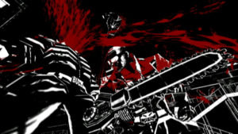
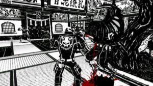

Who would have thought that the family friendly Wii console from Nintendo would host a game for sweet crazy days as steam as MadWorld? Make no mistake about it, with its black and white graphic with only the red color of blood, MadWorld is a work of unprecedented violence and barbarism without a name. But while Manhunt disturbed by realistic context similar to our daily and conventional weapons, MadWorld plays the cards of immoderation outrageously. Chainsaw, sharp barbs, shredded body, nothing will be spared. Disturbing? Strangely no, not at all. Once the Wii controller in hand, we forget the immoral side of the title to focus on our goal.

In MadWorld, you play Jack, a big guy armed with a chainsaw. At the beginning of the game, Jack engages in a kind of a reality show where the goal is to destroy all other competitors. Using a headset, its "sponsor" guides him in various levels as ranging as the streets of a suburb or a neighborhood featuring Chinese folk decorations. At first glance, the game draws and its visual appearance are compared to original image of the comic book Sin City by Frank Miller. Then comes the time where we fall in love with its simple controls. To give a sudden, you press A to catch a guy we keep the same key and we have the opportunity to hit the balls once we firmly stand by shaking the Nunchuk. In this gaming system, there are a lot of different ways to finish an opponent. When your human punching-ball is well bruised, an icon appears on the screen. It is time to press the Z button to initiate a decapitation, a pulling of the heart or any other funny things of that ilk. Thanks to the accelerometer and gyro capture capabilities of the Wiimote, all you have to do is travel in space similar to the actions of the good old Jack.

If it draws the graphics and controls that we delight, we must admit that it is a third point, which gives MadWorld his irresistible side able to convince all the gamers that we are. This mysterious element that literally sticks us on the screen is none less than a good old system of scoring. Popularized by the first video games, and elevated to the shoot'em up cult, the hunt for points is one of the most addictive and basic concepts of the game. In Madworld, killing an opponent earns you 10,000 points. If you knock out, you throw him a couple of balls and send him on a wall with spades, you will get 20,000 points. But this is just the beginning! There is so much to do with your little friends, the levels are full of various objects. A barrel, a tire, signs... All of which will allow you to make your enemies harmless and the time to finish others and your counter points will fly. Combined with fixed elements of the decor as the garbage dumpster lid guillotine or butcher hooks on which you can literally play yoyo with the victim, you can just imagine the scores of madness that will result. And then when you're tired of dragging feet on these points to the wall to the nearest peak, draw your chainsaw with the Z button and steam, stirring up the Wiimote in any direction. They are much sought after all.

By pushing the score to unlock the boss and some fun weapons all over each other (swords, baseball bats with nails, etc...), MadWorld is a video games that will bring more than pleasure.
