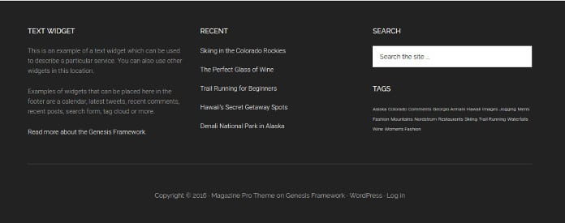

The Magazine Pro Theme from StudioPress is a powerful WP template for news and technology websites. It is based on responsive and minimal design.

The theme lacks lengthy CSS and JS codes and it looks great. It has clean SEO friendly HTML tags. The small assets and search engine friendly nature of the Magazine Pro make it one of the fastest loading WordPress themes.

The M Pro Genesis Child theme comes with valid Schema markups that help search engines identify various elements on your site.

## Magazine Pro Child theme features

**Beautiful Social Icons**: The Genesis MPro template provides beautiful social network icons. The icons have a light gray background which turns black when the user hovers the mouse cursor comes in contact with them. The theme supports the following social media networks:

- Pinterest.
- YouTube.
- Instagram.
- Twitter.
- Facebook.
- Google Plus.

**Featured Image:** The Genesis Magazine Pro theme allows you to add featured images to the blog post.

**Responsive Layout**: The StudioPress Magazine Pro theme renders beautiful on all type of devices. The template has a beautiful design. Hence, user experience across all devices is the same. It is powered by clean HTML5 code.

**Attractive sidebar**: The Genesis Magazine Pro WordPress theme packs several useful widgets to make your site more productive and user-friendly.

Like other popular WP Magazine themes, you can add a recent post widget with a thumbnail, a beautiful newsletter widget with custom next, search box and more.

The width of the sidebar is same as other popular News Magazine themes.

Download the template here.

### Customization

**Homepage**: The M Pro Genesis Child theme's homepage features different widget areas. You have to drag and drop the widgets and configure theme as per your requirements. For instance, you can configure M Pro to show posts from specific category.

**Footer**: The Magazine Pro Genesis theme has a three column footer section where you can add all types of WordPress widgets.

**Header**: The StudioPress template enables users to add primary, custom logo and secondary navigation to the header area of their site.

**Layouts**: The Genesis Magazine Pro WP theme enables you to add a sidebar to the left or right of the post content. The template supports full-width layout. You can configure it to show the right and left sidebars at a time. It supports up to 6 different layouts.

**Color themes**: The WP Magazine Pro Genesis theme supports four color styles i.e. green, orange, red, blue. You can switch to your favorite color template from the settings page.

One thing you should note is the color scheme changes the hover color of the URLs. It doesn't have any effect on the background color of the template

See demo here

**Featured Article**: The Magazine Pro theme allows users to set a featured article for the home page. The featured post can belong to any category. It appears right below the header section.

**Ad sections**: The Genesis Magazine Pro theme lets you place 720 x 90 ad banner to the header of your site. The ad appears to the right side of the website logo.

Like other Magzine themes for WordPress, you can place ad code in a text widget.

The Magazine Pro StudioPress template includes a special after content widget area where you can place a text widget with the ad code or a newsletter subscription form.

### Pros

- Small stylesheets.
- Responsive and fast.
- Beautiful footer area.
- SEO optimized.

Cons:

- None.

Buy Magazine Pro theme here at a great price.

**Note**: The theme supports all plugins StudioPress has introduced on the WordPress Plugin directory. Once you download the M Pro theme, install the Genesis Framework plugins to make your site more powerful. Some features we've mentioned above requires you to install the plugins.
