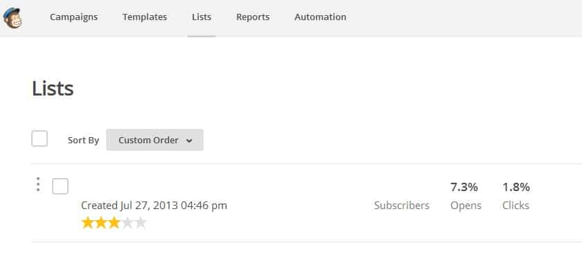
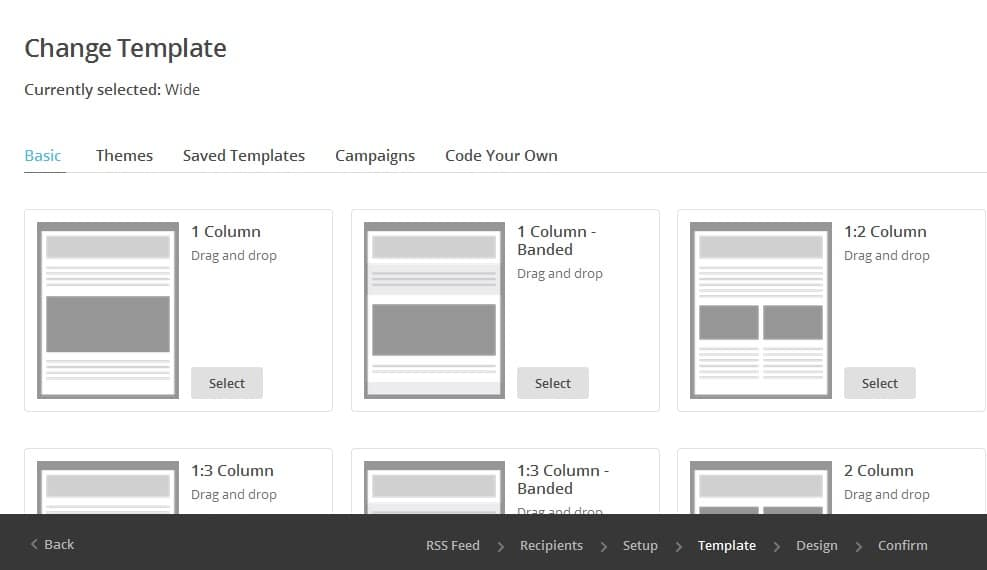
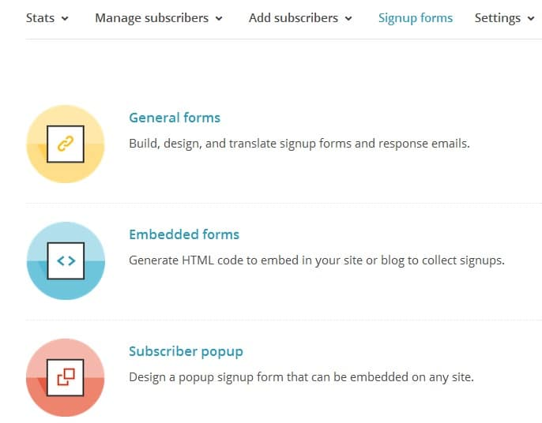

Many bloggers believe that email marketing is the best strategy to have a loyal and regular audience. Thus, you'll find an email opt-in widget on all popular blogs. There are a lot of email subscription service for blogs and in my perspective, Mailchimp tops the list. Mailchimp pricing is attractive, cheap and its features are powerful. The free version of MailChimp service allows you to change newsletter template, design, title. It can generate newsletter automatically from your blogs RSS feed.

Once you have got a MailChimp account, you can create general, popup, embedded newsletter forms without coding. All you've to do is design your form, copy the code and paste it in blogger or WordPress widget. If you have a large fan following on Facebook, you can easily embed MailChimp form into your FB page. Users can get details on subscriber activity. They can get information on which users opened the newsletter email. With this service, you can create a powerful and stylish newsletter campaign within a few minutes. If you want to use the default template/design, this time, will decrease to just 10 to 15 seconds.

Once you've designed the template, you can preview it before sending/scheduling it on just a single mouse click. What I really like about MailChimp is that it makes me aware whenever a new user has subscribed to  my blog's newsletter. It also sends me an email in case a user has cancelled the subscription. Mailchimp users can add or delete email address of the subscriber manually. I have managed to get 500+ subscribers within 6 months. This number could have been better if I had added a MailChimp WordPress widget to my website from day 1 of my blogging career. Anyways, if you want to improve your website subscriber count or if you're looking for a feed blitz, feed press, Aweber, Feedburner alternative, you should signup for MailChimp.

Talking about its Pricing, Mailchimp offers several plans. The free plan is limited to 2000 subscribers and you can send utmost 12000 emails. It doesn't include autoresponder. If you're subscriber count increase above 2K, you'll have to upgrade your MailChimp account by paying 20 dollars per month. Or if you want to send more than 12K emails for better conversion rate and traffic to your site, you should consider upgrading your account. If you have under 1000 newsletter subscribers, you can go for MailChimp's 15 dollar plan.

The competitor of MailChimp is Aweber. Many bloggers will recommend you to use 1 dollar coupon/promo code and signup for Aweber. Once the first month is over, you'll have to have to pay 19$ ( for 500 subscribers) to keep using this email marketing tool. To be honest, if your blog is not generating income or if you're earning not more than 100 to 150 dollars with your site, it is not very feasible to use Aweber. Feedburner is a good alternative to MailChimp. But it lacks many useful marketing tools. Google had stopped Adsense support its only email subscription service. Thus, it is possible that Google might kill Feedburner.
