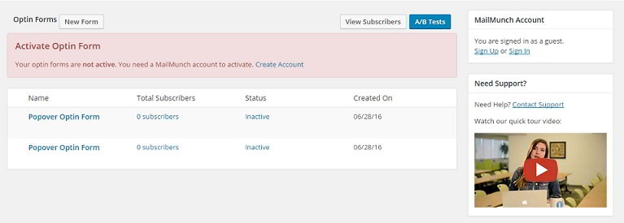
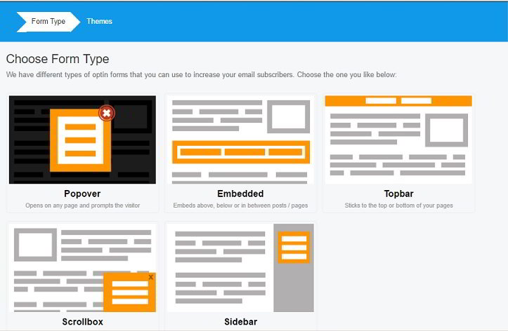
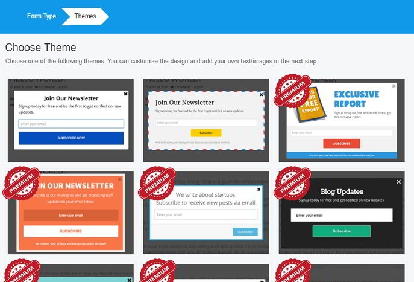
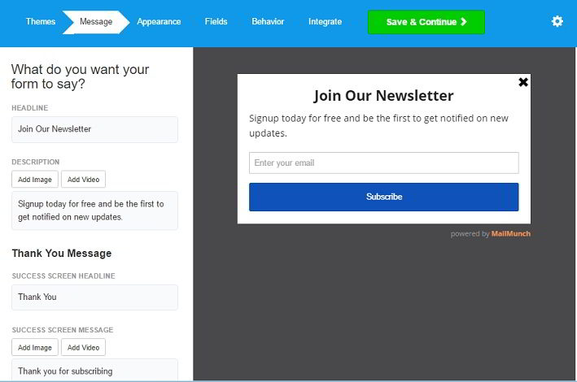
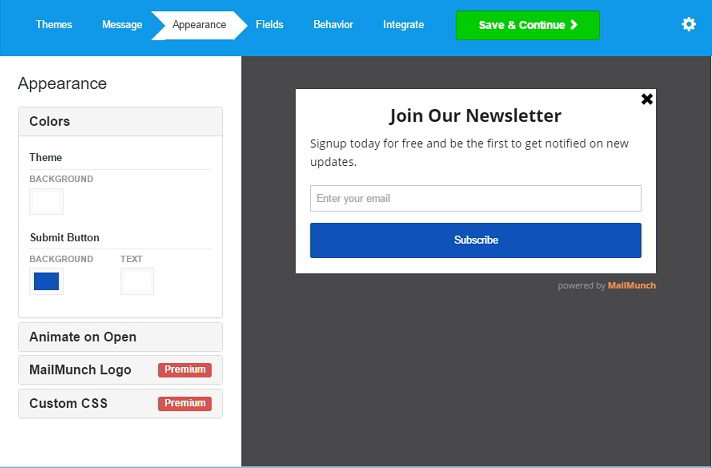
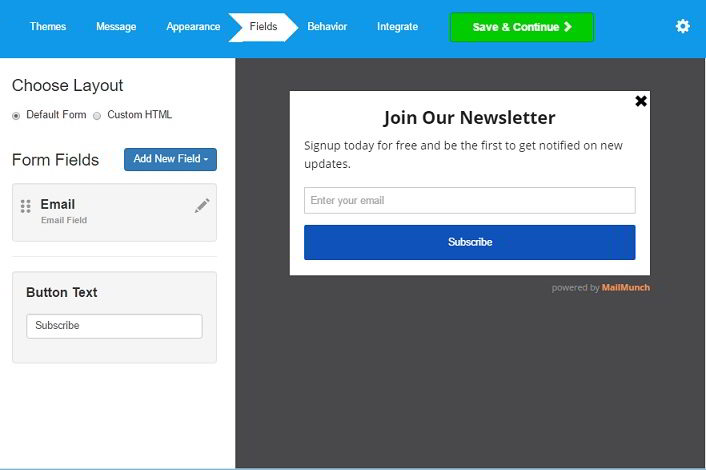
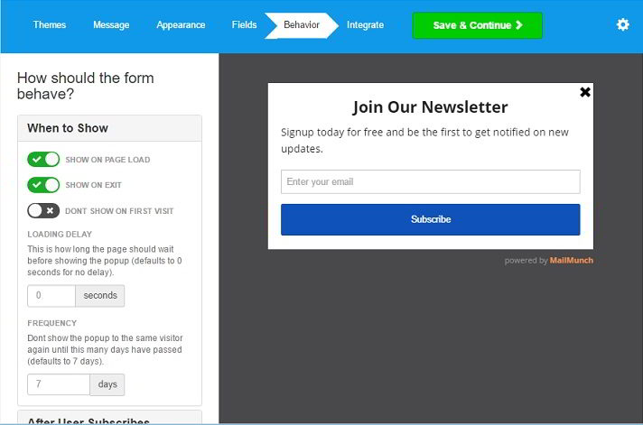
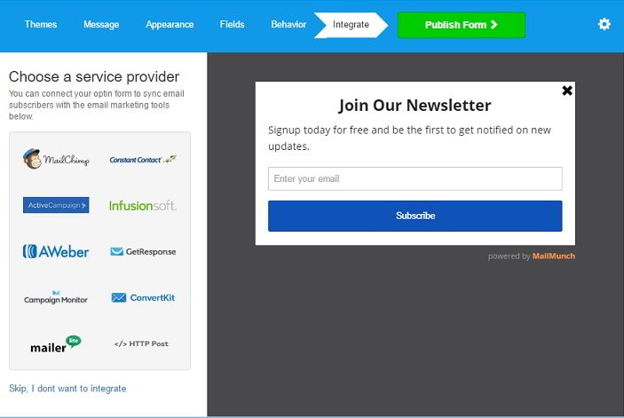

Opt-in forms and Newsletter subscription services are the best tools to get loyal and regular audiences. Once your blog or website has a couple of thousand regular readers, money will keep flowing.

WordPress, without any doubt, is the top CMS. Millions of bloggers use WP to fulfill their dream of running a website or making money from the web. If you use WP and want to add a killer opt-in form to your site for free, then download and install the MailMunch plugin.

## How to use MailMunch?

Once you activate this opt-in plugin, you'll be redirected to its settings page where you'll find a button to create a new form, create the first opt-in form, view subscribers. You'll also find hyperlinks to sign into the MailMuch account or create a new a/c.

Click on the 1st opt-in form button and choose one of the below form types:

- Pop Over.
- Embedded.
- Topbar.
- Scrollbox.
- Sidebar.

Once you've selected your preferred form type, you'll be asked to choose a theme for your opt-in. MailMunch comes with several themes. Out of the several themes, only a couple of them is free.

Note: I've selected the pop-over form.

If you choose a theme, the MailMunch plugin will request you to enter a title for the form. Do what the plugin says and then click on the create form button. Now you'll be able to customize the text content of your Newsletter form. The plugin lets you enter a headline, description, footer note, thank you and success messages. It also allows you to make the opt-in more beautiful by adding pictures or videos.

Once you're done with the customizations, click on the save and continue button. Now comes the most interesting part i.e., color customization. MailMunch plugin allows users to change the default color of the background, text, and the submit button. You can also apply animation effects to the form. MailMunch plugin will display "powered by MailMunch" logo below the opt-in. You cannot get rid of that unless you become a premium user of this plugin.

When you have finished customizing the colors, click the Save button to open the field manager tool which allows you to add new fields to the opt-in form. You're allowed to add hidden, drop-down and new text fields.

After adding the fields, click on Save button. Now you'll be asked to change the default behavior settings of MailMunch plugin or keep the settings intact. In the behavior section, users can configure the plugin to load the pop-up opt-in on page load, when the user clicks on exit button of the browser. You can specify after subscribing action and configure display displays in the MailMunch plugin.

Once the behavior of the plugin has been configured, click Save option and select your email subscription service. If you do so, you'll be requested to connect the service with the Mail Munch. The plugin supports GetResponse, MailChimp, Sendy, Aweber and many other email subscription platforms. Link the two services and click the Finish button. Your form will now appear in the MailMunch plugin's settings page.

Click on the preview link to review your pop-over opt-in.

That's it! Now open your WP website, install MailMunch and follow the instructions mentioned above to add a stylish opt-in form.

Note:  Adding Embedded, Topbar, Scrollbox and Sidebar opt-ins is easy. You might be given a snippet of code which must be added to the header section of the website, the sidebar or on the single.php page.

**Conclusion**: MailMunch is an excellent free plugin to add subscription forms to a website. Its wizard-based interface makes building, customizing, and integrating opt-ins an easy task. OptinMonster and the Bloom plugin are two good alternatives to the premium version of Mail Munch.

\[themify\_button bgcolor="red" link="https://wordpress.org/plugins/mailmunch/" target="\_blank"\]Download MailMunch\[/themify\_button\]
