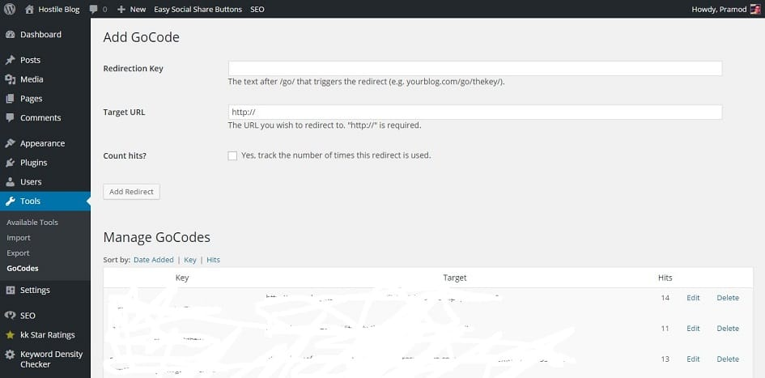

As a blogger, I've to use various strategies to earn money online. I use Google Adsense and many affiliate programs for the same.

You don't have to worry about ads delivered by Google. The entire process is automated and handled to perfection.

Managing affiliate links can be a headache because you've to be careful while using them.

If you link them in your WordPress posts in such a way that Google can crawl them, your blog will be penalized. Matt Cutts (former webspam head at Google) had revealed that Google doesn't like affiliate links. Thus you should make them nofollow.

If you don't want to use nofollow links, the best way to manage affiliate links is to block them with the robots.txt file.

To do this, you should use the free Gocodes plugin.

I've been using this plugin since few months, and I like its features. GoCodes has a settings/configuration page where the user can manage affiliate links easily. Read the below paragraphs to know how you can do the same.

When you install Gocodes, the first thing that you should do is choose a blocking URL name like Go, track, recommend, etc and add it to the robots.txt file.

For example, If I use the track code, I will update robots txt file with Disallow: /track/ line. Now every URL containing the track code will be blocked, and crawlers will have to ignore it. You can use robots.txt tester tool to check the same.

Now go to the Gocodes settings page and enter the redirection key.

For instance, if I want to add Bluehost affiliate link, I'll enter Bluehost so that my robots.txt blocked URL will look like http://example.com/track/Bluehost.

The last step is to check the number of times this redirect is used option. If you do this, this plugin will record the number of occasions the affiliate link has been clicked.

Pretty Link Lite and Thirsty Affiliates are the best Gocode alternatives.  They have many features that you'll not find in Gocodes.

Please make sure that you go through Affiliate terms and conditions because some companies don't allow users to block links or modify them. Don't use the above strategy for eCommerce based affiliate programs, i.e., Amazon Associates, Flipkart, eBay, etc.

**Conclusion**: Managing many affiliate links manually is a tough task. The plugins we've shared above solves this problem. They're lightweight. They'll not affect your blog's performance. Try them out!

Thanks to Diggity Marketing for the image.
