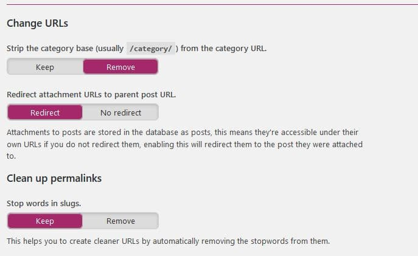
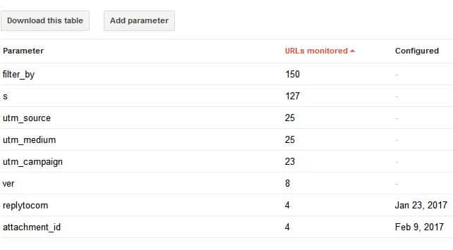

Attachment page is the built-in feature of WordPress. When these pages are not handled correctly by the website owner, Google and other search engines will index them.

WordPress attachments are thin pages that don't add any value to a blog. These pages should be used only on personal or photography blogs wherein you want the visitors to comment on the pictures, videos, and other media files.

WordPress doesn't provide an option to turn off or disable these pages. However, you can use third-party plugins to manage them.

## Managing attachment pages in WordPress

### Plugins

Yoast plugin has a built-in function to redirect attachment pages to their parent posts. This feature should be activated manually by the user. When you enable this function, search engine bots will follow the redirect and index the page that returns 200 HTTP status code.

If you are not using the Yoast plugin, use the attachment pages redirect plugin to get rid of thin image pages (download link).

Must read: Best plugin to fix broken links issue

### GSC (webmaster tools)

Google webmaster tools aka Google search console allows users to configure crawling rules for URL parameters. If you've been using the search console for a while, Google will display each parameter it has come across on your site in the URL parameters page. Look for the "attachment\_id" parameter and click on the edit button. When you do so, you'll see a popup box with a dropdown list. Click on the list and select "Yes, changes, reorders, or narrows page content".

The popup box will expand and display new options. You'll see 4 checkboxes in the popup box. Select the "No URLs" checkbox and click on the save button. Googlebot will now ignore the URLs with "attachment\_id" parameter while crawling your site. If you use this method, the attachment pages will automatically disappear from Google's index. Well, this won't happen overnight. This is because Googlebot crawls 1+ billion pages every month.

**Conclusion**: Attachment pages lack content. Unless your site is an authority one, these pages will hurt its search engine rankings. Use one of the two methods we've shared above and the fix the attachment pages problem on your website.

Also see: Best WordPress plugins
