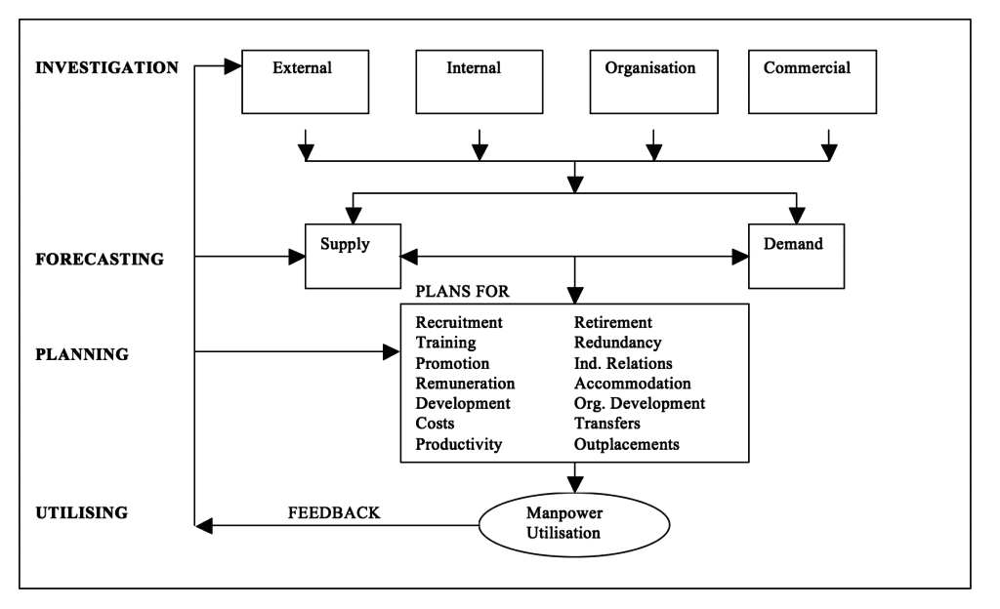
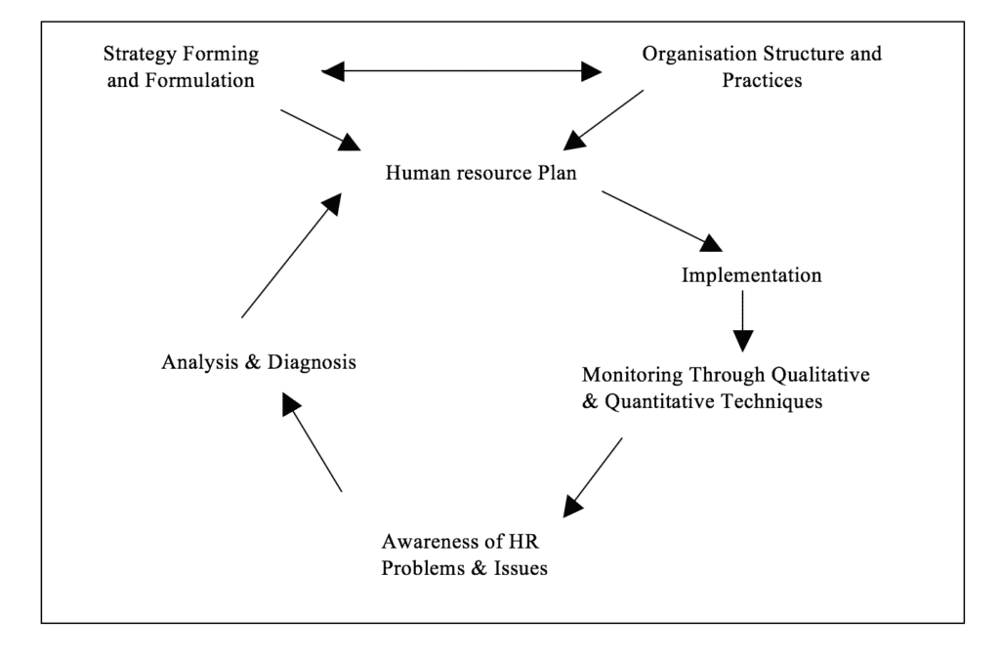

The differences between manpower planning and human resource planning will be outlined within this essay along with how human resource planning has built on and developed traditional manpower planning. The main sources of information to compile this assignment have come mostly from Coleraine and Jordanstown University of Ulster Libraries and the books used and referred to have been listed in the references and bibliography section of this essay.

## MANPOWER PLANNING

The main reason the process of manpower planning came about was to help the management of employees within a business organization.  Manpower planning looks at the organizations current and future need of labour within the business.  The current and future employment needs are a great concern and the examination of supply within the local area for possible new employees if required.

Manpower Planning came about when the cost of employment had rose to a height of concern within the management area.  These rises in cost involved both training and wages.  Because of this it was decided the company would be better off if it arranged it’s manpower resources more effectively saving both on company expenses and time.

The most common areas that arise when dealing with manpower planning are, how many employees the business currently has, age profile by department, where employees are found, largest departments in the organization, employee skills, annual number of employees that leave and which areas loose more employees.  These areas are vitally important for the overall success of the organization.  Without an adequate amount of employees the business would be in serious trouble.  Not only current but also future areas of concern could be highlighted.  For example if a large number of people left the same department at the same time because they all retired this would show that poor manpower planning had been implemented.

### **The Process**

The manpower planning process can be broken down into four main phases.\[1\]

1. investigating – in which an awareness is built up
2. forecasting – when predictions of the future are made
3. planning – policies to meet the future are agree
4. utilizing – success of policies measured

The first stage Investigating deals with the current manpower within the organization.  It looks at all the opportunities and problems with manpower, e.g. what areas could be improved upon to change problem areas into stronger opportunities of the business.  It also looks at the external environment including the labour market, what the current demand for workers within the local community is and how the company could possible use additional labour from the local area.  Productivity and working practices are also looked at in greater depth here looking at possible ways to improve productivity within the working environment by looking at the current situation.  Lastly within the investigation stage the organizations financial and marketing intentions are studied taking into account if the organization has enough manpower to get by or can it afford to employ additional employees if required.

Forecasting is mainly concerned with the demand of manpower.  It looks at the future requirements of the organization and how many employees will be required within different departments of the business.  It also looks at supply that is the provision of manpower, how this is supplied adequately throughout the business.

Planning deals mainly with taking information from the forecasting process and turning it into personnel policies.  These policies would then be used to recruit new employees with plans to train and develop them for the work they will be expected to carry out.  Usually policies will be implemented so that they are related to each other so that employees in different departments will be able to assist each other when required.

Finally, utilization deals with the realization of organizational objectives.  These objectives are usually measured by cost, productivity, customer service, or all three.

Below a diagram has been included to show how these processes make up the main framework for manpower planning \[2\]

To conclude, overall manpower planning is used within organizations with the intent to encourage the personnel manager in considering manpower issues.  From this planning should begin to ensure that the company will have adequate manpower within the different areas of the organization through the use of the processes described above.

## HUMAN RESOURCE PLANNING

Like manpower planning, human resource planning came about to deal with the management of employees within the business.  As discussed later some of the techniques used for manpower planning have been implemented into human resource planning.  Before dealing with how these techniques have been evolved into human resource planning we will firstly look at the differences in these two approaches.

### Differences from Manpower Planning

Human Resource Planning differs from the traditional manpower approach.  One of the main differences is the process and purpose of HRP.  Unlike manpower planning, HRP not only looks at current numbers of employees but also examines each individual of an organization. Human Resource Planning concentrates a lot on making the employee feel happy in their place of work through different motivation techniques.  The idea behind Human Resource Planning is that if the employee is happy in his / her place of work they will put more into their job therefore benefiting the organization in both efficiency and cost.  Human Resource Planning also concentrates largely on staff training believing that the continued development of employees is vital for the future of the company.

As mentioned previously, manpower planning is mainly concerned with forecasting, supply and demand, and matching manpower resources to different areas of the organization.  Although manpower planning differs from human resource planning, some of the techniques have been carried over to help build upon HRP within organizations.

Human resource planning looks at certain areas of the external environment, internal supply and demand and matching the demand and supply.  It is concerned with long term strategic planning of human resources with the increase of skill through training staff and motivation ensuring that the organization gets the best of the human resources.  Human resource planning also deals with forecasting and successful planning.

The food retail company in Northern Ireland, Crazy Prices has implemented human resource management over the over the last number of years.  All staff within the company whether full or part time must be fully trained for each post and reviewed.  Training has become a very important issue for the Crazy Prices group, as they believe they can get the best out of their staff if they fully understand the job at hand.  The company also believes that it is very important that the employee is satisfied with their job and working conditions.  Since Tesco bought over the company, all employees have been involved in meetings letting them know exactly what was happening and offering as much information as possible, as each and every employee was equally important and had every right to know what was going on.

Below is a diagram showing how human resource planning is implemented throughout an organization.

### Cyclical Process

As shown the plans for human resource planning are cyclical and continuous.  This shows that the process is on going throughout the company.  Human resource planning has a less deterministic view of strategy than manpower planning which plans were established with reference to a predetermined strategy over a long term.  The long-term strategy behind human resource planning is more concerned with the skill, quality and cultural change rather than statistical and performance needs of strategy\[3\].

Human resource planning has also built on manpower planning through some of the methods described.  Manpower planning as mentioned earlier has dealt with investigating, forecasting, planning and utilizing.  The manpower approach has been more statistically involved and less involved with the actual employees as people rather than just numbers in certain departments.  Human resource planning also involves the investigation stage whereby the strategy is formed into a human resource plan and a more qualitative view of the people within the organization is looked at in greater depth.  From this HRP is concerned with developing these people that is not looked at as greatly within the manpower planning process.

## CONCLUSION

In recent years more attention has been given to the importance of planning human resources.  The term Human Resource Planning has been used for this process which has taken over from manpower planning.

As outlined within the essay, human resource planning had been developed from the traditional manpower planning process that was first introduced to deal with the demand and supply of labour needs within an organisation.  Human resource planning was formed also to deal with this taking into account the actual people within the business as individuals who needed both motivated and trained for the individual posts.

As time goes on, more organizations still applying manpower planning are realizing that the traditional approach must be replaced through Human Resource Planning in order for the organization to benefit by getting more out of their labour resources.  They are realizing that unless employees are satisfied in their place of work they might not stay in the job or perhaps not put as much in to the job as they might otherwise.

Although Human Resource Planning is definitely the best approach, some firms may argue the point that in spending more money on training etc. they might not benefit and perhaps make a loss.  There is always the possibility that within certain job positions, no matter what the company does to try and help the staff, the employee interest will not be present.  In cases such as this perhaps it might be better to stay with the traditional manpower approach.  An example of this could be a business that has a reputation of a very high staff turnover.  With this in mind it is purely down to the management of each organization as to how they feel the company might benefit.

At the end of the day Human Resource Planning will without doubt benefit most organizations, if applied in the correct way.

## REFERENCES

1. John Braham (1988) Practical Manpower Planning   Inst. Personnel Management, P19
2. John Braham (1988) Practical Manpower Planning Personnel Management, P20
3. Brattan & Gold P122
4. Ian Beardwell & Len Holden (1997) Human Resource Management Contemporary Approach Pitman Pub.
5. Kendrith M. Rowland & Gerald R. Ferris (1982) Personnel Management Allyn & Bacon
6. John Storey (1995) Human resource Management A Critical Text Routledge
7. Derek Torrington & Laura Hall (1987) Personnel Management A New Approach Prentice Hall
8. John Braham (1988) Practical Manpower Planning Personnel Management, P20
