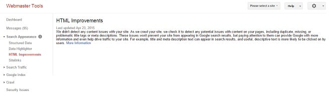
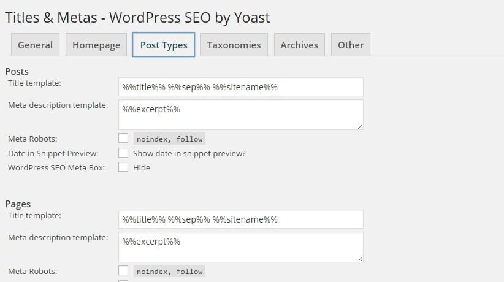

When it comes to blogging and search engine optimization, no other on-page element is as important as title and meta descriptions. According to Google webmaster guidelines, every page on a WordPress blog must have unique meta description and title.

If you don't follow this guideline, your site won't rank well in search engines, and if you've verified your blog with Google Webmaster tools, you'll see duplicate tag warning in HTML improvements section of your GWT account. Meta description is one of the most important on-page elements as it is the first thing that a search engine users see (if your site appears in the search results) when they search for some information. If you've not added relevant keyword and a useful short information in this tag, the user will not visit your blog. Meta description length should not be less or more than 170 characters, and it shouldn't be stuffed with keywords.

## How to automatically generate meta description in WordPress blogs?

Many bloggers fail to make money online and quit blogging because their blogs don't get traffic. Traffic to a site depends on HTML title and meta description tags as Google or Bing users see them. If your website is penalized, your site can get decent visitors if you've 100s of followers on social networks.

John chow's blog was removed from Google search index, and he still managed to earn over 10000 dollars every month. During the penalty period, the primary source of traffic to jownchow.com was Twitter and Facebook. If John ignored meta description and title tags, his blog would have been dead by now. In WordPress or Blogger platform, if a theme doesn't include inbuilt SEO support, the description wouldn't be generated. In such cases, Google will pick up any lines from a page, and it will use them as a meta description. Sometimes it will show missing description error in your webmaster tools.

I use the NewsPaper theme on my tech blog. Before using Yoast, I used AIOSEO (All in one SEO pack). Using any of these two plugins will make your blog rank high in Google or Bing. You can configure them to generate meta description tag automatically. Using a good code to create this HTML tag has a significant advantage that the description will be unique as the text will be picked automatically from any paragraph of your content.

### Auto Generate meta description in Yoast and all in one SEO plugin.

Move the cursor of your mouse to the Yoast plugin menu and navigate to title and meta page. Now click on post types tab and enter %%excerpt%% in meta description template box for posts and pages. Scroll down and hit the save button. If you're using a WP caching system plugin, delete all the cache files. Now Yoast will start generating meta-description automatically. If you're using AIOSEO WordPress plugin, open the settings page of this plugin and check the auto-generate meta description tag and click on save button.
