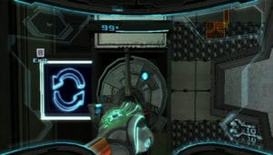
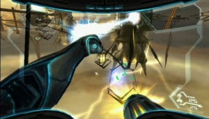

Despite the achievements it has accomplished to defend against the star system and against all attempts at domination perpetrated by the most dangerous creatures in the galaxy, the premiums hunter Samus Aran knows she is about to face a threat more terrible than all those she had already annihilate. Emergency contacted by members of the Galactic Federation, she learned that the Aurora 242 supercomputer has been infected by a virus of unknown origin, due to sabotage. Open from the beginning to save his own life at stake in this latest mission, Samus also knows that she will execute the directives of the Federation without asking any questions.

Representing the last hope of survival for all peaceful peoples of the stellar system, the woman who hides her true nature as an armored combination to suggest that his gaze fixed has nothing to lose. She must at all costs put an end to the activities of the pirates and thwart their plans for destruction by preventing them from corrupting the surrounding planets through phazon seeds called Leviathan. Lethal substance has already failed cost him his life during his previous expeditions, however, contaminates the phazon Samus in a violent face-to-face with her nemesis Dark Samus, corrupting our heroine like a deadly virus. Time bomb, this high concentration of phazons now threatens to eat his body to the point of no return. The end is near and that should give a positive conclusion to this final chapter is not known whether it will have the strength to go before its own annihilation.

Although visually this title is not out a lot of his predecessors, he easily convinces through diverse environments and effects galore. The universe created will especially delight fans of SF. Passing through the Wii for the gameplay of the series will be truly optimal. The controls are flawless and very intuitive, immersion is enhanced by the presence of movements directly related to acts of Samus.

We can estimate the duration of the game between 15 and 25 hours of play according to your way of playing. The most thoroughly searched scrupulously corners to get all the scans and the best percentage possible to discover the true purpose. Note that is now free to buy your own desired bonus (artworks, storyboards, music ...) through the various elements scanned.

If, like me, you have to stop the evil theme of introduction to start the game, you have every chance to adhere completely to the atmosphere of the sound in Metroid Prime. It speaks well of ambience and atmosphere as the music is entirely at the service of the pace of the adventure, sometimes eerily quiet and mysterious, sometimes nervous and overwrought. The History of Metroid Prime 3 marks the conclusion of the trilogy started on GameCube and the end of a cycle that has lasted for 4 years now. The role played by the Federation and the presence of some NPC break a bit the feeling of loneliness that prevailed in the old parts.

If Metroid Prime 3 boasts brilliantly to close the trilogy of Samus in the FPS adventure, it is primarily because its passage on Wii allows this episode to optimize management controls by making them more precise, more intuitive and ergonomic. Gameplay is very classic and not surprising really, but it is still the best episode of Metroid Prime released to date on console. We are now curious and eager to know what management will take the series after the end of the trilogy, hoping that designers will develop a sufficiently original to deviate from routines established for 4 years now.
