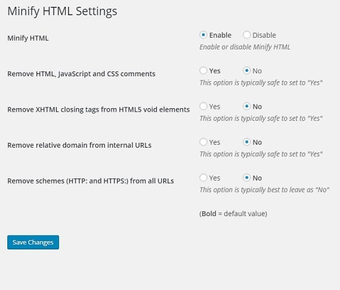

Minification is a process of stripping whitespaces and comments of a page. When you minify a web page, the visitors to your website will experience faster browsing experience on their desktop or mobile device. The page speed insights tool will not request you to minify HTML, JS, or CSS code.

When you minify HTML, CSS or JS code on your website, the server will send a small page to the client. The file size is yet another factor in determining the page speed of a website. The browser on the client device will download a smaller file faster.

Consider an example of a file download. I am using uTorrent to download  a program having a size of 1GB. My internet connection speed is 2 Mbps. The downloader will take up to 50 minutes to save the program on my PC. If the file size had been smaller, the download time would have been lower.

Autoptimize and BW Minify are my favorite plugins to minify JS and CSS scripts. If you are searching for a plugin to minify HTML without making changes in the JavaScript or stylesheet file, try out this plugin from Tim Eckel.

Once you install this free plugin, visit its settings page.

Now, you will see the below five options:

- Minify HTML.
- Remove HTML, CSS, and JS comments.
- Remove XHTML closing tags.
- Drop relative domains from internal URLs.
- Strip HTTP/HTTPS from the links.

Select the 1st option and leave the others unchanged.

Open any page of your website on the browser. View its source code. You will now see the minified HTML code. The pages of your WordPress blog/site will now load faster.

**Conclusion**: Minify HTML Markup plugin is free, lightweight, and easy to configure. I am using it with TagDiv NewsPaper theme. The plugin works great. It didn't break by my site. If you are using a free or premium theme, use MH plugin for reducing the size of the web pages.
