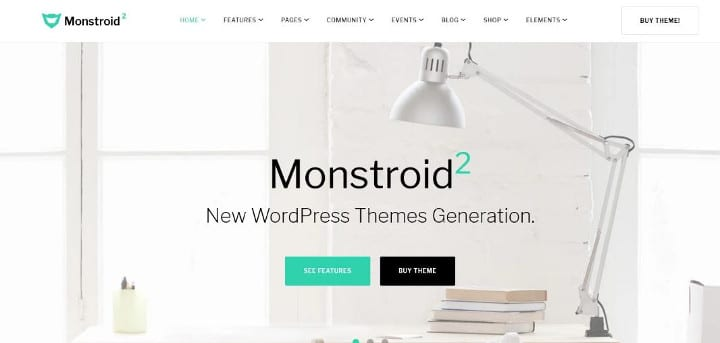
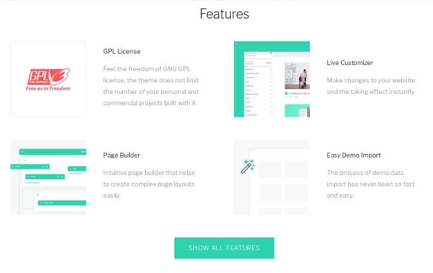
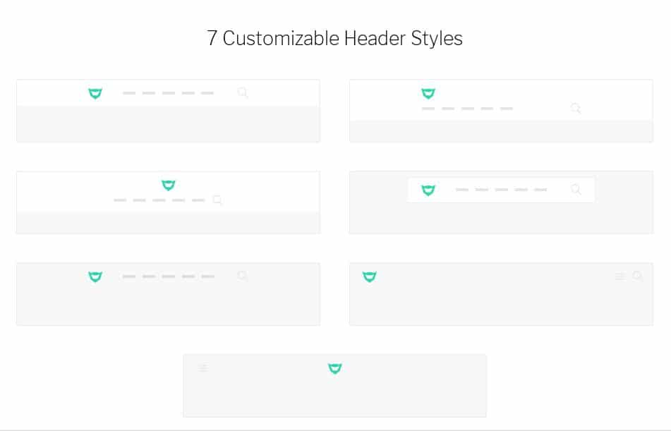
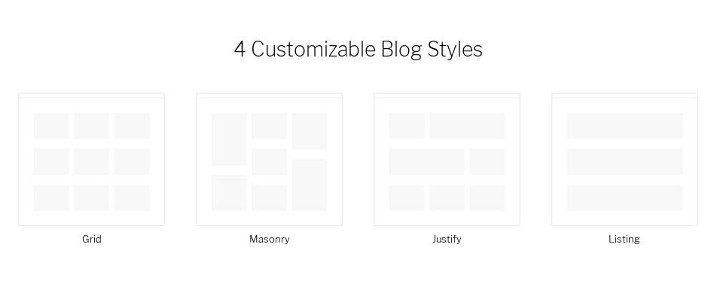
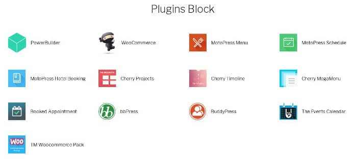

Monstroid2 is a premium multipurpose WordPress theme powered by Twitter Bootstrap and Cherry Framework, a secure modular open-source framework for developing themes and plugins. It is the successor to the Monstroid theme which had become a talk of the town within few months of its launch. Monstroid2 has new and powerful features. It also includes a powerful live theme customizer and page builder tool.

The theme has been developed by a firm called Jetimpex. Like StudioPress, Elegant Themes, Jetimpex is one of the top WP development companies. JI has launched 100+ templates for WordPress, Joomla, Prestashop on TemplateMonster, a marketplace for webmasters and developers. It has also published several plain HTML templates. Monstroid is Jetimpex's best-selling WP theme.

Coming back to the theme, Monstroid2 ships with 9 skins (pre-designed pages), which you can import and modify as per your requirements. It is a search engine optimized template with a plethora of customization options.

## Monstroid2 theme review

### Installation

The Monstroid2 theme is easy to install. Download the theme's zip package and upload it to the themes folder in the wp-content directory. Now, extract the ZIP archive and log in to your WP dashboard. Move the cursor of the mouse on the Appearance tab and click the "Themes" option. Now, activate the Monstroid2 theme. You'll see a popup box to install the "TM Plugin". Install and activate this plugin.

The TM Plugin provides a wizard tool that allows users to set up the theme with ease. The wizard checks the PHP and MySQL versions on the server. Then, it asks users to choose a skin and install the recommended plugin. In the last step of the wizard, Monstroid2 will display an option to import or skip the demo content.

When you click on the Next button in the final step, the wizard will install the plugins which you had selected. It will also regenerate the thumbnails. Once the wizard completes its task, you'll see two buttons - "View your website" and "Customize the Theme".

Click the 2nd button to open the live customizer tool of Monstroid2.

See demo of the theme here

### Live Customizer

The Monstroid2 WordPress theme allows you to customize the theme and see the changes in real-time. The live customizer tool lets you change the color scheme, header style, and typography of the theme.

Monstroid2 supports unlimited colors and it provides 5+ header styles. It supports full-width and boxed headers. The theme lets users customize the header. It also allows users to change the font of the headings, text, etc.

The Live Customizer tool of Monstroid2 theme enables you to manage advertisements and widgets. It allows you to set up MailChimp and add custom CSS code to your site. Users can specify the number of widgets they want to see in the footer section of their site. Tthe Monstroid2 WP theme supports two footer layouts - boxed and full width. Its customizer tool allows users to manage menus on their site.

Download Monstroid2 theme here

### Archive Style

If you are using Monstroid theme on a blog, you can choose one of the following for archive pages-

- Grid, Masonry.
- Listing and Justify.

### Page Builder

If you don't like the default page styles of the Monstroid theme, you can design your own pages with the Page Builder tool of the theme. The tool is easy to use and it allows you to add the following elements to your website:

- Accordion, Audio file, bar counters, Appointments.
- Testimonial, contact form, circle counter, slider.
- Icon, carousel, button, call to action.
- Map, login option, etc.

You can design as many pages you want with the page builder utility of this theme.

Buy Monstroid2 WP template here

### WooCommerce ready

Want to launch your online store without writing a single line of code? Don't worry, the Monstroid2 theme supports the WordPress WooCommerce framework that allows users to launch powerful e-commerce portals.

The theme's page builder and Wocommerce compatibility is a killer combination. The builder provides elements with which you can create beautiful pages for your eCommerce portal.

### Megamenu and social profiles

Monstroid2 allows users to add mega menus to their website. It also enables them to display social network profiles in a widget on a sidebar or footer.

**Other features**

The theme ships with PSD files so that you can customize its image files as per your requirements. It supports the Cherry Projects plugin with which you can create and share your work portfolio with the website visitors.

The theme supports right-to-left (RTL languages) and has a detailed documentation which explains the features of the theme. Monstroid2 has been built with CSS3 and HTML5. It has a responsive design and a clean code.

See demo of Monstroid2 theme here

#### Pros and Cons

Pros

- Great design.
- Page builder that supports various elements.
- Search engine friendly code.
- Powerful theme customizer.

Cons

- None.

**Conclusion**: Monstroid2 is a powerful premium theme with many customization options. It includes a page-builder utility and has several pre-designed templates which you can customize and use on your site. Monstroid2 theme costs $75. It is the best alternative to Divi 3.0 and the Avada WordPress theme.
