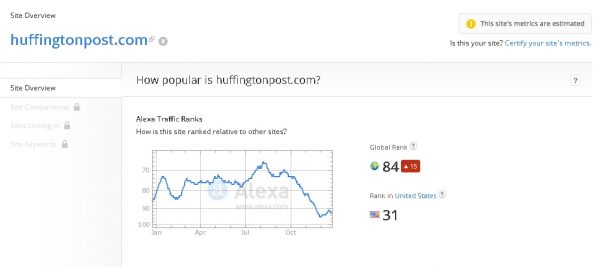

Our today's article - 10 most popular blogs on the internet (2015) has been published to inspire you. As a blogger, you need inspiration. Many times, you may not be satisfied with your online career and you may think to quit blogging.

I won't recommend you to do this as many months of your hard work will go in vain. Just go through the content published on the most popular blogs. Quality content has helped the best websites on the internet to rank very high in search engines. As they rank high, they get 1000's of do-follow natural backlinks every day. The owners of these blogs are self-made millionaires and they're an inspiration to all of us. If you're a newbie blogger, your articles won't rank as high as the articles found on the most popular blogs. But they'll outrank low quality and thin websites.

**HuffingtonPost**: It is perhaps the most popular blog on the internet. HuffingtonPost went live in May 2005 . It was launched by Arianna Huffington and her 3 friends. This blog covers latest political, entertainment, crime news. It has a dedicated portal for separate countries. Google has indexed 1.8 million pages of HuffngtonPost. This blog has an Alexa rank of 99. Huffington Post is now a part of AOL media.

**Mashable**: This blog was launched by Pete Cashmore in the year 2005. In his initial days of blogging career, Cashmore spent sleepless nights writing articles for Mashable. His target country was the United States and English-speaking countries. Due to Pete Cashmore's excellent writing skills, Mashable gained quick popularity on the internet. It is considered as one of the largest blogs with over half million pages indexed in Google.

**TechCrunch**: This blog was launched in 2005 by Michael Arrington. It covers high-tech gadgets, news on startups, applications, operating system's, etc. The news shared on TechCrunch is worth reading. Its Alexa rank is within 300 to 350.

**Gizmodo and Engadget**: If you'll open these 2 blogs, you'll find very high-quality reviews on latest gadgets, smartphones, tablets, laptops, and desktops. Pete Rojas is the founder of Engadget and Gizmodo.

**Hongkiat**: Launched by Hongkiat LIM, this popular blog receives over 8 million monthly pageviews. It has visitors from all parts of the world. At one point of time, Hongkiat had an Alexa ranking of below 700. The rankings dropped down to 1100, thanks to the Google panda update. Now the site has again started to do well in search results. Hongkiat is a design blog.

**GigaOM**: Yet another technology blog in this list, GigaOM shares news on latest computing and mobile technologies. This site has published articles from over 150 top writers. If you're interested in going through the research of technology analysts, then there's no better site than Gigaom.

**Gawker**: This is a weblog dedicated to lifestyle news. It covers celebrity gossips, fashions, movie reviews, etc.

**LifeHacker**: Yet another popular blog, LifeHacker shares Windows, Linux tricks. The site has also started publishing reviews on Android and IOS apps.

Please do let me know if I've missed out your favorite blog.
