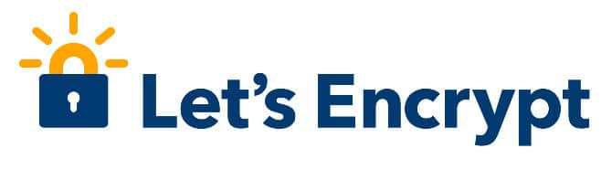

As mentioned in my earlier blog post, I am using LetsEncrypt free SSL certificate on one of my sites. The certificate was due to expire in few weeks. The CertBot dispatched an alert message for the same on my official email address.

As I'm using SSL for the first time and having several doubts in mind, I decided to renew LetsEncrypt certificate immediately. I fired the following command in the Linux terminal (10 days prior the certificate's expiry date) and restarted Nginx.

`certbot renew`

My misconception that the CertBot allows users to renew SSL certificate only on/before the expiry date was wrong. CertBot renewed my SSL certificate within few seconds. Now, the certificate will expire in July instead of April.

## Moving SSL certificates

I've seen many people complaining that they're unable to move their LetsEncrypt SSL certificate from one server to another.

Folks, migrating SSL certificate is dead easy. If you're using an unmanaged hosting service, create a tar gzip archive of the /etc/letsencrypt directory and the directory where the web server configuration files are stored.

Once you do so, use SFTP to move the compressed archives to the new server.

Follow the below procedure:

Enter the command `sftp username@ipaddress` in the terminal. Don't forget to replace the username and IP address.

If the server is allowing sftp connections, you'll be prompted to enter a password. Enter the password and hit enter. Use PUT command to upload the archives to the server.

Example: put file\_name.tar.gz

Extract the folders and replace the old directories.

Install the web server, the backend database server. Configure them to serve the server side code.

Now, install CertBot on your Ubuntu, Centos, Fedora VPS and restart the Apache, Nginx or any other web server you're currently using.

If you use shared hosting service, you can use the CPanel to create new SSL certificate. Once your certificate is ready, make sure that the HTTP to HTTPS redirects are working correctly.

You can follow the same steps to move certificates provided by other companies.

**Conclusion**: My experiences with LetsEncrypt has been great so far. If you want to enable HTTPS on your site, use LE. It is free. Furthermore, configuring, renewing or moving LetsEncrypt certificates is an easy task.
