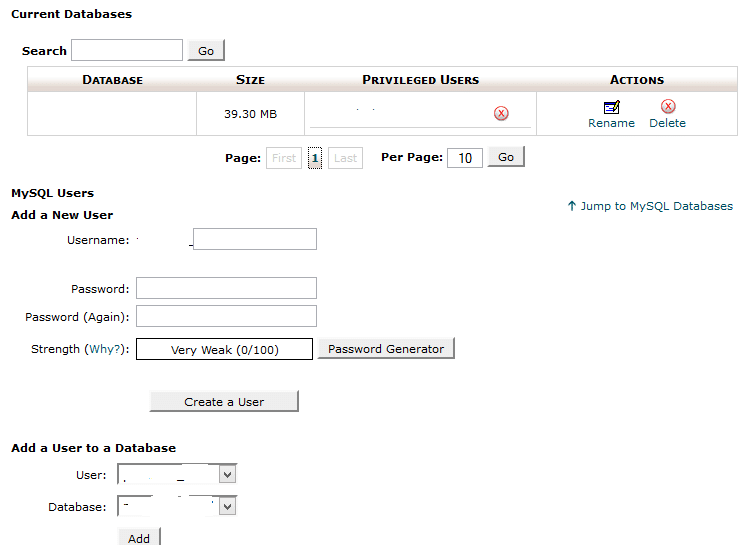
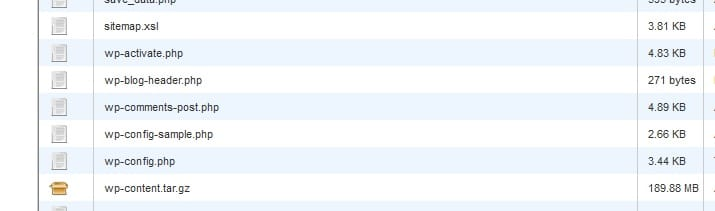
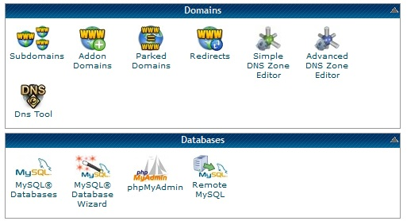
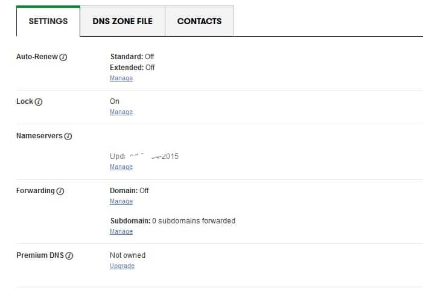
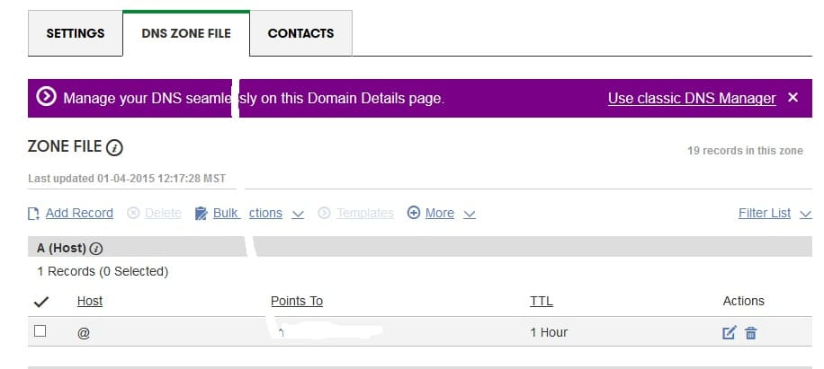

I've managed to move my WordPress site from one server to another a couple of times with 0 seconds downtime and no loss of traffic. For a newbie, the transfer process can take almost an hour. For an experienced guy, the time will be reduced to 20 or 25 minutes. Migrating a WordPress site is impossible if you're using a slow internet connection. So make sure that you're a broadband user with a web speed of at least 1 or 2 MBPS.

## Steps to Move WordPress site from one server to another

**Create a backup copy of your website database**: Open PHPMyadmin tool from the CPanel and select your DB from the drop down list. If you don't know the database name, go through the wp-config file in the root directory of your server. Now navigate to the export tool and click on create button. PHPMyadmin will generate a backup file that features all tables, triggers, cursors, and functions. This file will be in .sql format. Save the backup to the desktop of your computer.

**Delete useless files**: Open the CPanel of your hold host and navigate to the wp-content folder. Now visit each of its subfolders and remove all useless database backups and files. You can also delete cached files created by W3TC or WP-Super cache plugin. You can also delete any unused WordPress plugin.

**Compress the WP-Content folder**: Every hosting provider includes a set of tools in its Cpanel. File compressor/extractor is one of such tools. Select the Wp-content folder and click on the Compress button to add all your important WordPress themes, plugins, images in upload folder to a highly compressed file. If you want to upload files individually, you can step this step.

**Install an FTP client and run it**: The archive file created in step 2 must be now uploaded to the server of your new host. Although the CPanel features a tool to upload files, you should avoid using it as you cannot pause or resume installation with this utility. FTP client for Linux or Windows is the best software that can do the job of uploading or downloading files remotely. Thus, download and run it on your computer.

**Download the compressed wp-content folder:** Connect the client software with your old hosting account and download the archived file to your computer. Download time depends on the file size. If your blog has 1000s of images, the download process will take some time to finish its job. The download speed would not be more than 50 or 60 KBPS.

**Install Wordpress on your new host:** Before uploading the backup and the compressed wp-content folder, you'll need to install WordPress on the new server. You don't need technical knowledge to install WP. Find the one click installer in your Cpanel and click on it. Once WP has been successfully installed, open PHPMyadmin and select the database you've created. Now open the export tool, select the .sql file and click on the upload button. Your empty DB will be uploaded with new tables.

**Create a new database using DB manager tool:** Create a database with strong login credentials. The username and password should be complex. Now create a new DB user with all SQL permissions. Link this user with your DB. Now open the root folder and open the WP-Config file and enter the correct DB name, user, and passwords. Now move the htaccess file from your old server to the new hosting provider.

**Change DNS servers and hosting IP-address:** Open the site with which you have registered the domain name for your blog/site. Select the domain name and navigate to its management tool. Edit nameserver fields and enter the nameserver of your new hosting provider. Open DNS zone file editor and edit the A records. Enter the IP address of your new host in front of the @ host. The DNS propagation will take few seconds or minutes. It might event take 1 or 2 days.

Once the edited records have been saved, enter your domain name in the address field of your browser and hit the enter key. Your website should load without any problems.To check that your blog has been configured correctly. Open GTmetrix and intodns tools, enter the permalink of ay page of your blog in the text field and click on the enter button. IntoDNS will make you aware of DNS errors.

Gtmetrix will display the page load time and several other website optimization points of your site. You can follow instructions suggested by GTmetrix to improve your website performance. The last step is the most important thing to do after you've moved WordPress site from one server to another.
