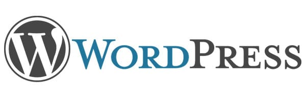

WordPress, being a versatile plugin allows you to launch all types of sites. It allows users to install plugins to make website search engine friendly, faster, highly rewarding, etc.

WordPress has millions of users. The WordPress repository hosts over 100k plugins of all types. An experienced blogger using WP platform may not difficulty in choosing the right plugin. But the newbie users may get confused.

To help WordPress beginners, I've compiled the list of must have plugins for the WP platform.

## Top WordPress plugins for all websites for 2016

### P3 Profiler

P3P is a free plugin that makes you aware of plugins that are affecting the page speed of your web pages . The plugin runs a test in your WordPess dashboard itself and shows the plugins responsible for the high loading time of the blog pages.

### SEO Plugin

Yoast is the best WordPress SEO plugin. It has over 20 settings that make a WordPress site super SEO friendly. The plugin removes replytocom variables and has the option to generate meta tags automatically. Once you configure it correctly, forget about on-page SEO issues and focus on the content.

Apart from fixing SEO problems, the Yoast plugin allows users to write better articles. It has powerful grammar checking modules.

### Easy Social Share buttons

With the ESSB plugin, you can insert stylish social sharing icons at various positions in the blog posts. The Easy social sharing buttons plugin also has the option to add newsletter forms under/above blog posts and in the sidebar. It supports native sharing buttons i.e. Facebook like, Twitter tweet, Google plus one, etc. It is one of the best WordPress plugins.

### WP-Optimize

WP-Optimize is a smart plugin. The developer has added the following options to it:

- Remove post revisions, empty trash.
- Clean trackbacks, pingback, spam comments.
- Delete orphan metadata, unapproved comments.
- Optimize the database tables.

### SBSC (Simple basic contact form)

SBSC is a free plugin that enables you to add a lightweight contact form to your WordPress site.

### Spam blocker

Antispam works great for me. I'm using on on three websites. The plugin doesn't have any settings. Install it and forget about the spam comments, trackbacks, and pingback produced by spammers.

### Popular posts

Adding this module helps in increasing the page views on your website. If you have inserted affiliate links, the popular post widget improves the conversion.

### Broken Link Checker

BLC is an old plugin, but it is still pretty useful. It runs in the background for every N hours and checks all blog posts to find broken links. The plugin lets you unlink dead URLs without requiring you to edit a post.

### Redirection

Link juice lost by the 404 URLs can be regained if you redirect them to relevant pages. To help you with this task, install the Simple 301 redirects plugin.

### Caching

In case you're using VPS platform to host your site, you can use OpCode cache, Memcached, Redis or similar extension to make your site faster. On shared hosting platform, install and use Super Cache or W3TC.

**Conclusion**: When you buy hosting from firms such as Bluehost, Hostgator, Digital Ocean, and install WordPess, the first thing you should do is install the plugins we've mentioned above.
