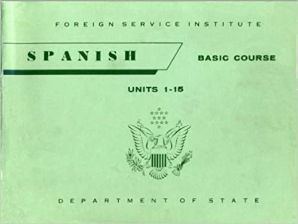
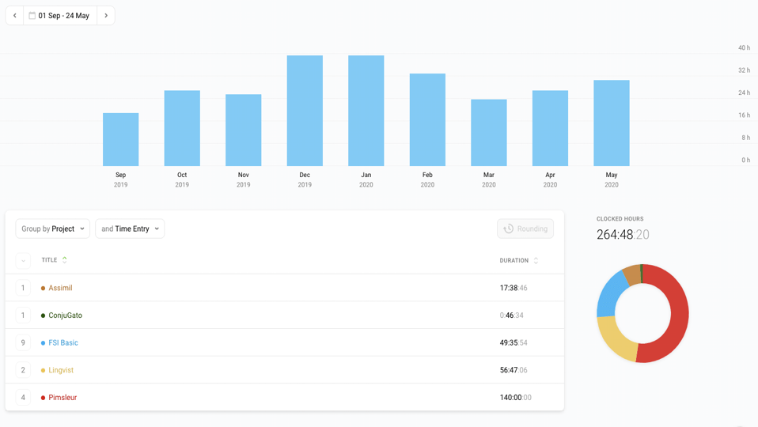

I've always had an interest in learning Spanish. Over the years, I've dabbled with various language learning programs, however I never really stuck at them for long.  I have probably spent more time researching language learning programs and techniques, than I have actually practiced the language.

The United States Foreign Service Institute, or FSI, estimates that the Spanish language takes approximately 750 hours of study to build fluency. Unfortunately, FSI classes are reserved for Diplomats and involve dedicating 30 weeks of full-time study to reach the desired hours needed for mastery.  My approach has involved a longer-term strategy involving daily practice and drills using multiple modes of learning, vocabulary building using spaced repetition, and immersion techniques.

## Daily Practice and Drills

Even the busiest schedule can allocate one hour to something you are passionate about learning. I committed to one hour of practicing Spanish each day.  When I started, I used Pimsleur Spanish, an audio-only program that I could listen to on my daily commute to develop a good foundation for the language. Once I had that foundation, I began using the 1960s public domain version of FSI’s Spanish Program, which relies heavily on multiple modes of learning to build automaticity.  This method involves repetition of vocabulary and language structure so that it becomes a part of the long-term memory.  Whereas Pimsleur touches on the language and structure, FSI reinforces patterns and deepens vocabulary, filling in many gaps by having me listen to the audio, read text, and speak out loud. This is not surprising because Pimsleur was created as a tool for absolute beginners with no pre-requisites, whereas FSI was created as a curriculum to be taught by experts supporting classes of Diplomats. FSI encourages using multiple modes of learning including listening to the tapes, reading text, and speaking out loud. A typical unit includes listening to a dialogue between native speakers in real speed, reading the transcript of that dialogue to better understand what was being said, and then participating in multiple drills that reinforce structures of the language and introduces new vocabulary. Each unit focuses on an aspect of Spanish grammar.

## Vocabulary Building

My approach includes a commitment to one hour of time each day with multiple modes of learning, but also a strategy called spaced repetition for vocabulary building.  Building vocabulary is essential in language learning because you need approximately 10,000 words to be fairly fluent. To put this into perspective, the FSI program gives you about 2,500 vocabulary words and the Pimsleur program even less than that. Spaced repetition is a memory technique that aids in this vocabulary acquisition.  

The premise of spaced repetition is based on the curve of forgetting.  It suggests that reintroducing already learned concepts at specific optimal intervals will integrate that information into your long-term memory.  I use an app called Lingvist to accomplish this. Lingvist was founded by one of the scientists at CERN. The program provides flashcards with the most common 6,000 Spanish words in context and adjusts to my specific curve of forgetting. I use this app for about fifteen minutes twice a day, which is enough time to get through about 100 cards. To date, I have learned over 2,200 new words this way. 

## Immersion Techniques

I mentioned that the Lingvist flashcards provide context for each new vocabulary word.  This links with the final technique in my approach: immersion. It is common knowledge that the best way to learn a language is to be in an environment that is rich with it. This is why teachers and parents are constantly reading books, singing songs, and speaking with young children. Since my wife would veto moving our family to Argentina, I simulate immersion as best I can by reading Spanish text, listening to Spanish radio, and conversing with native speakers. There are two resources I use to read Spanish text. Assimil Spanish is a language learning book that contains brief stories in Spanish as well as the English translation and explanations of tricky structure. LinqQ is an app that lets you import any Spanish text that interests you. I am currently in the third chapter of Charlie y la Fabrica de Chocolaté, or Charlie and the Chocolate Factory. When you come upon a word that you don’t recognize, you can tap it for a definition. That word is then added to a list of vocabulary to revisit. The benefit of this app is the ability to read whatever text you choose.

Another way to practice fluency with a high level of choice in content is to hold conversations with native speakers. For several months I have been corresponding in Spanish through email, instant messages and face to face interactions with a work colleague who is a native speaker. This puts my language skills to use in an authentic way and helps clarify nuances of the language that are hard to gain through book learning. If I based all of my learning on FSI, for instance, I would be conversing as a 1960s male diplomat which doesn’t always translate into the politically correct environment of 2020.

All of these programs and tools may seem overwhelming as you start the journey toward language learning, but remember I committed to only one hour a day.  In the days of long commutes and Pimsleur audio lessons, I drove to work, listened to the CD, and talked to myself in the car.  Today, in quarantine, as my wife and I work remotely full time and also homeschool three children under the age of 7, this hour looks very different… but it still happens. It is often spread over the day into smaller increments. I may listen to a 15-minute audio lesson as I wash dishes or push the baby on the swing. I often use the Lingvist flashcards or the Linq app for a half hour after I put my three boys to bed. My wife rolls her eyes as I mutter to myself with my earbuds attached, while responding to drills as we prepare dinner.

## Tracking Progress

Just like a weight loss program, I find tracking my hours and breaking them down into the different programs that I use to be very motivating over time. Without a tracker, it would be difficult to gauge the collective progress that I’ve made through these self-study programs. 

Toggl is a free app that includes a simple start/stop button that helps easily track my language learning over time, even when it is spread over 15-minute increments in a day. Toggl automatically graphs my learning as it tracks, and even color codes the different programs that I have used to accumulate hours.To date, I have logged over 264 hours of Spanish language learning, which includes 140 hours of Pimsleur, 56 hours in Lingvist, 49 hours of FSI, and 18 hours of other program but it all started with committing to just one.
