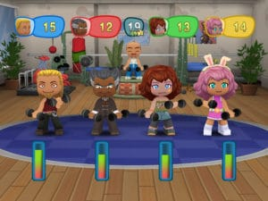
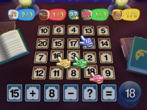

As you may know MySims is a simulation game on Wii. But over the management of family, you can head a Sims and invests in a real mission, if not a destiny: to revive a virtually abandoned city. The next MySims almost deserves to be renamed OurSims. Indeed, MySims Party is a license that offers a real multiplayer aspiration and explores new ways to play video games. However, it forgets nothing that made its success, starting with its so special graphics style and its total originality.

Let’s draw a little schema. Until now, in MySims, we were only seeking quest. Species were being sought and plans to build various objects in order to give new life to some abandoned places. And if we made new friends, they were virtual. Okay, the PC version allowed us to connect with players but no one could take an active part in the game of another lover of this great license. It is with the avowed aim of bringing the multiplayer series that the developers of MySims had the idea of MySims Party. Well ... In terms of multiplayer, you will not go to the entire world. Any notion of sharing will stop to the four people present in front of the Wii. But let's say it's already a nice beginning.

You know the famous mathematical rule applied to the world of video game to which Game + Wii Play with the word "Party" in its title = party-game. It does not escape either. MySims Party is a series of small funny tests that are very quickly assimilated and who have no other purpose than to provide a playful screen confrontation interposed between friends or within the family members. In all, the Wii version will offer fifty different sets of topics compiled by a dozen festivals. One example is the Music Festival or the Festival of Horror. Do not worry, it will also be a frightening turn in your neighborhood the night of Halloween, MySims oblige. The idea is to pass the tests to establish the elements necessary to build a city. The events resolved within a few tens of seconds for example, will be to escape the last giant robot built by Dr. F., picking up as quickly as possible the scattered papers in an office or to bring the bags left by customers of a hotel to the reception. We have also seen a ski race on a track filled with many bumps. In addition to completing the first, it was to each bond to achieve the combos shown on the screen.

A feature of this title held in team building according to the type of events to come. For example, for races, people should be quick. Each of the avatars available is defined by the criteria of strength, speed, energy and luck. The latter simply makes some things simpler. It should be noted that each event is placed under the sign of one of the above criteria. And when your characters are involved, they gain a point in this category, for example speed. So it will be necessary to diversify because it is simply impossible to do that race if we have chosen a character too quickly. And the points lost can be gained from time to time by participating in a special mini-game in which it will draw lots of cards offering bonus.

MySims Party will also be available in DS version. On the portable Nintendo console, four people can connect to a part by sharing a single cartridge. This version will bring together forty mini-games, ten less than the Wii version.
