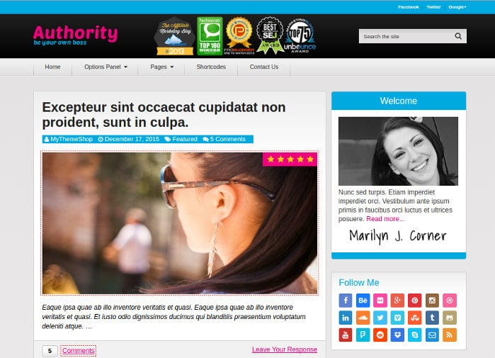
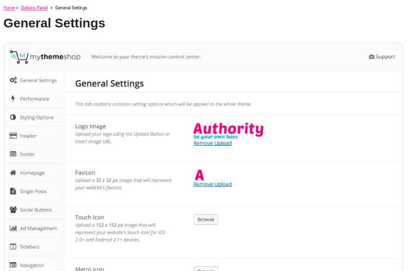

Authority is one of the best-selling WordPress templates of MyThemeShop. It has a large number of users. It is inspired by design of the website of popular blogger Matthew Woodward.

Authority is a responsive WordPress theme that supports customization of almost every element you'll find on it. It has amazing page speed. It is a premium template with great design and plenty of options.

## MyThemeShop Authority WordPress theme review

Once you buy the theme, download its ZIP file and upload it to the wp-content folder of your blog. Extract the zip file and activate the theme from your WordPress dashboard.

Now head over to the live customizer tool or navigate to the settings panel to begin customizing your website.

Below are the various features that MTS Authority template provides to its users.

### Header section

Authority theme from MyThemeShop offers a simple navigation bar that supports customization. The header section includes the following elements:

**Top bar**: The authority theme includes a top bar where you can display links to your social profiles.

Below the top bar, you'll find a row that features a textual logo. The row has a free space to show logos of websites you have been featured on. It also includes a search bar.

The main navigation appears below the above row. You can add the important categories of your blog to a menu bar and configure the template to show the menubar below the row.

The menubars provided by the Authority theme are responsive. When the visitor accesses your website on a mobile device, he'll see an off-canvas menubar instead of the regular menubar.

The MyThemeShop authority theme offers a header settings panel where you'll find options to disable the top bar, enable floating menu bar, enable parallax effect, change the background color of the navigation bars, etc.

Buy MTS Authority here.

### Footer

The Authority WordPresss template provides a footer section where you can insert copyright information, or add a menubar that includes links pointing to the privacy policy, disclaimer, about me pages.

The Authority theme comes with support for footer widgets. You can add three or four widgets to the footer area. Like the header section, the template allows you to customize the footer background color. You can also enable or disable parallax effect for it.

### Container

The MTS Authority theme has a built-in related posts function and has a beautiful author box module. You can configure it to show related posts and author bio below or after post content.

MTS authority supports breadcrumbs. You can disable or enable breadcrumbs through the settings panel. It supports left and right sidebars and has five predefined homepage layouts.

Download MTS Authority theme here.

Other important features:

**Social network icons**: The MyThemeShop Authority theme has options to show social media sharing buttons above and below the post content. It comes with support for floating social media sharing icons too.

The template lets you add the social sharing buttons for the following social networks:

- LinkedIn, Facebook.
- Twitter, Google+, Buffer.

**Ad management**: Authority theme features ad management panel where you can add AdSense code for the header, below post title, and after post content. Users have to place the code in the text fields that appear in the panel. The theme will show ads automatically. You can configure the template to show Ads after X days (X is the number set by the user).

**Typography settings:** To change the font or font size for the post content or title of the widget/post, open the typography settings. Authority theme supports Google fonts.

Buy MTS Authority here

### SEO Friendliness

The MyThemeShop authority template comes with valid Schema markup. Hence, it is a search\-engine friendly theme. It has single H1 tag on the single post template.

### Pagespeed

MyThemeShop doesn't include unnecessary elements in their themes. They keep the theme related CSS and JS files short. This results in blazing fast page speed. The theme's page speed without caching plugins will be below 2 seconds.

### Support and updates

MyThemeShop premium theme users are allowed to access support forum where you can seek help regarding the template. The support staff replies to your queries within 4 to 5 hours on working days.

MTS releases updates for its themes on a monthly or quarterly basis. If the template has a serious webmaster guidelines issue, the updates are launched within few weeks.

Buy the template here for $47 (limited time discount).
