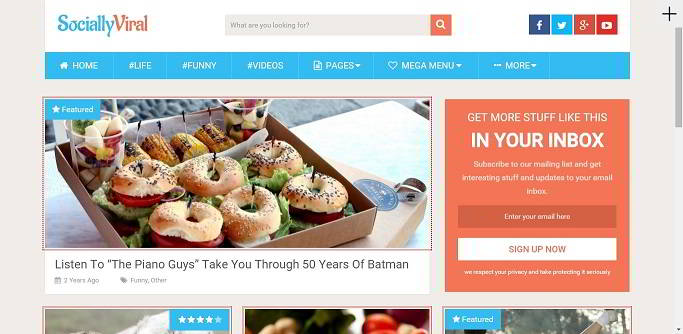
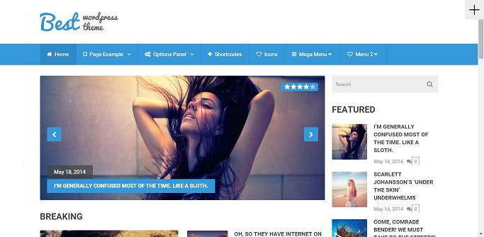
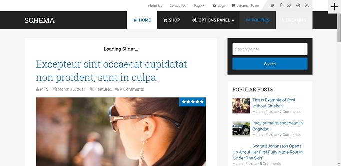
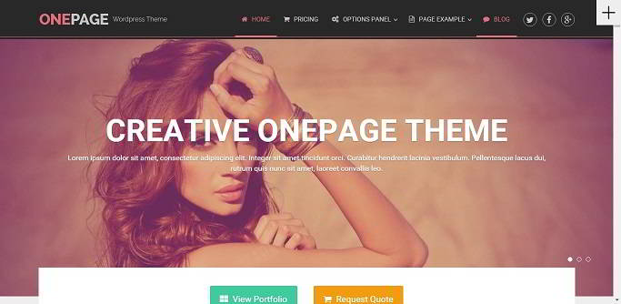

Buying a premium theme or plugin is not an easy task as there are a lot of WP developers who have launched a variety of templates for the users. To make things less complicated and easy for you, we are trying our level best to shared a detailed review on themes launched by top developers.

Last month, we had shared a detailed and honest review on Elegant Divi and Themeforest NewsPaper. After going through the two powerful templates, we've concluded that ET and TF are undoubtedly 2 of the top platform for buying a high-quality WordPress plugin or templates.

Today, we'll have a look at various products from Mythemeshop (one of the top WordPress developer). MTS has launched over 100 stylish and SEO friendly templates for different purposes at a very reasonable price tag. Over 300000 people are the customers of MTS. If the themes developed were of poor quality, MTS wouldn't have been a favorite WordPress brand.

MTS has introduced a lot of lightweight themes and plugins for WordPress till date. Some of their best products are mentioned below:

## MyThemeShop Review: Best WordPress third party developer?

### Socially Viral

This theme is designed to make your blog posts viral. It has been inspired from Viral Nova - one of the most popular blogs on the planet. In this WordPress template, you'll find social network icons below post title and last paragraph. SociallyViral has breadcrumbs, and it includes megamenu.

Demo/Download link

### MTS Best

This is a popular and one of the most popular premium template. MTS Best is a lightweight magazine and responsive theme with plenty of features. It has inbuilt review tool and a beautiful design. Many websites use MTS best. Most of them rank on 1st three pages of Google for major search queries.

download/demo of the above template.

### Schema

This WordPress theme has been optimized for speed. According to MyThemeShop Schema scores 99% when Schema is tested with Google page speed tool. Schema is available in 2 layout options, i.e., default and minimal. The default version has featured images and an excellent navigation system. The minimum version lacks unnecessary features that affect website load time. This theme's page size is just 99 kilobytes. Its code is secure and clean.

check live demo or download the schema template.

### Business

This one-page theme features an inbuilt counter to display statistics on your business. You can share your portfolio on it. MyThemeShop business template supports unlimited colors. It has twitter feed module, pricing table generator, and responsive layout.

download theme.

### WP Subscribe:

This is a premium WordPress subscription plugin and an excellent alternative to OptinMonster. This plugin will add ajax based newsletter signup form to your website. It supports a lot of color schemes and subscription services. WP Subscribe supports popups. It is SEO friendly and powerful way to get loyal readers. This plugin posts 27 dollars on MyThemeShop. \[download\]

### WP Review Pro

If you're a WordPress theme that doesn't have a review module, you should consider installing MyThemeShop WP Review Pro. This plugin generates rich snippet based SEO friendly reviews. It supports shortcodes and all popular WordPress caching plugins. WP Review Pro comes with an options panel where you can change the color, review box size, etc. It is priced at 27 USD on MyThemeShop website. \[download\]

### Why MTS?

The above MyThemeShop items are built using the latest HTML and CSS standards. Whether you open the website using MTS on EDGE, Internet Explorer, Mozilla Firefox or Chrome browser, the theme's layout will remain the same, and it will not break.

This is the era of responsive websites and blogs. All products from MyThemeShop are highly responsive, and they look beautiful on mobile devices. The user will not have to hire WordPress developer to make the site tablet and phone friendly.

MyThemeShop WordPress templates are search engine friendly. They have schema.org markups that will ensure higher rankings in search engines. They're well integrated with social networks. Thus there are high chances that your website's referral traffic will increase.

The CSS and JavaScript code written for the MyThemeShop themes are well optimized. Thus the page size will be small. This not only improves page load time but it also ensures a good experience to mobile users using slow GPRS internet.

### Good Support

People buy premium themes thinking that the seller will solve technical problems and help them in customization of the template. I've had appalling experience with a few developers, but I'm quite happy with ThemeForest. MyThemeshop has skilled folks who will help you in fixing a problem related an MTS theme or plugin. A support forum is a setup where users and experts try to solve issues and performance related queries put forward by users.

Check all amazing products from Mythemeshop here.

**Conclusion**:

After going through its templates, I've become a huge fan of MTS. The support from this WordPress developer is excellent, and the products are worth the money.

**Update**: MTS has organized the super black Friday sale for 2016 in which you can get any of their theme or plugins for just 19 dollars. Visit this link and grab the offer soon before it expires.
