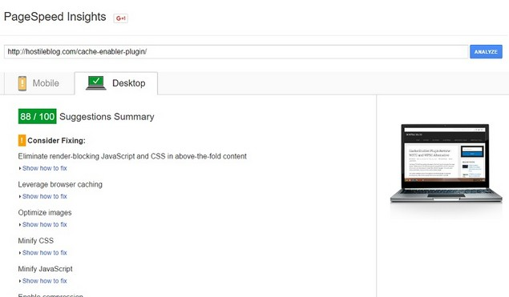
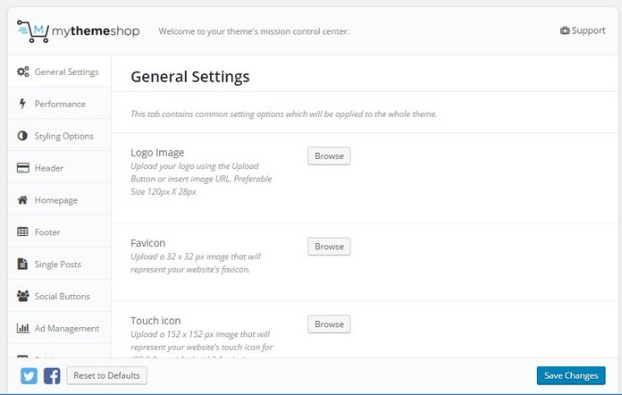
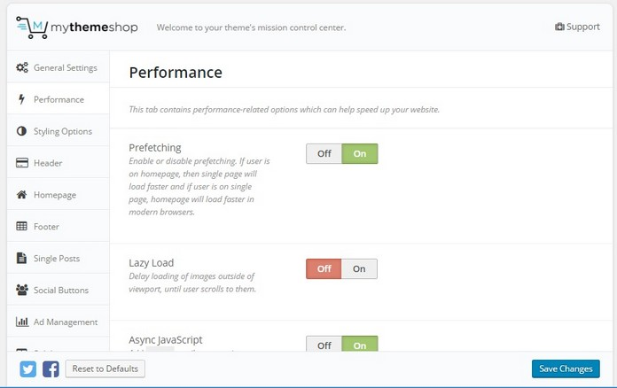
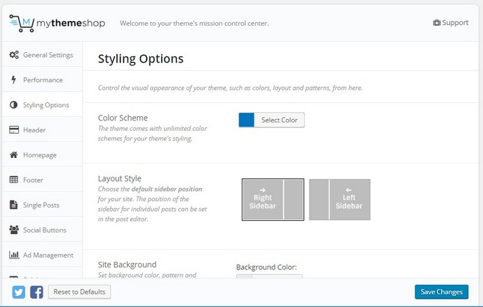
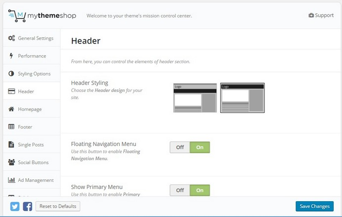
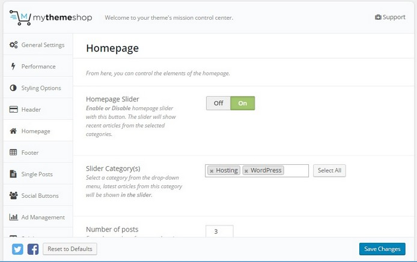
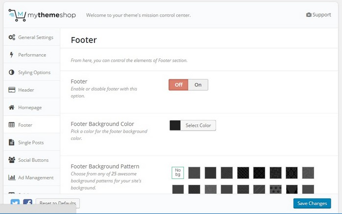
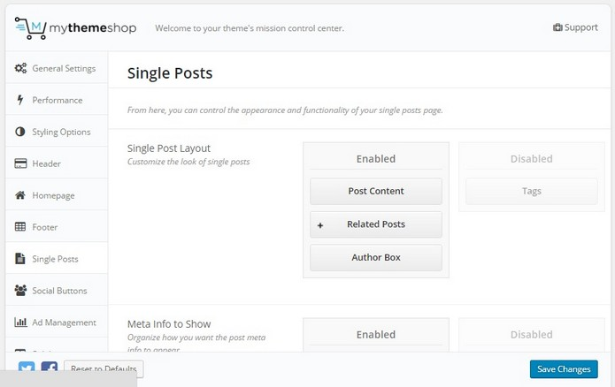
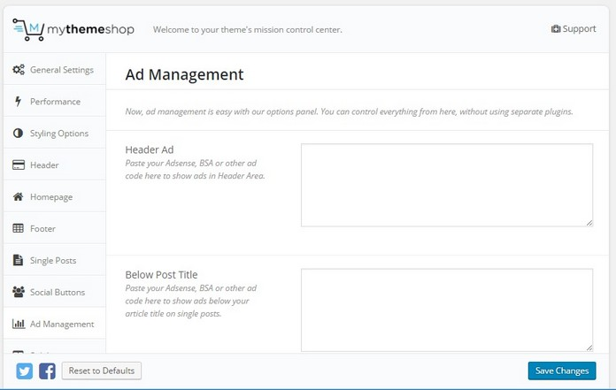
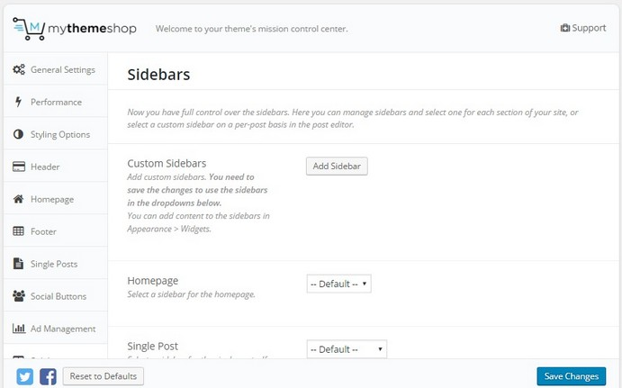

Buying a premium WordPress theme ensures that you'll be given assistance when you encounter problems with the theme.

The theme will have clean code and it will be search engine and mobile friendly. Unfortunately, the premium theme which I used earlier on this blog was a waste of my money. I had bought it when I was a newbie blogger after reading a review.

The theme was good initially, but the developer removed its inbuilt review system. When I asked the development team why they did so? They asked me to wait for a few weeks because they'll be launching a review plugin. It has been 5 months now, the plugins have not been released yet. All my reviews and the schema start rating markups were gone.

Recently, I updated PHP on my VPS server to PHP 7.0. The theme started to fumble even though the server had enough free RAM and CPU. I raised a support ticket to seek help on this issue. The team closed the ticket claiming that they'll check the code of the theme. I waited for several weeks hoping that the developer will fix the issue and release a new update for the theme.

No update was released. I then decided to move on and buy a theme from a renowned WordPress theme development company. After researching a bit, I ended up buying the MyThemeShop schema theme.

I was confused between Genesis Framework and MTS Schema because both templates were having valid schema markups. Unfortunately, Genesis framework developer Studiopress have limited free child themes to offer. Schema theme looked similar to Genesis Metro Pro theme which costs around 90 USD. I decided to buy MTS Schema because of its SEO friendly nature**.**

MyThemeShop has launched over 50 premium and impressive themes. In the future, I may replace the current theme with some another template. Buying 50+ themes individually will cost around $2500. Luckily, I came to know that MTS runs VIP membership program that allows you to download all premium themes and plugins for just $87 (discounted link).

Hence, Instead of downloading Schema template that costs $59, I became a VIP member. Now, I have access to all premium MTS templates (including Schema). If you're planning to buy the MyThemeShoop schema theme, then you have made the right decision. The template offers the below features:

### Valid Schema markups

Head over to Google structured data testing tool and test this page with it. Yes, that's right. I'm using the Schema theme for HB. The page will pass with flying colors.

### Great Page Speed

Open page speed insights website speed testing tool, copy the URL of this page and test its page loading speed. Impressed? Check the page size. It will be below 1 MB. Small Size pages will load faster on the visitor's web browser.

**Theme option:** The theme has an ajax based options panel where you can configure the Schema template as per your requirements. The panel is divided into the below sections:

### General Settings:

 

This section allows you to insert Google Analytics code to the header or footer section of your website. You can add a favicon, new logo, touch, and metro icons to your website through the general settings of Schema theme. This panel lets you specify your twitter username.

GS has the option to set a pagination type and enable ajax based search module for your WordPress website. It allows you to display full posts on the homepage instead of excerpts. It has an option to enable RTL support and disable responsiveness.

### Performance

When you're using the Mythemeshop schema theme, you don't have to install any speed booster plugin. The theme's performance section allows users to enable or disable the below options:

- Prefetching, Lazy Load.
- Asynchronous loading of script files.
- Remove Version URL parameters.

Enabling the above features will fix the major page speed problems.

**Buy MTS Schema here**

### Styling

Here, you can set a color scheme, default location of the sidebar (left or right), site background color and background image for your website. Styling settings have the option to enable parallax effect and lightbox for post/page images. It has a large text area for entering custom CSS code.

### Header

Mythemeshop schema supports sticky and fixed menu bars. You can add a maximum of two menu bars (primary and secondary) to the header section of the website. If you haven't uploaded a logo for your website, you can configure the theme to use a text site name by disabling the logo module from the header settings.

### Home Page customization

In this settings page, the user will find a toggle button to:

- Disable or enable slider module.
- Use a larger picture or smaller featured thumbnail for excerpts.
- Set featured categories.
- Enable or disable the displaying of author name, date, categories, and comment count.

**Download the Schema theme here.**

### Footer

Schema WordPress Theme supports multi-column footer. You can easily add your favorite widgets to the footer or set a background color for it. To enable and customize footer, navigate to the footer settings of Schema theme options.

#### Single posts

With Schema theme, you don't have to add CSS code to hide the theme's inbuilt related posts, author box module or meta information like the name of the author, post date, categories or comments count. Simply drag and drop the desired fields on disable box to disable it.

### Social buttons

The Mythemeschema theme includes social sharing buttons which can be easily inserted above the post content, below content or to the opposite side of the sidebar in a floating position through the social buttons settings panel.

This panel has the option to disable social buttons on pages. Mythemeshop schema supports the below social networks:

- Facebook, twitter, google plus.
- Pinterest, Facebook share, LinkedIn, Stumbleupon.

### Ads management

You don't need Google Adsense plugin when you're using the MTS schema theme. The ads management section lets you enter ad code for the header ad and below post title/content. The code will be automatically inserted in the post. Advertisements can be configured to appear after X days.

**Download the theme here.**

### Sidebar

Mythemeshop schema WordPress template supports unlimited sidebars. You can set a custom sidebar for the homepage, single post, single page, archives, tags, categories, 404 not found, search, date archive pages.

### Typography

MyThemeshop Schema theme uses Google Fonts to make text content look beautiful. If you don't like the default Google Font, you can easily change it from the typography settings of Schema theme

### Breadcrumbs

The theme allows its users to enable or disable breadcrumbs. If your site is having hierarchical categories, then enabling this feature will make navigation easier for the user and search engines.

Other features:

- Custom widgets like Facebook Like box, Popular posts, twitter feed.
- Translation support.

**Conclusion**: MyThemeShop schema is a powerful theme with over 30 settings to configure. Because of its valid Schema markup, the template can help your blog in getting higher rankings in Google. **Click here** to buy MTS Schema with a good discount.

**Note**: I'm using MTS Schema on this site. I've tweaked the CSS as per my requirements. Explore the site to see the theme's performance, speed, etc (demo).
