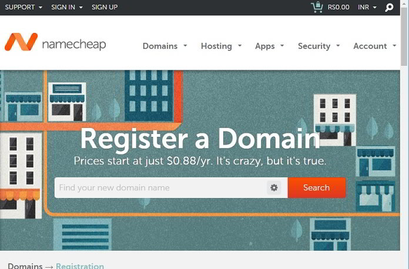

Last week, I was thinking about registering a new domain name for my new project. My first choice was GoDaddy. I had shortlisted a few TLDs from GoDaddy, but I was not able to buy a domain name for less than 10$.

GoDaddy runs a promotion wherein new customers can register a TLD for USD 0.99. I've been using GoDaddy for three years. Hence, I was not eligible for this offer.

I started looking for an alternative to GoDaddy for buying a domain name at a cheap rate. After exploring the web for an hour, I came across Name Cheap, a domain registrar approved by ICANN.

Namecheap company started its operations during the dot-com bubble. Its first office was set up in Los Angeles. Because it provided high-quality services, the registrar didn't take a long time to become a worldwide renowned brand.

### Domain Names

Namecheap allows you to register hundreds of types of domain names at the same rate as other top domain registrars.

In some cases, you can buy domain names for less than 0.99 cents. **With this special URL**, I got my DN from Namecheap for just 0.88 USD.

Domain registration is an easy task with Namecheap. Once you have selected the best domain name for your business/website, click on the view cart button, and then click the confirm order button for completing the payment.

Namecheap website automatically detects your region so that it can display the subscription costs in local currency. It offers free whois guard protection which prevents visitors from getting your contact details.

Namecheap provides an easy to use dashboard for managing domains. You can prevent unauthorized access to your registered domain names by turn on the two-factor authentication. Enabling 2FA on your account requires you to verify your phone number.

The dashboard shows the domain status, a toggle button to enable auto-renewal, and the expiration date.

It is easy to manage the name servers with Namecheap. You have the option of using the Namecheap DNS or you can setup a custom NS with just a few clicks of a button. If you are using an NS, you can set up redirects for the domain name.

Namecheap lets you transfer the domain name to other registrars at any moment. The transfer process is easy and fast.

### Namecheap SSL

I also bought an SSL certificate along with the new domain to prevent others from eavesdropping on my site's data.

The address bar will show a green label when you have implemented a valid SSL. This label indicates that the data sent from the web server to the client browser is encrypted. The certificates support 128 bits and 256 bits encryption.

Namecheap provides single domain, wildcard, and multi-domain SSL certificates for a price starting at USD 9. **Click here** to see the latest SSL pricing.

If you're running an eCommerce website or a portal that asks users to submit their debit/credit card details, passwords, then you must enable HTTPS for your website.

### Namecheap Support

The company offers two types of support - live chat, and ticket based. The company provides support 24 x 7.

Buy a domain name from Namecheap **here with a special discount**.

**Conclusion**: NC offers impressive domain registration services. If you are planning to start a new website, NC is a very a very good option for buying a domain name.
