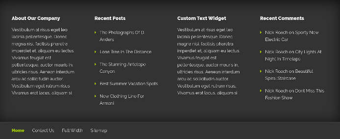
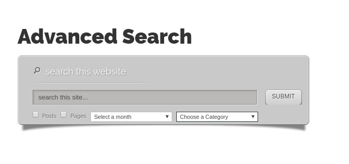
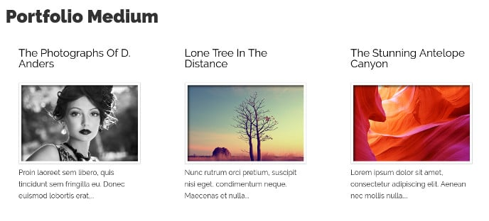
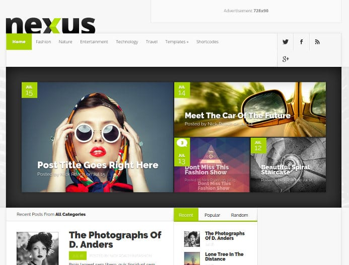

Nexus is a powerful WordPress magazine theme developed by ElegantThemes. For those who aren't aware, ET is one of the top WP theme and plugin development companies. Some of its most popular products are Divi theme, Monarch social sharing plugin, etc.

Nexus template has a beautiful layout and it provides a plethora of widgets. It is a customizable theme that supports full-width layout. It is ideal for news websites and blogs.

Below, we've shared and explained various features offered by the theme.

## Nexus WordPress Theme review

### Design

The Nexus WordPress theme has an eye-catchy design. The header section of the template comprises of a logo, free space for 728 x 90 ad unit, and a menubar with social profile icons.

You can define a menu bar for the header and configure social profiles from the theme settings panel.

The Nexus theme has stunning hover effects. You can change the colors using the live customizer tool provided by the theme.

Below the header section, you'll find a featured image area that features a beautiful background picture and a post or page title.

Nexus allows you to change the fond of the HTML heading and has the option to change the post title background color.

Below the featured image area, you'll find a meta info block that features author name, post category name, the number of comments.

Below meta info, the user will find a post content area. To the bottom of the content area, Nexus Theme features a beautiful author box widget.

The social sharing icons are positioned below the author info widget.

### Footer

The Nexus template from Elegant Themes comes with a multi-column footer section.

You can add up to four different widgets to the footer area. The template supports footer menu as well.

See the demo of Nexus theme here.

### Theme Settings

You can control the appearance of the entire theme through its settings page.

The page provides options to add site favicon, logo, configure featured posts for the homepage, define a layout for the pages.

The theme comes with advertisement blocks/areas. The settings page has the text boxes where you must place the code.

The theme provides the following eight templates:

1) **HTML sitemap**: The Nexus WordPress theme comes with an HTML sitemap module. The sitemap will make your site user-friendly.

2) **Advanced search**: This widget will generate better site search results for the user. It displays the following four options:

- Checkboxes for selecting post or page.
- Dropdown list for selecting the month or category.

Example usage: If the user selects post checkbox, a category called "WordPress", and enters the search keyword as "user-friendly", the search function will search for the post belonging to the category WordPress and having the user provided keyword.

3) **Member login**: This is a special module that allows your website visitor to log in to their accounts.

4) **Image gallery:** Want to display some photos to the visitor? Use the lightbox powered image gallery template of the Nexus WordPress theme.

5) **Portfolio**: If you've completed a project recently, you can share it with your readers with the Portfolio template of the Nexus theme.

6) **Full Width**: The ElegantThemes Nexus provides full-width layout option. If you enable this template, the sidebar will be removed from the website.

7) **Contact Us**: The Elegant Themes Nexus provides a contact us page template. Hence, you don't have to install a form builder plugin.

**Download Nexus template here**.

### Shortcode support

The powerful Nexus WordPress theme comes with support for the following shortcode:

- Small and big size buttons with or without icons.
- Content boxes toggled and tabbed content.
- Image sliders, tooltips, Social media buttons.
- Author bio shortcode.
- Column layout, icon list.
- Price tables, testimonials, drop caps.
- And more.

You can use the above WordPress shortcodes in the sidebar, post, and taxonomy pages of the template.

**See demo here**.

### Homepage customization (builder)

 Like other magazine WordPress themes, Nexus enables you to customize the home page.

The Nexus template allows you to add a beautiful post grid to the home page. It enables you to add various types of widgets, slider, social media icons, and advertisements to the home page.

Nexus lets you change the background color of the modules that appear on the homepage.

The theme offers support for drag-drop mode. Hence, you can customize the homepage of your site within few seconds.

**Download the theme here**.

### Other features

The Nexus WP theme is compatible with Firefox, Internet explorer, Google Chrome, Safari, Opera, and many other top browsers. It has valid HTML, CSS and JS code.

The template is SEO friendly. It supports several popular WordPress plugins and has a responsive design.

### Pricing

Nexus is a part of the lifetime and yearly access/developer package of Elegant Themes. The lifetime package costs $249 and the yearly access package costs $89.

If you buy any one of the above packages, you'll get access to all premium themes and plugins launched by Elegant Themes.

The package includes the powerful DIVI, Extra WP templates, Bloom email subscription plugin, and more.

ET has launched over 5 premium plugins and 60+ premium themes. You'll be able to download and use all products launched by the firm.

Buy Nexus theme here with 20% discount.
