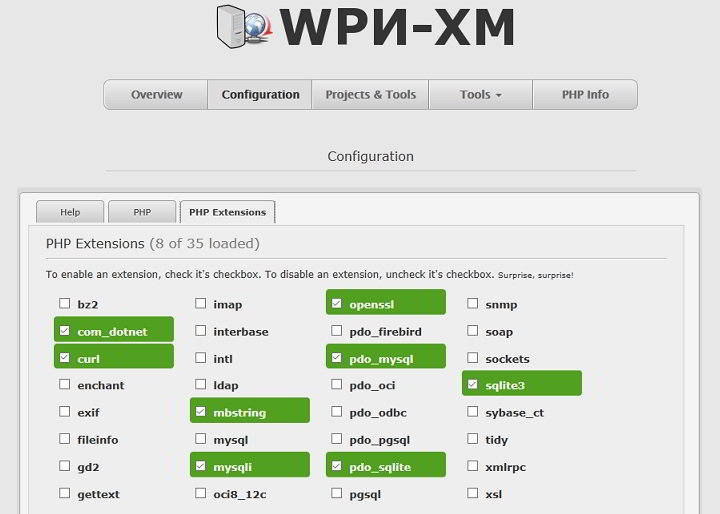

I own a laptop which has a dedicated graphics card. I am a developer who prefers using Linux OS. I've tried 3 distros of Linux, Mint, Ubuntu, OpenSuse. No matter what version of Linux I use, the OS fails to recognize the AMD graphics card in my laptop and the WiFi connection always drops. I fixed the WiFi issue by upgrading the driver but the GPU installation always fails. Hence, I decided to give up using Linux and stick with Windows 10 OS for development tasks.

I own three sites which are powered by Nginx web server and PHP. I have started coding a new site which I'll deploy it along with my other websites. As I decided not to waste time with Linux OS, I was searching for a NGINX, PHP\-FPM, MySQL stack for Windows.

After researching for a couple of hours on Google, I found a great open-source software called WPN-XM.

### WPN-XM development stack overview and features

WPN-XM is similar to WAMP, XAMPP development stacks for Windows. It provides a one-click option to start, restart, and stop NGINX, MySQL, PHP-FPM. It is a LEMP stack for the Microsoft Windows OS.

When you use WPN-XM. your default project folder (Nginx root in the default configuration file) is on the partition where you have installed Windows OS. On my laptop, location is "C:serverwww".

You can use your favorite IDE or code editor software to create a project in the folder I've mentioned above.

Once you install WPN-XM stack, the software will automatically create configuration files for Nginx, PHP-FPM, and MySQL (MariaDB). You can find the config files at the location in Windows "C:serverbin".

You don't require administrator permissions for tweaking the config files.

As I have mentioned earlier, WPN-XM allows users to:

**Manage Hosts**: If you are using Windows as an administrator, you can add new hosts in Windows OS through the WPN-XM add hosts module.

**Manage PHP Extensions**: You can add new extensions for PHP or disable existing ones easily with the WPN-XM interface.

**Check PHP info**: Want to check the PHP configuration? Simply click on the PHP info menu on the web-interface.

**Go through access, error logs:** The interface lets you check the error and access logs created and maintained by MySQL, Nginx, and PHP-FPM.

### Download and Installation

You can grab the setup file for WPN-XM stack from its official website. The software supports PHP 5.5, 5.6, and PHP 7.0.
