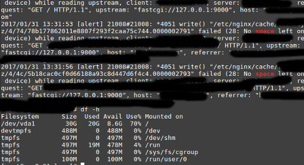

Nginx is one of the world's most powerful web servers. It has a robust caching system which eliminates the need for optimizing websites with third-party caching solutions.

While managing your website, you may come across the strange error called No Space Left on Device while reading upstream.

You won't know that Nginx is throwing the "No Space Left error" until you check the HTTP response header or go through the log files. To see the response header, install the Redirect Path Chrome extension or use the online redirect checker tool.

The problem occurs when Nginx is unable to store the cache file to the hard disk. The error clearly indicates that the hard disk partition has no room for new files.

The site will continue to work as usual but Nginx won't serve non-cached webpages quickly.

### How to fix the error?

First, identify which partition doesn't have free space. You can do so by typing the following command in the terminal:

`df -h`

You'll now see the following details on the screen:

- File system.
- Size.
- Used.
- Available.
- Used.
- Mounted on.

Go through the partition details and check whether any partition's disk space usage has reached up to 100%.

Once you find the partition, open it and delete useless files so as to free up the disk space and fix the problem.

In case the partition is mounted on the system memory (indicated by the TMPFS directory), run the below command to unmount it.

`Umount path_to_the_directory.`

Now, restart Nginx. The error will now disappear from the file.

To prevent the no space left on device error in future, edit the Nginx configuration file (or your website's config file) and increase the value of the key zone.

Users face the problem because they configure the OS to serve cache files from RAM. Although this can boost the performance of your site quickly, it reduces the amount of RAM available for other applications running on the server and leads to out of memory error.

If your server uses SSD instead of HDD, you don't have to mount the partition into the system memory.
