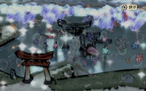
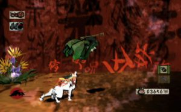

While the pointer of my blog editor flashes before my eyes, I suddenly feel some anxiety, some fear. The latter told me that I could not find the right words to describe what I was invaded by discovering Okami. Thus, paradoxical as it may seem, the doubt comes knocking at my door just as many blank pages await my impressions I sleep to tell you my journey, the same one that made me assume the role a Japanese divinity which has been a difficult task to restore color to a world fallen into a torpor monochromatic. The exercise is all the more difficult it is a kind of homage to a still-born point that deserved its deadly fate. But this is not the time for tears, if not joy, because constrained and forced, I am ready to really start this test and tell you about one of my best gaming events since I looked on my very first Game & Watch.

Elevant graphics to the level of a worthy successor of Japanese prints, Okami succeeds where many have failed. From the first seconds, the player is caught in this maelstrom of colors, this waltz of colorful shades, this enchanting fantasy forms. Except trip science fiction end slightly off about the title Clover has a no-fault based on major works from the worlds of gaming and film. The result is a lithograph of pixels that offers the player the dual role of spectator and artist.

Apart from any difficulties and problems on camera during the clashes, the playability of Okami is original, profound and perfectly controlled. Leaving the player to handle the virtual brush to create, repair or hit, Clover offers a surprising gameplay which is added a search for weapons, changing characteristics of Amaterasu as well as learning techniques. Adaptation on Wii also benefit from the Wiimote to control even more precise even though sometimes we would have liked a little more flexibility in the implementation of pictorial techniques.

Not less than thirty hours if you press the foot carefully and avoid most confrontations. However, Okami is full of quests that ostensibly lengthen longevity base already appreciable. In fact, you can easily add ten hours if the urge takes you to walk at length the vast universe at your disposal. Of course, this last solution is to call as there is to discover and enjoy through numerous bonuses to unlock all more interesting than the other. With a spread of 4 OST cds (most of whose songs are to be found in the Bonus), the score of Okami is a fine and pure style. Eclectic and inspired, the soundtrack is like a real guerrilla symphonic percussion with drooping, its brass and powerful blend of refinement and musical clarity. In addition, developers have been very good idea to use a language consisting of rumbling, this avoiding the trap of dubbing which could easily have broken the magical ambience of soft.

It is difficult to comment on the scenario of Okami that does not dream the peaks achieved by Shadow Of The Colossus to mention only the latter. Yet here too, Clover has demonstrated intelligence by giving the title looks like mythological fable does not take seriously. Set Okami comes to claim a plethora of adjectives as the proposed venture is elegant, soothing, poetic, delicate, and graceful. Having cared for both substance and form, Clover has created a piece which should grasp its scope. As original as generous, as funny as sincere, the work in question surprises, delights, entertains and marks the meeting of developers with their audience. Twirling the pen, ink and magic ... Unprecedented.
