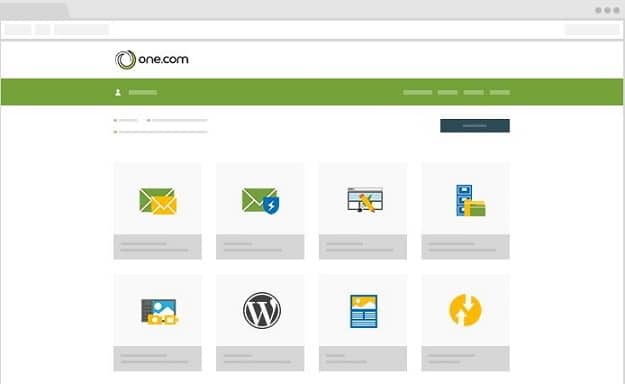
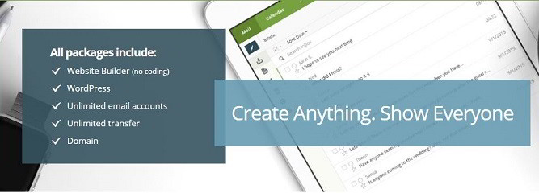

One.com is a hosting company founded 14 years back by Jacob Jensen. The firm hosts around a million sites and has branches in various countries. Top brands and experts recommend one.com hosting for its quality service and great uptime of over 99%.

Below are the various features the customers of One.com hosting enjoy.

### Control panel

A control panel is a web-based server and website management tool. You'll find an option to install CMS such as WordPress and manage database in the control panel. One.com offers a beautiful CP with plenty of options.

### Webmail

Once you become a customer of One.com, you can create a branded email ID. To view emails sent to the new ID, log in to the webmail UI.

### Uptime

Editors working at PC Magazine tested the One.com hosting for several months. They concluded that One.com has uptime of 99.5+%. PCMag is one of the most trusted tech magazines in the world.

### Website builder

One.com provides free access to its website builder tool, with which you can launch single or multi-page websites. In addition to this, One.com supports websites developed using PHP. It provides MySQL/MariaDB databases and 1-click WP installation tool.

### Statistics

To know what type of traffic your website gets and source of the visitors, you can use the statistics tool offered by One.com. Customers don't have to pay a penny for accessing the website traffic statistics feature.

### One.com discount codes 2016

One.com provides the follow four hosting plans:

| Plan name | Specs | Discounted Price |
| --- | --- | --- |
| Starter | 15GB storage, 512MB RAM, single site, SSL | Free |
| Professional | 100 GB storage, 1 GB RAM, Multiple databases, Single domain, SSL, SSH access, 2 x CPU | Below $3 |
| Professional plus | 200 GB storage, 2 GB RAM, quad-core CPU, Backup Restore | Below $4 |
| Business | Eight-core CPU, 500 GB storage, and 4 GB RAM | Under $7 |

Get full details on the above plans here.

One.com's free 1-year hosting plan covers a free domain name worth $15 and an SSL certificate worth $50. You get free storage space of 15 GB and a single database for a year. The server where your site 's code resides has 512 megabytes RAM. One.com will not charge you for the hosting, but it will ask you to pay 14 to 15 USD as a setup fee. The deal is excellent because you get 1 year hosting for less than 15 dollars.

Other companies charge 5 to 10 dollars per month for shared hosting.

How to avail the offer?

1. Click here to open pricing page of One.com.
2. Click on the select option below the 1-year free label.
3. Enter your preferred domain name.
4. Enter your details in the customer registration form and submit it.
5. Complete the checkout process.
6. Done

### One.com support

One doesn't provide phone support. You can avail support by using the live chat feature in the CPanel or by raising a ticket.

**Conclusion**: One.com is a great hosting service for newbie bloggers or developers who want to launch their PHP site for a cheap subscription cost. Once you register an account with One.com, you get full access to detailed tutorials. Refer the guides to make website setup faster. One is one of the few hosting companies which you can trust on. One.com doesn't have as many customers as Bluehost and Hostgator, but it is highly affordable.
