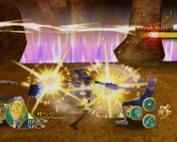
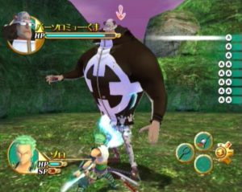

Echoing the broad outline of the pattern established in One Piece Unlimited Adventure, the Unlimited Cruise series certainly does more of the element of surprise but it should nevertheless allow us to follow for a long time wandering the straw hat and his band of pirates off standards. Before entering the heart of the matter, it is better to warn immediately the reader: One Piece Unlimited Cruise: Episode 1 is based on narrative elements that we discovered that from Volume 46 of a manga. Thus, although the scenario of the game does not follow the pattern of the series, there are characters and elements that may not have the players not yet reached this stage of history.

At the outset of the adventure, the crew of Luffy now vogues aboard the Thousand Sunny and a new recruit who has nothing to envy to his companions in terms of uniqueness. Brook could almost pass as being normal, if it was not a living skeleton... Beside him, there are Luffy, Zoro, Nami, Usopp, Sanji, Chopper, Robin and Francky, bringing to nine the number of playable characters in the adventure mode. In addition, each of these actors has a range of attacks and techniques to unlock, fighting hostile individuals who inhabit the five islands making up the story of this first episode of Unlimited Cruise. The player has the opportunity to move from one character to another at any time, each with its own bar life and talents. For example, lianas and bamboo shoots can be cut by someone who has a sharp weapon, like Zoro Brook.

Each tool requires specific materials to be built, most of the game is just to survey the islands in search of these materials. Your team will then create all kinds of tools aboard the Thousand Sunny: a pickaxe to dig stone, a vacuum cleaner to swallow the toxic smoke, a fishing rod or a butterfly net. If Usopp specializes in accessories of all kinds, Sanji expects you to bring back edible food to prepare good meal, while Chopper is hard to fill your health with all kinds of remedies. The inventory grows rapidly to dozens of disparate elements combine to build the tools that enable you to further your investigations on the ground. In the same vein, we find missions system, imposed or secondary, which involves the regular boost of magical power to open secret passages utilizing the talents of Franky or Gabura, a strange creature with a design similar to Chopper.

The more you venture away on an island, the more you'll have chance of hitting a boss, among which we find most of the opponents that Luffy was led to fight throughout the 46 volumes of the manga published so far. The defeat will not only advance the story but will also unlock these characters in the versus mode, with a total of 30 individuals to unlock. If this is still quite limited, it at least has the merit of enabling the rapid discovery of all the techniques available to each of the protagonists of the game without having to develop them one by one in the adventure mode. The opportunity to see the animations for the special attacks of each brings a lot of fun. If One Piece Unlimited Cruise: Episode 1 has some very good ideas, his approach to marginally limit to an audience of fans, not to mention that the program remains hardly accessible to non-Japanese. One Piece Unlimited Adventure have been entitled to an U.S. version, we cross our fingers for this to be the same with episodes of Unlimited Cruise.
