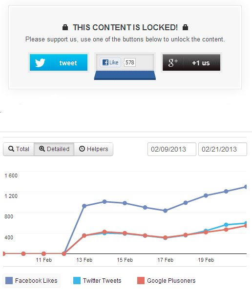

Content locker WordPress plugins are becoming popular these days. They are useful in increasing the Facebook likes Google plus one and twitter tweet counts. The plugin hides your content for visitors (not for search engines) and displays it only when the user shares your post on the pre-configured social networks.

OnePress is the best content locker plugin for WordPress. It is available in free and premium versions. The free version of OnePress allows webmasters to add maximum three social sharing buttons, i.e., FB, G+, and tweet. The pro version supports many other popular social networks. OnePress comes with an analytics dashboard. To improve your social visibility, you can use this dashboard for analysis and adjusting the position of the locker.

When the user hovers his mouse over them, the buttons will animate. The user will like the effect, and he will click on it. The coolest feature of OnePress Social Locker is that it will never hide content for search engines. Its developer claims that the plugin is SEO friendly.

The plugins support Visual Composer, the best drag and drop page builder plugin. It includes more than three types of powerful and stylish locks. OnePress Social is compatible with responsive websites too. It will be automatically sized when the user opens your website post on mobile devices. It is light weight. Thus the content locker will open very fast on all types of phones, tablets and desktop browsers.

The free version of OnePress has limited features. You can download it from the WordPress repository. The premium version has the below amazing features:

- Extra templates with beautiful styling.
- Support for eight social networks (including YouTube).
- Includes twitter follow and sharing on the LinkedIN module.
- Supports Ajax loading for better and faster performance.
- Makes you aware of new leads.
- Inbuilt timer for unexpected visitors.
- Close box for guests who don't want to see the content locker.
- Better support and many more cool features.

As they say "Good things come at a cost." The proverb applies for OnePress Social Locker for WordPress too. If you want to use the premium version of the plugin, you will have to spend just 25 dollars. The paid plugin is available only on CodeCanyon.

Note: SeoMoz has published a research article which claims Google plus one count have a direct impact on search rankings. No one has proven that Twitter and Facebook can influence your Google rankings.
