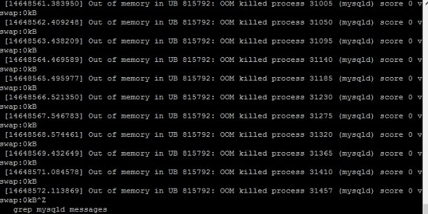

Since two weeks, my website was frequently crashing because the MySQL server stopped abruptly at random times of the day.

This issue started when I was on a holiday. My site was down for several hours. I configured crontab to start MySQL server when the service had stopped. This didn't help.

I enabled query cache to reduce the load on the server. I use NGINX Fast CGI cache, APCu, and OpCache for my sites. Thus, I didn't felt the need to install a caching plugin for my WordPress blog.

I reinstalled WordPress, changed DB structure of WordPress Database tables from MyISAM to INNODB, but the MySQL service was still crashing. I checked error logs and found that the MySQL server stopped each time the PHP executed the code in the wp-db.php file.

To seek help, I created a new thread on WordPress forum. One of the users asked me to check system log files (messages, Syslog) which can be found under the /var/log directory. The messages log file was populated with the below message:

`out of memory in UB 815792: OOM killed process 29747 (MySQLD) error messages.`

The out of memory manager module in my Linux VPS was killing the MySQL service immediately after the crontab started it.

OOM is a system module which ensures that aggressive processes using high system resources are killed to avoid malfunctioning of the system. In my case, the MySQLD service was using a large volume of RAM due to which the OOM killer had no other option than killing MySQLD process.

To fix the problem, I stopped MySQL server along with the services dependent on it. Then, I rebooted the VPS.

What should you do to **prevent OOM process killer from stopping MySQL, PHP-FPM, NGINX, Apache, Oracle DB** or any other critical service?

**Check Linux memory** usage often with commands like `ps aux and` `free -mt`. Once you find that the server doesn't have enough free memory, identify the process which is using the most RAM and check its configuration. For example, if the PHP-FPM processes are using a large amount of RAM, you should tweak its configuration to lower the system memory usage.

**Kill stopped jobs**: When you stop a job in Linux, the task is still assigned resources the system had allocated to it. To free up these resources, you should terminate all finished jobs. To do so, run the below command in the terminal:

`jobs -ps`

Now, the terminal will display a list of process ids of stopped jobs. Use `kill -9 pid` command to kill them.

**Check log files**: If your website is deployed on a VPS server, you should check PHP, Nginx, MySQL as well as system log files every 2 or 3 hours. Use the command `tail -30 file_name` to learn about the latest errors.

**Use updated software**: When a developer or a company releases a new version of a product, the bugs that were found in earlier version of the software would have been fixed. If you're using a CMS, make sure that the software you're about to upgrade is compatible with your CMS.

If this doesn't help, lower the max connections default value in my.cnf file to 50. Configure the PHP-FPM process manager to create additional processes ondemand and reduce the value of max children variable.

**Conclusion**: Fixing out of memory errors in Linux can be tricky. You should first find the cause of the problem by checking the error log files. If the problem is occurring because of poor code or slow SQL query, you should fix the code. If the code works great on other machines, reboot the OS.
