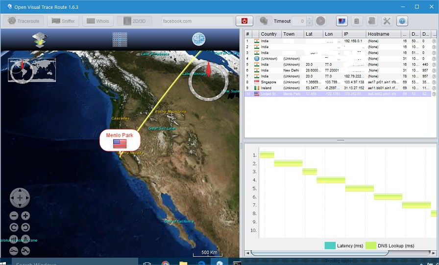

Traceroute is an important and one of the most widely used commands. It is recognized in all the operating systems. In case you're searching for standalone Windows program that simulates the traceroute command, try out Open Visual Traceroute.

OVT is an open source program that can be used on Windows as well as Linux OS. It has been built with Java and available for download on sourceforge.com. Users must install the Java Runtime Environment to use this program. OVT has the below three essential utilities that webmasters often use:

### Traceroute

OVT allows users to check the path that data packets take when a request is made to the web server from a client browser. You must enter the URL of the website or the IP address that you want to trace. Once the URL or IP has been entered, click the Enter key or the trace button.

Open Visual Traceroute will refer the GeoIP database for tracing the path taken by the packet from your place to the server on which your website is hosted. This program will show the latency and DNS lookup time for each path. Open Visual Traceroute will display the path on a map. The program supports 3D as well as 2D maps.

### WhoIs

OVT comes with an inbuilt WhoIs tool to help webmasters in finding the details of the website owner. To use this function, enter the website's URL in the textbox on the main Window of Open Visual Traceroute and then click on the lookup domain data button. The program will fetch data of the website's owner, and the same will be displayed on the main interface.

### Packet Sniffer

Open Visual Traceroute for Windows can sniff data packets flowing to a particular domain name or IP. It can detect and capture TCP, UDP, or ICMP packets accepted on a particular port. Users can configure OVT to sniff packets of a specific length. The user must specify the packet length. The program makes use of WinPcap to sniff data packets.

Open Visual Traceroute has the option to copy the tracking data to the system clipboard or take its screenshot. You can also export the data to a file.

OVT has a settings window where you can update the GeoIP database manually, change network interface, specify max hops for packets, change the 3D animation's time frame, enable OS traceroute support, etc.

Visit SourceForge to download the cross-platform Open Visual Traceroute program on your PC.
