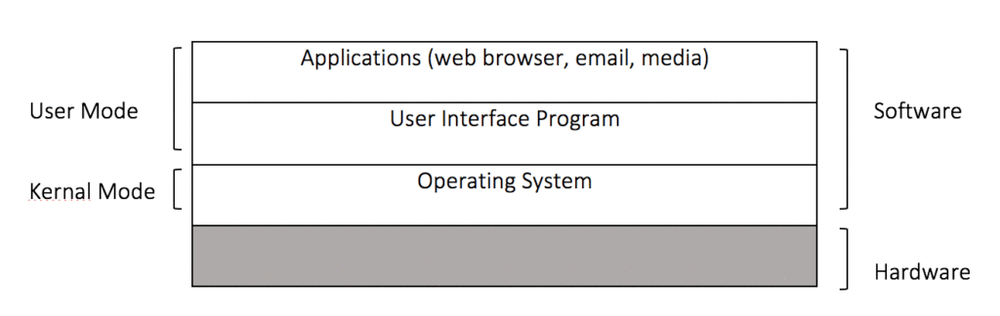

The Internet has brought us a wealth of conveniences and everyday tools that we could not live without and more importantly a dependency that we cannot break. In the workplace the Internet has become a part of our day to day lives. We rely on instant communication with our co-workers, friends and colleagues as well as access to a multitude of information at our fingertips. Children from younger ages are becoming more involved with computers and technology in a trend will continue as the Internet of Things evolves around us in every day appliances. Unfortunately, with all these convenience come challenges and risks that we need to deal with.

All of our devices, computers, laptops, and phones are managed by an operating system that directs all of the computing resources and processes that we as users take for granted. Operating systems have been around since the 1950s and their evolution has followed the growth of computing and networking over the years. In the 1980s and 1990s it was common to see single user operating systems such as DOS (Disk Operating System), CPM, and earlier versions of Mac OS and Windows. Nowadays most operating systems are multi-user in nature and actively connected to the Internet.

This article focuses on security methods to protect multi-user operating systems commonly used in enterprise environments. Advantages and disadvantages of each are discussed and the paper concludes with an overall ranking in terms of overall effectiveness. While much of the paper leans heavily on Microsoft technologies, many of the concepts are equally applicable to any other multi-user operating system currently used today, including those we take for granted on our smart phones and tablets.

## Operating Systems Overview

Modern computers and devices are complex systems that have to deal with multi-processor cores, vast amounts of memory and system power, as well as a multitude of connected peripherals. In order for software to be written and properly maintained, some of these details need to be handled, or abstracted away otherwise programming would be extremely challenging. In addition to this, something needs to actively manage and process all requests by users and applications on an ongoing basis. This is where the Operating System (OS) come into the picture. For many, operating systems may be a term used to describe the graphical user interface that provides an interactive environment with a computer or device. Operating systems are however much more than this. They provide a number functionalities essential to the inner-workings of the computer or system we work with today.

Tanenbaum (2009), describes the operating system conceptually in two basic modes; Kernal mode and User mode. The kernal can be considered the ‘core component’ of the operating system. Goodrich & Tamassia (2011). It is the kernal that manages all of the low level details around memory management, looking after all running system processes, and working directly with system hardware. In Tanenbaum’s model, kernal mode and user mode are further broken down into layers dealing with various operations. At the bottom, we have hardware. The next layer up contains the kernel mode and is part of the overall operating system. The kernel communicates directly with hardware through device drivers, pieces of software designed to provide an interface to the kernel and its resources. The next layer is part of the user mode and contains user interface program and the applications that the user interacts with. A diagram follows illustrating this model of how an OS fits into the overall system.

Figure 1: Where the Operating System Fits in Tanenbaum (2009)

Figure 1 demonstrates the operating system set up at a very high level. Within the kernel mode, the operating system software operates at a lower level with resources than the end user applications. The user interface program (or UI) provides the graphical interactions that many have come to accept as the OS itself, such as the WIMP (Windows, Icons, Menus, Pointer) environment common in Windows and Mac OS systems.

## Securing the Operating System

The weakest point within any system is often the end-user. It comes as no surprise therefore that a large percentage of security breaches over the last decade have come from the inside of an organization, often unknowingly by the user. Conrad et al (2009) points out that the employee population is often the greatest threat to internal information systems. Whether through careless actions or by deliberate intent, this is something that should be considered first and foremost in securing an OS. The recommendations that follow focus mainly on areas of access to an OS by the end user. These include Roles Based Access Control (RBAC), Just Enough Administration (JEA), and the Walled Garden approach to application deployment both publically and within the enterprise.

### Roles Based Access Control

Access control has been a persistent challenge over the years as operating systems and networks have evolved in size, complexity and features. Roles based access control (RBAC) models have commonly been used over the years in multi-user environments, to manage permissions attached to various resources within a file system in the OS. The main idea behind RBAC is that permissions are ‘associated with roles, and users are assigned to appropriate roles.’ (Sandhu, Coyne, Feinstein, & Youman, 1996). A typical organizational setting may have roles defined based on job position. For example, an employee working in Human Resources (HR) might require special permission to HR systems, whereas someone in operations may need resources from an entirely different part of the network. In the past, network specialists or the organization’s Information Technology (I.T.) team would typically have access to provide user permissions, maintain software, troubleshoot, and provide technical support where needed.

RBAC has evolved over the years, however it is not the only common access control method for permissions and users. Discretionary Access Control (DAC) is worth a mention here as it is also based on permissions, however it targets specific users instead of groups. DAC uses an Access Control List or ACL that determines each user’s rights to access or manage a specific resource within the system. It allows greater control but its really suited better for smaller environments or in specific use cases as ACLs can potentially cause management issues as user numbers and resources grow. DAC is commonly found within the Windows file system, however RBAC is more commonly found within Active Directory in Windows Server on a corporate network. Some of the advantages and disadvantages of RBAC are discussed below.

#### Advantages of RBAC

Easy to Setup and Implement: Smaller organizations can benefit from RBAC by grouping resources and access levels with ease. Larger organizations can benefit from inheritance models whereby roles with higher levels of access can inherit from lower roles in the organization, lending itself to easier administration.

User Administration: Roles can easily be administered in an RBAC model from a central area by systems administrators. Users can easily be added to and / or removed from roles as their positions and responsibilities change within the organization.

Maintenance and Cleanup: RBAC allows for minimal work disassociating users from roles. This makes for easier overall user administration throughout the organization in times of termination, resigning, or other events causing the employee to either leave the department or organization. This contrasts with DAL where potentially complex ACLs would need to be updated / modified in numerous places.

Staffing: RBAC is commonplace in systems like Microsoft Active Directory, which is used in many enterprise networks. Because of this staff resources to support it should be easy to find.

#### Disadvantages of RBAC

Implementation Sometimes Challenging: RBAC can be difficult to implement if the organization policy is poorly documented, or not adhered to. If there are no clear divisions of departments, roles and responsibilities, it can be challenging setting up appropriate groups and permissions.

Can Violates Principle of Least Privilege: Due to the nature of RBAC, permissions can be assigned primarily to roles that may change over time, resulting in too much access. Organizations also tend to deal with security as they become known and this can become a danger for allowing greater access than needed. Rights (2001).

### Just Enough Administration (JEA)

The inherent security concerns and challenges in relation to operating system access has often been that individuals end up with access to more resources than they really need. The principle of least privilege requires users and applications within the operating system to be given the most restrictive access possible to perform their tasks. (Motiee, Hawkey, & Beznosov 2010). Relying solely on RBAC can sometimes not be enough to achieve this. A relatively new concept called Just Enough Administration or JEA has been making its way into the forefront of access level security, and is being pushed by Microsoft in their latest server based operating system, Windows 2016. The goal of JEA is to reduce administrative access to systems wherever possible and at the same time allowing administrators to carry out their jobs. It does this by enabling specific users of the system to carry out admin-related tasks without actually enabling admin access on their account or adding them to an admin role. In addition to this JEA audits all actions carried out by the user. Microsoft (2014).

Just enough administration moves away from role-based access control to task-based administration. Through the use of PowerShell constrained run spaces available within the OS, it is now possible to build controls for specific tasks. Traditionally if a system administrator needed to change the title of an employee in Active Directory, they would need a certain level of access to do this, potentially giving them the capability to administer parts of the system they didn’t need. This would break the principle of least privilege. A ‘just enough administration’ approach would enable that same administrator to run a set of scripts or tools, that would have the necessary access to carry out the title change, without impacting their own access role within Active Directory.

#### Advantages of JEA

Principle of Least Privilege: The very nature of JEA means that custom scripts and tools are built to carry out specific tasks based on a need, instead of a role or individual. Therefore, the principle of least privilege is upheld by not giving rights or access (at the user or role level) unnecessarily to any individual or group.

Comprehensive Audit Logs: JEA auditing ensures all actions and activity are appropriately recoded. In addition, auditors only have access to the specific logs they need. Even the best-intentioned RBAC takes on more risk than desired. Auditors need access to different systems in order to verify information on a read-only level. This often requires unnecessary administrator access to business critical systems. JEA mitigates this fully by only giving access to the specific request tasks for audit logs. Microsoft (2015).

Day-to-day Administration Tasks: Junior administrators often need to carry out routine tasks such as rebooting a database or web server, applying patches, and / or perform basic troubleshooting. These tasks in a RBAC model would require administrative or elevated access to the affected systems. JEA does not require elevated permissions.

Build and write own parameters: Tasks, processes and parameters can be customized and written for specific use-case scenarios giving greater control over access to critical systems.

#### Disadvantages of JEA

Learning Curve and Complexity: JEA is implemented via Windows PowerShell Desired State Configuration (DSC), which enables scripts to apply, monitor and / or maintain a configuration in declarative language. Microsoft (2015). Programming knowledge and skills are needed to implement JEA effectively, which may not be available to many systems administrators and junior networking staff. JEA might also become difficult to maintain if correct approaches not used in building out appropriate configuration.

Limited User Interface tools: In order to make JEA open to non-developers, User Interface or UI components can be developed directly within PowerShell. Out of the box there are limited UI tools, however there is acknowledgement that more UI components will be developed for future versions of Windows Server.

Emerging Technology: JEA is going to be a core feature within Windows Server 2016, however the operating system is still not in final release status and is not scheduled for release until the first quarter of 2016. Existing infrastructure would not be able to support JEA without challenges.

### Walled Garden Application Deployment

The concept of a walled garden model for application deployment has become common-place in recent years since the introduction of Apple’s iPhone back in 2007. The approach allows the vendor or manufacturer of the device to have full control over third party software installations on end-user devices. The model restricts users to pre-approved applications that are distributed through a vendor app store. Developers work directly with the vendor to submit their applications, which go though an approval process. This helps decrease the chances of malicious code being distributed to user devices and is therefore considered a safer more secure approach to that of an end-user control model, which provides no control over software installation by the vendor. (Barrera, & Van Oorschot 2010).

Apple isn’t the only company that has pushed the walled garden model on its devices. In 2012, Microsoft released their first generation Surface tablet running an OS called Windows RT. RT used a similar app store setup as Apple and in a similar way pushed developers to submit all applications via an approval process. This ensured that the Surface RT was free of any malicious code or security vulnerabilities, that had plagued other versions of Windows before this time. Unfortunately, the Surface proved too restrictive as it would not run any legacy software, and the RT series ultimately became a footnote in Microsoft’s history. Today however Microsoft is again pushing for a walled garden model in it’s latest version of Windows. More recently Microsoft has committed to opening the store to accept traditional applications, broadening the library and becoming less restrictive. Kidman (2015).

In the enterprise, Microsoft is in the process of introducing Business Store for Windows 10. This will enable organizations to purchase volume licensing and provide a selection of software via a private store to employees within the company. Microsoft Developer Network (2015). By restricting employees and potentially clients of an organization with access to network resources, the benefits in terms of application security are clear. All applications distributed to employee OS’s, running on either devices or computers, will be restricted to store delivery ensuring increased security throughout.

#### Advantages of Walled Garden Application Deployment

Full Control over Software Policy: In a walled garden model, the organization is the sole authority for software installations, updates and removals. Using this model with appropriate security in place the organization can ensure that no unauthorized or malicious software is intentionally or unintentionally installed on the end users OS.

Ease of Deployment: The store model not only gives complete control over the software that can be installed on end-user systems, it also provides an easy to use platform for installing applications, pushing updates, and in cases where issues arise, removal of applications. In contrast to traditional network and OS software installations, this provides greater efficiency in software maintenance.

Common application support throughout the organization: The store model provides a library of applications used within the organization. This pushes for a more standardized approach to software delivery within preset categories and a maintainable library within the organization.

#### Disadvantages of Walled Garden Application Deployment

Ethical questions: The question of ethics may be less of a concern within the enterprise compared with consumer devices and restrictions, however it should still be addressed. In context of the the consumer world, a walled garden prevents access to users that they are normally entitled to on other platforms. Think about Apple’s iOS Operating System and its restriction. It also restricts the freedom of software makers of freely distributing and selling applications. In a corporate setting this may be less of an issue, however it is still a disadvantage to this type of software delivery model.

False sense of security: As recently a several weeks before writing this paper, news surfaced of over 4,000 infected applications in Apples’ app store by malware called XcodeGhost. The malware allowed attackers to steal data about users and send it to servers they controlled. BBC News (2015). There have been other cases of malware slipping through the app store in the past. It is important that any implementation of an app store in the enterprise environment take this into consideration and do not assume all software is completely safe.

Too restrictive to end users (developers, power users): App stores by their very nature are restrictive. This can be especially true for those employees whose day-to-day work involves the use of specialized tools. In cases of engineers, software developers who need up to date specialized software, an app store model may simply be too cumbersome due to restrictions.

Emerging Technology: Although the concept of app stores and their use in the consumer market has been prominent for several years, this type of delivery system is still relatively new within the enterprise. As such the same drawbacks with JEA being an emerging technology is also a disadvantage here.

## Ranking of Methods

Of the security methods mentioned in this paper, most have had a focus on Windows based systems, however some of these concepts can carry over to other operating systems such as Unix, Linux and Mac OS. Each of the methods were discussed in the context of implementing within a business or enterprise environment. Challenges have been addressed with security management and implementation, and advantages and disadvantages covered for each. What follows is a summarized ranking of each of these methods in figure 2 below.

|   | **Ease of Implementation** | **Associated Sec Management Issues** | **Total Ranking** |
| --- | --- | --- | --- |
| **Just Enough Administration** | Difficult | Time / skills to develop new configurations. | 1st |
| **Roles Based Access Control** | Easy | Potential for too much access. | 2nd |
| **Walled Garden Application Deployment** | Medium | Restrictiveness for power users. | 3rd |

Figure 2 Ranking

Out of the methods covered, Just Enough Administration has the potential to be ranked number 1 because of its strong emphasis on access security and adherence to the principle of least privilege. Following this is Roles Based Access Control, which is commonly in use in many distributed operating systems today. Finally, the walled garden approach to application deployment, which comes with the most challenges, follows in third place.

### Other Security Methods

There are many other techniques that organizations can implement to protect both their operating systems and networks as a whole. Some of the more common methods have been outlined below:

- Virus and malware protection are often a baseline security measure adopted in most corporate networks. They should be a considered layer of security within a multilayer defense strategy.
- Organizations that develop custom applications as part of their business model are familiar with custom code security scanning tools. Software tools such as HP Web Inspect enable the detection of poorly written code that could potentially cause vulnerabilities on the operating system’s web server that would host such applications.
- Virtual Machines (VMs) can provide an alternative the to a walled garden approach where specialists need access to software that might not typically be available to others, or applications that may be higher risk. The VM provides a safe environment for that user to work within an environment that should not be risky to the host operating system.
- Finally, some of the most effective security measures come through effective organizational policies, training and efforts to raise overall awareness of security risks and concerns.

## Conclusion

Regardless of chosen security methods within an organization, protection of the OS and network should be at the forefront of any policy. Without adequate protection, an organization risks potential damage by malicious individuals or groups, losing its intellectual assets, or damaged reputation.

A solid multilayered approach should be adopted throughout the organization. Up and coming security tools such as JEA should be considered building on tried and proven techniques such as RBAC. Better more efficient ways of managing application deployment through either walled garden approaches or a more centralized security model will ensure greater risk mitigation over time. In addition to this secure policies with regard to end-user devices such as those which can be connected via USB to the host OS, should be considered.  At the end of the day, awareness should be raised throughout the organization to ensure employees abide by the best security practices based on well defined and maintained policies.

## References

Barrera, D., & Van Oorschot, P. (2010). Secure software installation on smartphones. IEEE Security & Privacy, (3), 42-48. Retrieved from: http://people.scs.carleton.ca/~paulv/davidb.pdf

BBC News. (2015). Apple App Store malware ‘infected 4,000 apps’. Retreived from http://www.bbc.com/news/technology-34338362

Conrad, S., H., Durán, F., A., Conrad, G., N., Duggan, D., P., & Held, E., B. (2009). Proceedings for the 2009 int’l system dynamics conference: _modeling the employee life cycle to address the insider threat_. Retrieved from: http://www.systemdynamics.org/conferences/2009/proceed/papers/P1365.pdf

Kidman, A. (2015). How Will Microsoft Persuade Developers To Use The Windows Store. LifeHacker. Retrieved from: http://www.lifehacker.com.au/2015/06/how-will-microsoft-persuade-developers-to-use-the-windows-10-store/

Microsoft. (2014). Just Enough Administration. White Paper. Retrieved from: http://aka.ms/JEA

Microsoft Developer Network (2015). Business Store Overview. Retrieved from: https://msdn.microsoft.com/en-us/library/Dn986864%28v=VS.85%29.aspx?f=255&MSPPError=-2147217396

Motiee, S., Hawkey, K., & Beznosov, K. (2010, July). Do windows users follow the principle of least privilege?: investigating user account control practices. In _Proceedings of the Sixth Symposium on Usable Privacy and Security_ (p. 1). ACM. Retrieved from: http://cups.cs.cmu.edu/soups/2010/proceedings/a1\_motiee.pdf

Rights, R. F. (2001). SANS Institute InfoSec Reading Room. Risk, 1, 27. Retrieved from: https://www.sans.org/reading-room/whitepapers/sysadmin/role-based-access-control-nist-solution-1270

Sandhu, R. S., Coyne, E. J., Feinstein, H. L., & Youman, C. E. (1996). Role-based access control models. _Computer_, (2), 38-47. Retrieved from: http://modelibra.googlecode.com/svn/trunk/Modelibra/doc/security/sandhu96.pdf

Tanenbaum, A. S. (2009). Modern operating systems, Third Edition. Amsterdam, The Netherlands: Pearson Education International.
