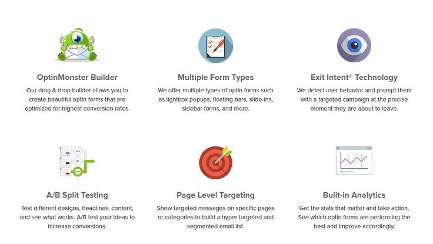
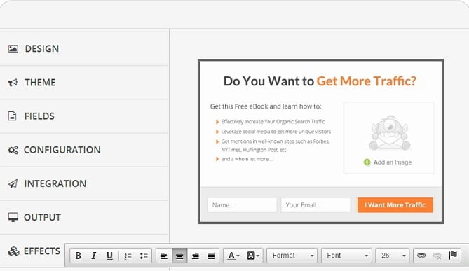
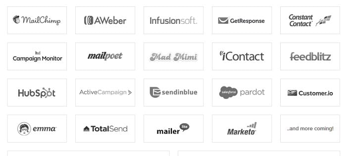

Email marketing is probably incomplete without a good newsletter plugins that add subscription forms in our WordPress sites.

There are a lot of free plugins to add newsletter forums to a website, but the features they offer are limited. For example, the MailChimp plugin doesn't support popups, and it lacks an Ajax based form which makes the sign-up process fast. You can only change the background and button color with it.

For people who consider email marketing a serious opportunity to earn money and get loyal readers, there's no other option than buying a premium plugin.

Elegant Themes Bloom plugin is an excellent WordPress newsletter plugin, but if you're looking for an alternative to it, OptinMonster is the best available option for you.

### OptinMonster Features

OptinMonster has been developed with an objective of increasing your blog's subscribers count. It was coded by a team lead by the popular WordPress blogger, Syed Balkhi.

The first version of OptinMonster was launched three years back in 2013. The latest version comes with a lot of cool features (**full features/changelog**). It is lightweight, and the code is error-free. It is considered to be one of the best lead generation plugins of all time.

The code that generates forms is not hosted on your server. Once you get the plugin, you'll be able to log into the official website of OptinMonster where you'll find a dashboard. The dashboard allows users to create a campaign.

Once the campaign has been created, you'll be able to access the settings panel where you'll find the option to create option forms and manage its style, behavior, location, etc.

### Designing forms

OptinMonster is powered by a special drag and drop builder tool with which users can create stylish opt-in forms. **Check its demo here**.

OptinMonster has an option of creating a powerful email subscription form within few seconds. This WP plugin offers eight cool designs i.e. light-box, After post/inline, side in, floating bar, sidebar, canvas, mobile and full screen.

Once you select the design, OptinMonster will open a customization page where you can change the predefined settings to suit your current theme's color accent. You can change fonts of the text content or stylize it.

Users are allowed to modify the background color of the form, buttons, and they can also edit the message that appears within their opt-in forms.

The best thing about the opt-in monster plugin is that you can perform A/B testing with your forms. This feature will help you in choosing the best opt-in style, and it will also increase your conversion rate.

The plugin is powered by unique Exit-intent technology which checks the activity of the user before displaying the popup. This technology makes sure that the user is not annoyed.

Some free plugins load popups as soon as the visitor opens the web page. This is an annoying experience for the user. The visitor will leave the page immediately resulting in high exit and bounce rate.

**Plugin Download Link**.

OptinMonster's EI module will ensure a seamless experience for the visitor. It will never distract your blog visitors. It will load the popup when the user has finished reading your content and is about to exit.

The OptinMonster plugin has been designed for people who don't know PHP, CSS, HTML, JS. Once your form has been created, you can easily place it at any position on your blog. OptinMonster has options to do so.

OptinMonster comes with support for more than 15 email marketing websites which includes Aweber, MailChimp, GetResponse, etc. Integration with the service provider is an easy task which can be accomplished from the OptinMonster plugin dashboard.

If you're facing difficulties in setting up MailChimp, Aweber, GetResponse, Infusionsoft, constant contact, campaign monitor, MailPoet, Mad Mini, iContact, Feedblitz, Hubspot, Emma, Mailer and many more services, then please refer the plugin documentation or contact the support team.

OptinMonster ships with a statistics section which makes you aware of the conversion rate, number of visitors that had seen the opt-in and the number of conversions.

### Pricing

OptinMonster is a premium subscription plugin for WordPress. It comes with three subscription plans. The basic plan will cost you 49 USD. The Plus and Pro subscription plans are priced at USD 99 and 199 respectively. **Visit OptinMonster website** for full details on the plans.

**Basic Plan features**:

- A/B testing, unlimited opt-in forms.
- Page Level Targeting, User-friendly UI.
- One website is supported.

**Plus plan features:**

- Floating bar, sidebar forms.
- Inline and after post forms.
- Support for three websites.

**Pro Plan:**

- Referral detection, exit intent support.
- Special forms for mobile devices.
- Full-screen forms, slide-in modules.
- Full support.
- Supports unlimited websites.

OptinMonster is offered with a 14 days money back guarantee. If you don't like the plugin or if you think it doesn't meet up to your requirements, you can get your money back easily.

**Conclusion**: Email marketing plays a major role in building a website. If you're serious about your blog and want to have tons of email subscribers and generate new leads, grab your copy of OptinMonster plugin and spend few minutes in configuring it. Check performance report occasionally, improve the design and conduct A/B testing.
